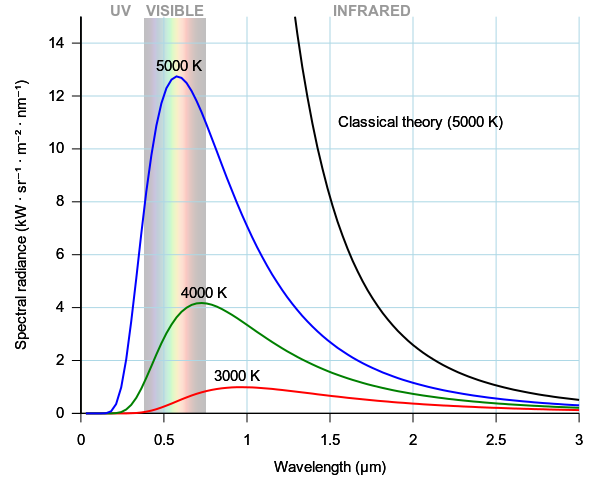

\cleardoublepage
\pagenumbering{arabic}
# Introduction to Quantum Mechanics {#Motivation}

## Historical Context
Quantum mechanics is a branch of physics that deals with the behavior of matter and energy at the atomic and subatomic level. It is a fundamental theory that has revolutionized our understanding of the physical world, and it is a cornerstone of modern chemistry. But the road to the development of quantum mechanics was a long and winding one that spanned several decades and involved many of the greatest minds in physics.

The story of quantum mechanics begins in the late 19th century, with the discovery of the electron by J.J. Thomson in 1897. This discovery, along with the discovery of radioactivity by Marie and Pierre Curie in the same year, sparked a flurry of activity in the field of atomic physics. Scientists were eager to understand the structure and behavior of atoms, and they soon discovered that classical physics was inadequate for this task.

In 1900, the German physicist Max Planck made a breakthrough that would lay the groundwork for quantum mechanics. Planck was studying the spectrum of light emitted by a heated object, and he found that the energy of the emitted radiation was not continuous, as classical physics would have predicted, but instead came in discrete packets or "quanta". This discovery was revolutionary and opened up a new era in physics.

The next major milestone in the development of quantum mechanics came in 1913, with the Bohr model of the atom. Danish physicist Niels Bohr proposed a new model of the atom that incorporated the idea of quantized energy levels. According to Bohr's model, electrons could only occupy certain discrete energy levels, and when they moved from one level to another, they emitted or absorbed energy in the form of light. Bohr's model was a significant step forward, but it had limitations. It could only accurately predict the behavior of simple atoms with one or two electrons, and it did not account for the complex spectra of more complex atoms.

It was not until the mid-1920s that a truly comprehensive theory of quantum mechanics began to emerge. In 1925, Austrian physicist Erwin Schrödinger published his famous equation, which described the wave-like behavior of particles at the atomic level. Schrödinger's equation was a mathematical triumph, but it was also highly abstract and difficult to interpret. At the same time, Werner Heisenberg, a German physicist, was developing a different approach to quantum mechanics, known as matrix mechanics. Heisenberg's theory was based on matrices, which are arrays of numbers that can be used to describe the properties of quantum particles. Heisenberg's approach was highly mathematical, but it provided a more intuitive interpretation of the behavior of particles at the atomic level. The two approaches, matrix mechanics and wave mechanics, were eventually shown to be mathematically equivalent, and together they formed the basis of modern quantum mechanics.

In the decades that followed, quantum mechanics continued to evolve, with new discoveries and theories expanding our understanding of the behavior of matter and energy at the atomic and subatomic level. Today, quantum mechanics is a thriving field of research, with applications in chemistry, physics, and many other areas of science.

The development of quantum mechanics was driven by a series of discoveries and experiments that challenged classical physics and its inability to explain the behavior of atoms. These are the "ultraviolet catastrophe", the photoelectric effect, and the wave-particle duality. We will discuss each of these cases below.

## The Ultraviolet Catastrophe

The ultraviolet (UV) catastrophe, also called the Rayleigh–Jeans catastrophe, is the prediction of classical electromagnetism that the intensity of the radiation emitted by an ideal black body at thermal equilibrium goes to infinity as wavelength decreases (see figure \@ref(fig:Fig1c1)^[This picture is taken from [Wikipedia](https://en.wikipedia.org) by user Darth Kule, and in in the Public Domain]). 

```{r Fig1c1, out.width='70%', fig.show='hold', echo=FALSE, fig.align = 'center', fig.cap='The ultraviolet catastrophe is the error at short wavelengths in the Rayleigh–Jeans law for the energy emitted by an ideal black body. The error, much more pronounced for short wavelengths, is the difference between the Rayleigh–Jeans law —black—and Planck\'s law—blue.'}

```


A black body is an idealized object that absorbs and emits all frequencies. Classical physics can be used to derive an approximated equation describing the intensity of a black body radiation as a function of frequency for a fixed temperature. The result is known as the Rayleigh-Jeans law, which for wavelength $\lambda$, is:

\begin{equation}
I(T)={\frac {2ck_{\mathrm{B}}T}{\lambda^{4}}}
(\#eq:rjlaw)
\end{equation}

where $I$ is the intensity of the radiation —expressed as the power emitted per unit emitting area, per steradian, per unit wavelength (spectral radiance)—
$c$ is the speed of light, $k_{\mathrm{B}}$ is the Boltzmann constant, and $T$ is the temperature in kelvins.
The paradox —or rather the breakdown of the Rayleigh–Jeans formula— happens at small wavelength $\lambda$. If we take the limit for $\lambda \rightarrow 0$ in eq. \@ref(eq:rjlaw), we obtain that $I \rightarrow \infty$. In other words, as the wavelength of the emitted light gets smaller (approaching the UV range), the intensity of the radiation approaches infinity, and the black body emits an infinite amount of energy. This divergence for low wavelength (high frequencies) is called the ultraviolet catastrophe, and it is clearly unphysical.

Max Planck explained the black body radiation in 1900 by assuming that the energies of the oscillations of the electrons responsible for the radiation must be proportional to integral multiples of the frequency:

\begin{equation}
E = n h \nu = n h \frac{c}{\lambda},
(\#eq:uvcat)
\end{equation}

with $n$ being an integer number bigger than zero. Planck's assumptions led to the correct form of the spectral function for a black body:
\begin{equation}
I(\lambda ,T)={\frac {2hc^{2}}{\lambda ^{5}}}{\frac {1}{e^{hc/(\lambda k_{\mathrm {B} }T)}-1}}.
(\#eq:uvcatpl)
\end{equation}

If we now take the limit for  $\lambda \rightarrow 0$ of eq. \@ref(eq:uvcatpl), it is easy to prove that $I$ goes to zero, in agreement with the experimental results, and our intuition. Planck also found that for  $h = 6.626 \times 10^{-34} \; \text{J s}$, the experimental data could be reproduced exactly. Nevertheless, Planck could not offer a good justification for his assumption of energy quantization. Physicists did not take this energy quantization idea seriously until Einstein invoked a similar assumption to explain the photoelectric effect.

## The Photoelectric Effect

The photoelectric effect refers to the phenomenon where electrons are emitted from a metal surface when it is illuminated with light of a certain frequency. This effect was first observed by Heinrich Hertz in 1887 and later explained by Albert Einstein in 1905, who proposed that light energy was quantized into discrete particles, or photons, each with an energy proportional to its frequency.

Before Einstein's explanation, the classical prediction for the photoelectric effect was based on the wave theory of light, which assumed that light was a continuous wave.
According to this assumption, the intensity of light is associated with the energy of the electromagnetic waves that make up the light. The intensity of light, $I$, is defined, as in the previous case, using the spectral radiance, which is the power emitted per unit emitting area, per steradian, per unit wavelength:

\begin{equation}
I = \frac{P}{A},
(\#eq:pe1)
\end{equation}

where $P$ is the power of the light, and $A$ is the area of the wave front. The power of the light is related to the energy of the electromagnetic waves that make up the light, and is given by:

\begin{equation}
P = \frac{dE}{dt},
(\#eq:pe2)
\end{equation}

where $P$ is the power of the light, $E$ is the energy of the electromagnetic waves, and $t$ is time. Therefore, the intensity of light is related to the energy of the electromagnetic waves that make up the light, and can be increased by increasing the energy of the waves or by increasing the number of waves per unit area (i.e., increasing the wave's amplitude or its frequency). 

Applying this classical wave theory of light to explain the photoelectric effect, we deduce that when light shines on a metal surface, the energy of the light is transferred to the electrons in the metal continuously. The electrons would then be emitted when they accumulate enough energy to escape the surface. Since the energy of the light increases with its intensity, the kinetic energy of the emitted electron, $K$, should be proportional to the intensity of the incident light, $I_{\text{in}}$:

\begin{equation}
K= c_{\text{PE}} \; I_{\text{in}},
(\#eq:pe3)
\end{equation}

with $c_{\text{PE}}$ being a constant that depends on the metal and the characteristics of the incident light. In other words, if we change the intensity of the incident light, the kinetic energy of the emitted electrons would change accordingly. This explanation predicts also that a sufficiently dim light should result in a delayed emission. This prediction, however, was contradicted by Hertz's experimental observations, which showed no dependence on the light's intensity and no delayed emission (results were clearly independent on the duration of the exposure). In all of his experiments, electrons were dislodged from the surface of the metal only when the light exceeded a certain frequency, regardless of the intensity of the light.

Einstein used the lack of dependency on the intensity of the light in Hertz's experiment to propose that a beam of light is not a wave propagating through space, but a swarm of discrete energy packets, known as photons. Each of this photons will have an energy that is given by the smallest possible frequency in Planck's theory of the black body (corresponding to $n=1$ in eq. \@ref(eq:uvcat)):

\begin{equation}
E = h \nu.
(\#eq:pe0)
\end{equation}

The energy of the incident photons is therefore quantized, and only photons with a frequency greater than the threshold frequency (corresponding to the work function of the metal) can eject electrons from the metal surface. A low-frequency beam at a high intensity will not build up the energy required to produce electrons, because there is no process for accumulation. The maximum kinetic energy that the electron can gain, $K_{\text{max}}$, is equal to the energy of the incident photon, $E_{\text{in}}=h\nu_{\text{in}}$, minus the work function of the metal $\phi$, which is the minimum amount of energy required to remove an electron from the metal surface. Mathematically, this can be expressed as:

\begin{equation}
K_{\text{max}} = E_{\text{in}} - \phi = h\nu_{\text{in}} - \phi.
(\#eq:pe4)
\end{equation}

## Wave-Particle Duality

Einstein had shown that the momentum of a photon is 

\begin{equation}
p = \frac{h}{\lambda}.
(\#eq:wp1)
\end{equation}

This can be easily shown as follows. Assuming $E = h \nu$ for a photon and  $\lambda \nu = c$ for an electromagnetic wave, we obtain 

\begin{equation}
E = \frac{h c}{\lambda}
(\#eq:wp2)
\end{equation}

Now we use Einstein's relativity result, $E = m c^2$, and the definition of momentum $p=mc$, to find:
\begin{equation}
\lambda = \frac{h}{p},
(\#eq:wp3)
\end{equation}

which is equivalent to eq. \@ref(eq:wp1). Note that $m$ refers to the relativistic mass, not the rest mass, since the rest mass of a photon is zero. Since light can behave both as a wave (it can be diffracted, and it has a wavelength), and as a particle (it contains packets of energy $h \nu$), de Broglie reasoned in 1924 that matter also can exhibit this wave-particle duality. He further reasoned that matter would obey the same eq. \@ref(eq:wp3) as light. In 1927, Davisson and Germer observed diffraction patterns by bombarding metals with electrons, confirming de Broglie's proposition.

Rewriting the previous equations in terms of the wave vector, $k=\frac{2\pi}{\lambda}$, and the angular frequency, $\omega=2\pi\nu$, we obtain the following two equations

\begin{equation}
\begin{aligned}
p &= \hbar k \\
E &= \hbar \omega,
\end{aligned}
(\#eq:wp1b)
\end{equation}

which are known as **de Broglie's equations**. We will use those equation to develop wave mechanics in the next chapters.^[This chapter has been written with help from ChatGPT]


## Chapter Review {#rev1}
### Study Questions {#quest1}

**1. The “ultraviolet catastrophe” refers to which failure of classical physics?**

a. Inability to explain discrete atomic emission spectra  
b. Prediction that black-body intensity vanishes at long wavelengths  
c. Prediction that black-body intensity diverges at short wavelengths  
d. Failure to explain the existence of photons  
e. Prediction that all objects emit only in the ultraviolet region  

---

**2. What key assumption did Planck introduce to resolve the ultraviolet catastrophe?**

a. Charge is quantized in units of the electron charge  
b. Energy of oscillators is quantized in multiples of $h\nu$
c. Momentum is continuous but position is quantized  
d. Light speed depends on wavelength in vacuum  
e. Temperature of a black body is quantized  

---

**3. What is the main qualitative difference between the Rayleigh–Jeans law and Planck’s law at short wavelengths?**

a. Rayleigh–Jeans diverges, Planck’s law goes to zero  
b. Both diverge to infinity but at different rates  
c. Rayleigh–Jeans is constant, Planck’s law oscillates  
d. Rayleigh–Jeans is valid only in the ultraviolet, Planck only in infrared  
e. Planck’s law diverges while Rayleigh–Jeans goes to zero  

---

**4. In the classical wave picture of the photoelectric effect, how is the kinetic energy $K$ of emitted electrons predicted to depend on the incident light?**


a. Proportional to the square of the wavelength  
b. Independent of intensity, depends only on work function  
c. Proportional to the inverse of exposure time  
d. Proportional to the intensity of the light  
e. Independent of both intensity and frequency  

---

**5. Which experimental observation about the photoelectric effect contradicts the classical wave prediction?**

a. Increase of emission with higher temperature of the metal  
b. Emission of electrons only for polarized light  
c. Existence of negative ions at the surface  
d. Disappearance of current at very high intensities  
e. Existence of a threshold frequency independent of intensity 

---

**6. Using $E = h\nu$ and $\lambda \nu = c$, which expression correctly relates photon energy to wavelength?**

a. $E = h c / \lambda$
b. $E = h \lambda / c$ 
c. $E = c / (h \lambda)$
d. $E = h c \lambda$
e. $E = \lambda^2 / h c$

---

**7. Which de Broglie relation connects particle momentum $p$ with wave vector $k$?**

a. $p = k / \hbar$
b. $p = \hbar / k$
c. $p = \hbar k^2$
d. $p = k^2 / \hbar$
e. $p = \hbar k$ 

---

**8. What is the main conceptual implication of wave–particle duality for matter?**

a. Matter is purely a continuous wave  
b. Matter has only discrete allowed velocities  
c. Matter exhibits both wave-like and particle-like properties depending on the experiment  
d. Matter exists only as photons at small scales  
e. Matter cannot be localized in space  

---

**9. In the historical development described in this chapter, which of the following came first chronologically?**

a. Planck’s black-body quantization  
b. Schrödinger’s wave equation  
c. De Broglie’s matter waves  
d. Heisenberg’s matrix mechanics  
e. Bohr’s model of the atom  

---

**10. Which of the following best summarizes the crisis that led from classical to quantum physics as outlined in this Chapter?**

a. Classical theories failed to conserve energy in chemical reactions
b. Classical theories could not explain black-body spectra, photoelectric thresholds, and matter diffraction
c. Classical mechanics could not describe planetary motion
d. Classical thermodynamics predicted negative absolute temperatures
e. Classical optics could not describe refraction at dielectric interfaces


---

`r if (knitr::is_html_output()) {
  '
  Answers: <span style="cursor: pointer; color: blue; text-decoration: underline;" onclick="document.getElementById(\'reveal-inline-content\').style.display=\'inline\'; this.style.display=\'none\';">
    Click to reveal
  </span>
  <span id="reveal-inline-content" style="display: none;">
            1.c, 2.b, 3.a, 4.d, 5.e, 6.a, 7.e, 8.c, 9.a, 10.b
  </span>
  '
} else if (knitr::is_latex_output()) {
  'Answers: 1.c, 2.b, 3.a, 4.d, 5.e, 6.a, 7.e, 8.c, 9.a, 10.b'
}`

