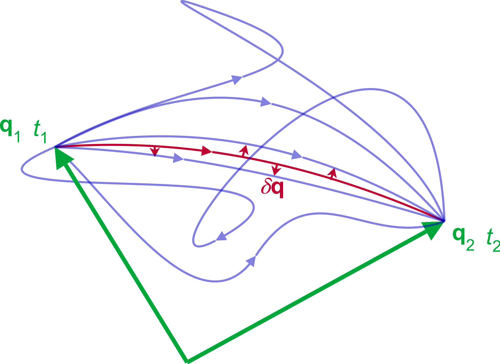

# Classical Mechanics {#Classical}


Quantum mechanics cannot be derived from classical mechanics, but classical mechanics can inspire quantum mechanics. Quantum mechanics is richer and more sophisticated than classical mechanics. Quantum mechanics was developed during the period when physicists had rich knowledge of classical mechanics. In order to better understand how quantum mechanics was developed in this environment, it is better to understand some fundamental concepts in classical mechanics. Classical mechanics can be considered as a special case of quantum mechanics. We will review some classical mechanics concepts here.

## Newtonian Formulation
In classical mechanics, a particle moving in the presence of potential $V(q)$ will experience a force given by:

\begin{equation}
F(q) = -\frac{dV(q)}{dq},
(\#eq:class1)
\end{equation}

where $q$ represents the coordinate or the position of the particle. Hence, the particle can be described by the equations of motion:

\begin{equation}
\frac{dp}{dt} = \dot{p} = F(q) = -\frac{dV (q)}{dq},\quad \frac{dq}{dt} =\dot{q}= \frac{p}{m}.
(\#eq:class2)
\end{equation}

For example, when a particle is attached to a spring and moves along a frictionless surface, the force the particle experiences is $F(q) = -kq$ where $k$ is the spring constant. Then the equations of motion of this particle are

\begin{equation}
\dot{p}=-kq,\quad \dot{q}=p/m
(\#eq:class3)
\end{equation}

Given $p$ and $q$ at some initial time $t_0$, one can integrate \@ref(eq:class2) or \@ref(eq:class3) to obtain $p$ and $q$ for all later time. Notice that only two variables $p$ and $q$ are sufficient to describe the state of a particle. These equations of motion are essentially derived using Newton’s law. However, there are at least two other methods of deriving these equations of motion, which are described below. 

## Lagrangian Formulation
Another way to derive the equations of motion for classical mechanics is via the use of the Lagrangian and the principle of least action. The Lagrangian formulation is obtained by starting from the definition of the Lagrangian of the system:

\begin{equation}
L = K - V,
(\#eq:lag1)
\end{equation}

where $K$ is the kinetic energy, and $V$ is the potential energy. Both are expressed in terms of coordinates $(q,\dot{q}$) where $q$ $\in$ $\mathbb{R}^{n}$ is the position vector and  $\dot{q}$ $\in$ $\mathbb{R}^{n}$ is the velocity vector. Notice that for a fixed time, $t$, $q$ and $\dot{q}$ are independent variables, since $\dot{q}$ cannot be derived from $q$ alone. 

The time integral of the Lagrangian is called the **action**, and is defined as:

\begin{equation}
S = \int_{t_1}^{t_2} L\, dt,
(\#eq:lag2)
\end{equation}

which is a functional: it takes in the Lagrangian function for all times between $t_1$ and $t_2$ and returns a scalar value. The equations of motion can be derived from the principle of least action,^[Sometimes also called principle of stationary action, or variational principle, or Hamilton's principle.] which states that the true evolution of a system $q(t)$ described by the coordinate $q$ between two specified states $q_1 = q(t_1)$ and $q_2 = q(t_2)$ at two specified times $t_1$ and $t_2$ is a stationary point of the action functional. For a stationary point:

\begin{equation}
\delta     S = \frac{dS}{dq}= 0
(\#eq:lag3)
\end{equation}

Requiring that the true trajectory $q(t)$ be a stationary point of the action functional $S$ we obtain the equation of motion (figure \@ref(fig:Fig1c2)^[This diagram is taken from [Wikipedia](https://en.wikipedia.org) by user Maschen, and distributed under CC0 license]). This can be achieved applying classical variational calculus to the variation of the action integral $S$ under perturbations of the path $q(t)$, eq. \@ref(eq:lag3). The resulting equation of motion (or set of equations in the case of many dimensions) is sometimes also called the Euler—Lagrange equation:^[The mathematical derivation of the Euler—Lagrange equaiton is rather long and unimportant at this stage. For the curious, it can be found [here](https://en.wikipedia.org/wiki/Euler–Lagrange_equation).]

\begin{equation}
\frac{d}{dt}\left(\frac{\partial L}{\partial\dot q}\right)=\frac{\partial L}{\partial q}.
(\#eq:lag4)
\end{equation}


```{r Fig1c2, out.width='70%', fig.show='hold', echo=FALSE, fig.align = 'center', fig.cap='Principle of least action: As the system evolves, q traces a path through configuration space (only some are shown). The path taken by the system (red) has a stationary action under small changes in the configuration of the system.'}

```

## Hamiltonian mechanics

A third way of obtaining the equation of motion is Hamiltonian mechanics, which uses the generalized momentum in place of velocity as a coordinate. The generalized momentum is defined in terms of the Lagrangian and the coordinates $(q,\dot{q})$:
 
\begin{equation} 
p = \frac{\partial L}{\partial\dot q}.
(\#eq:ham1)
\end{equation}

The Hamiltonian is defined from the Lagrangian by applying a Legendre transformation as:^[We have already encountered Legendre transform in [The Live Textbook of Physical Chemistry 1](https://peverati.github.io/pchem1/Potentials.html#thermpot) when transforming from the thermodynamic energy to any of the other thermodynamic potentials.]

\begin{equation} 
H(p,q) = p\dot{q} - L(q,\dot{q}),
(\#eq:ham2)
\end{equation}

The Lagrangian equation of motion becomes a pair of equations known as the Hamiltonian system of equations: 

\begin{equation} 
\begin{aligned}
\dot{p}=\frac{dp}{dt} &= -\frac{\partial H}{\partial q} \\
\dot{q}=\frac{dq}{dt} &= +\frac{\partial H}{\partial p},
\end{aligned}
(\#eq:ham3)
\end{equation}
 
where $H=H(q,p,t)$ is the Hamiltonian of the system, which often corresponds to its total energy. For a closed system, it is the sum of the kinetic and potential energy in the system:

\begin{equation}
H = K + V.
(\#eq:hamdef)
\end{equation}

Notice the difference between the Hamiltonian, eq. \@ref(eq:hamdef), and the Lagrangian, eq. \@ref(eq:lag1). In Newtonian mechanics, the time evolution is obtained by computing the total force being exerted on each particle of the system, and from Newton's second law, the time evolutions of both position and velocity are computed. In contrast, in Hamiltonian mechanics, the time evolution is obtained by computing the Hamiltonian of the system in the generalized momenta and inserting it into Hamilton's equations. This approach is equivalent to the one used in Lagrangian mechanics, since the Hamiltonian is the Legendre transform of the Lagrangian. The main motivation to use Hamiltonian mechanics instead of Lagrangian mechanics comes from the more simple description of complex dynamic systems.

> ```{example, hamex1}
*Basic Interpretation of Hamiltonian Mechanics*

A simple interpretation of Hamiltonian mechanics comes from its application on a one-dimensional system consisting of one particle of mass $m$. The Hamiltonian can represent the total energy of the system, which is the sum of kinetic and potential energy. 

\begin{equation}
\begin{aligned}
H &= K+V \\
K &={\frac {p^{2}}{2m}},\quad V=V(q),
\end{aligned}
(\#eq:ham4)
\end{equation}

where $q$ is the space coordinate and $p=m\dot{q}$ is the momentum. Then
$k$ is a function of $p$ alone, while $V$ is a function of $q$ alone.

In this example, the time derivative of the momentum $p$ equals the Newtonian force, and so the first Hamilton equation means that the force equals the negative gradient of potential energy:

\begin{equation}
\text{Newtonian force:}\qquad \frac{dp}{dt} = -\frac{\partial V(q)}{\partial q},
(\#eq:ham5)
\end{equation}

which is exactly the first equation of motion in eq. \@ref(eq:class2) of Newtonian mechanics. Notice that this equaiton could have been easily obtained in the Lagrangian formulation by writing the Lagrangian \@ref(eq:lag1), and using the Euler-Lagrange equation, eq. \@ref(eq:lag4). 
The time derivative of $q$ is the velocity, and so the second Hamilton equation means that the particle's velocity equals the derivative of its kinetic energy with respect to its momentum:

\begin{equation}
\text{Velocity:}\qquad \frac{dq}{dt} = \frac{\partial K}{\partial p} = \frac{\partial \left(\frac{p^2}{2m}\right)}{\partial p} = \frac{p}{m},
(\#eq:ham6)
\end{equation}
 
which is exactly the second equation of motion in eq. \@ref(eq:class2) of Newtonian mechanics.

```


