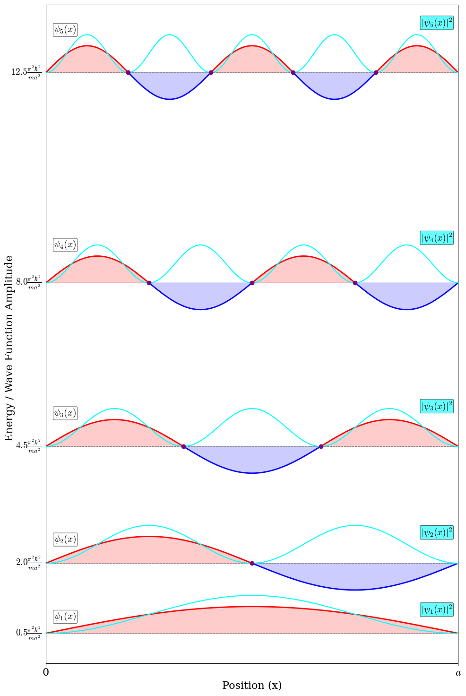
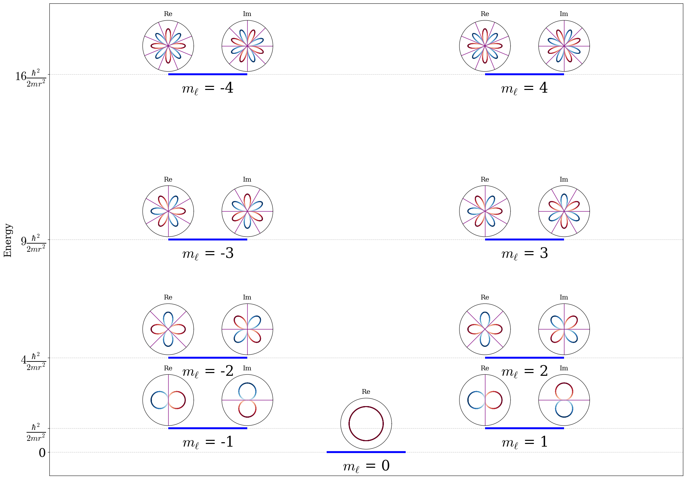
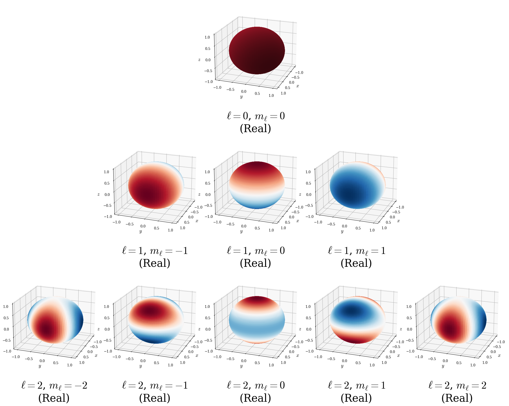
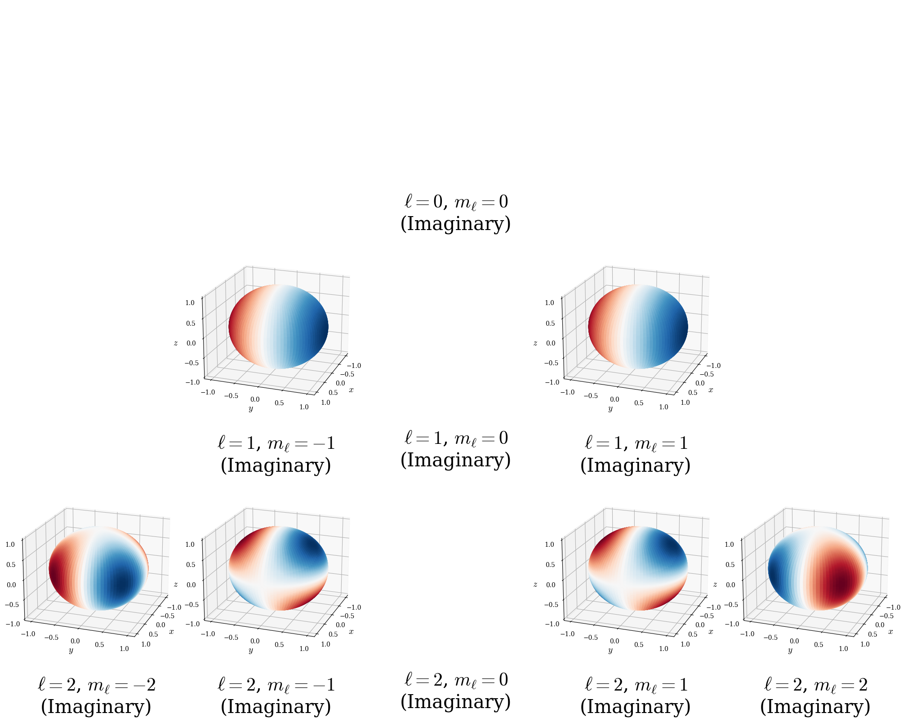
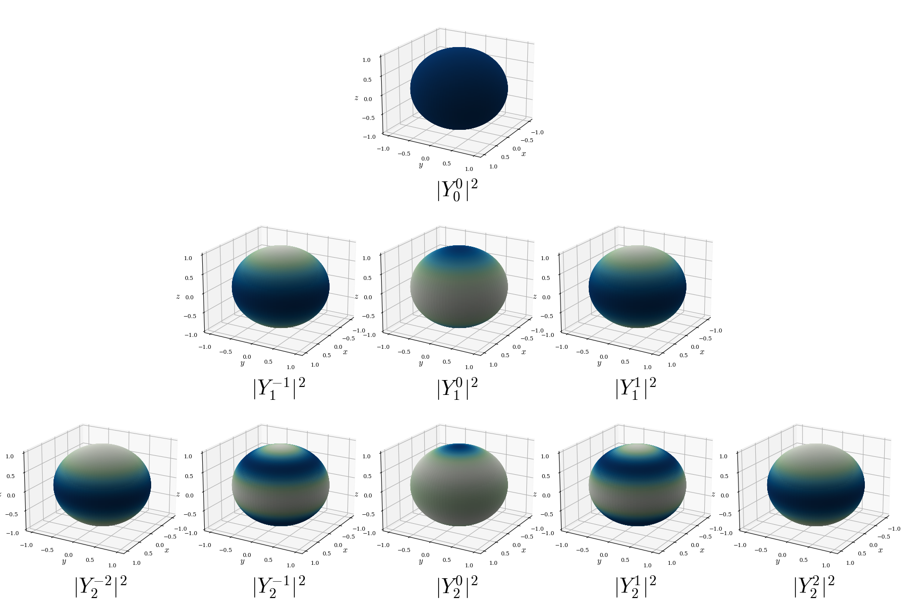
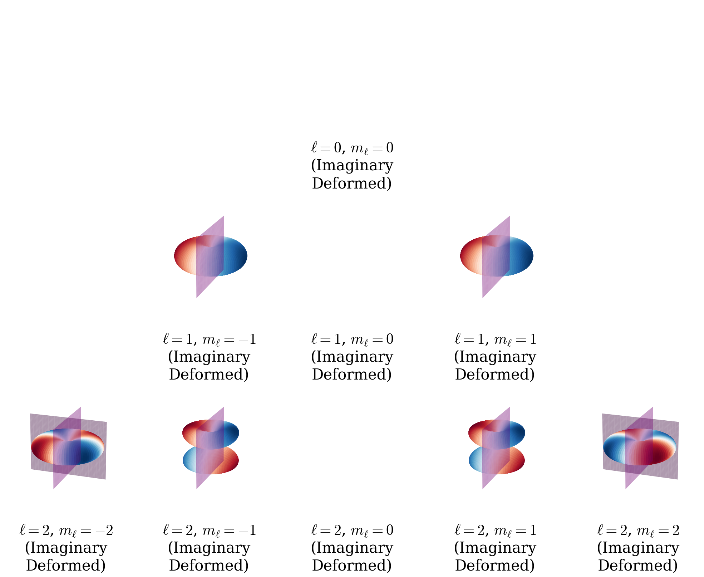

# Analytically Solvable Models {#Models}

The TISEq can be solved analytically only in a few special cases. We saw one of those special cases, the free particle, at the end of the previous chapter. In this section, we will analyze four others. Luckily, we can use these solutions to explain most of the effects in chemistry since we can combine them to describe the hydrogen atom upon which we can build more complex chemical systems, as we will show in the next chapters.

## The Particle in a Box

We can start by considering a particle constrained to move in a single dimension, under the influence of a potential $V(x)$ which is zero for  $0 \leq x \leq a$ and infinite elsewhere. Since the wavefunction is not allowed to become infinite, it must have a value of zero where $V(x)$ is infinite, so $\psi(x)$ is nonzero only within $[0,a]$. The Schrödinger equation is thus:

\begin{equation}
- \frac{\hbar^2}{2m} \frac{d^2\psi}{dx^2} = E \psi(x)
\qquad 0 \leq x \leq a.
(\#eq:PIB1)
\end{equation}

In other words, inside the box $\psi(x)$ describes a free particle, but outside the box $\psi(x)=0$. Since the Schrödinger equation involves derivatives, the function that solves it, $\psi(x)$, must be everywhere continuous and everywhere continuously differentiable. This fact means that the value of the wave function at the two extremes must be equal to zero:

\begin{equation}
\psi(0)=\psi(a)=0.
(\#eq:PIB2)
\end{equation}

Inside the box the solution will be the same as for the free particle:

\begin{equation}
\psi(x) = A e^{ikx} + B e^{-ikx},
(\#eq:PIB3)
\end{equation}

where $A$ and $B$ are constants. Using the two constraints in eq. \@ref(eq:PIB2), we get at $x=0$:

\begin{equation}
\psi(0) = A + B = 0 \implies B = -A
(\#eq:PIB4)
\end{equation}

And at $x=a$:

\begin{equation}
\psi(a) = A e^{ika} + B e^{-ika} = 0.
(\#eq:PIB5)
\end{equation}

Replacing \@ref(eq:PIB4) into \@ref(eq:PIB5) gives:

\begin{equation}
A e^{ika} - A e^{-ika} = 0
(\#eq:PIB6)
\end{equation}

which is then easily simplified into:

\begin{equation}
e^{ikL} = e^{-ika}\\
e^{i2ka} = 1.
(\#eq:PIB7)
\end{equation}

This equation is solved when:

\begin{equation}
2ka = 2n\pi,
(\#eq:PIB8)
\end{equation}

which is trivially solved by either $k=0$ or $a=0$. This trivial solution is completely uninteresting, since it describes no particles in no boxes. A more interesting set of solutions however, are those for which:

\begin{equation}
k_n = \frac{n\pi}{a} \quad (n = 1, 2, 3,\dots,\infty),
(\#eq:PIB9)
\end{equation}

which represents an infinite set of functions, $\psi_n(x)$, determined by a positive integer number $n$, called *quantum number*. Since these functions solve the TISEq, they are also called *eigenfunctions*, but they are not a continuous set, unlike in the previous case. 

Using \@ref(eq:PIB4), the wave functions becomes:

\begin{equation}
\psi_n(x) = A \left(e^{i\frac{n\pi x}{a}} - e^{-i\frac{n\pi x}{a}}\right),
(\#eq:PIB10)
\end{equation}

and using Euler's formula $\left(\sin\theta = \frac{e^{i\theta} - e^{-i\theta}}{2i}\right)$, we get:

\begin{equation}
\psi_n(x) = A \frac{e^{i\frac{n\pi x}{a}} - e^{-i\frac{n\pi x}{a}}}{2i} = C \sin\left(\frac{n\pi x}{a}\right)
(\#eq:PIB11)
\end{equation}

where $C = \frac{A}{i}$ is a complex constant.

To calculate the energy eigenvalues, we can replace \@ref(eq:PIB6) into eq. \@ref(eq:PIB1), to obtain:

\begin{equation}
E_n = n^2 \frac{\pi^2 \hbar^2 }{2 m a^2} =  \quad (n=1,2,\ldots,\infty).
(\#eq:PIB12)
\end{equation}

A few interesting considerations can be made from the results of eq. \@ref(eq:PIB7). First, although there is an infinite number of acceptable values of the energy (eigenvalues), these values are not continuous. Second, the lowest value of the energy is not zero, and it depends on the size of the box, $a$, since:

\begin{equation}
E_1 = \frac{\pi^2 \hbar^2 }{2 m a^2}\neq 0.
(\#eq:PIB13)
\end{equation}

This value is called *zero-point energy (ZPE)*, and is a purely quantum mechanical effect. Notice that we did not solve for the constant $A$. This task is not straightforward, and it can be achieved by requiring the wave function to describe one particle exclusively (we will come back to this task after chapter 7).


The most profound physical insight from the particle in a box solution comes from Born's interpretation of the wave function. The probability of finding the particle between positions $x$ and $x+dx$ is given by $|\psi_n(x)|^2 dx$, where $|\psi_n(x)|^2$ is called the **probability density**.

For the particle in a box eigenfunctions in eq. \@ref(eq:PIB6), the probability density is:

\begin{equation}
|\psi_n(x)|^2 = A^2 \sin^2\left(\frac{n\pi x}{a}\right).
(\#eq:PIB14)
\end{equation}

This function tells us where the particle is *most likely* to be found if we measure its position.


### Wave function analysis

The main results of the solution of the TISEq for the particle in a box are reported in figure \@ref(fig:fig1c4). In this picture, the first five egenfunctions are plotted together with their probability densities and spaced according to their energy levels. The non-trivial nodes are also reported.


```{r fig1c4, out.width='80%', fig.show='hold', echo=FALSE, fig.align = 'center', fig.cap='The first five eigenfunctions and energy levels of a particle confined inside a box by walls with infinte potential energy. The nodes of the wave functions are reported as purple dots. The probablility density for each level is also plotted in cyan.'}

```

A few important considerations can be made by analyzing the plots of the solutions, specifically:

1. **Eigenfunctions**: The solution of the TISEq for the particle in a box are mathematically identical to the **standing wave** modes on a vibrating string fixed at both ends. In classical waves, boundary conditions quantize allowed frequencies; in quantum mechanics, the infinite walls quantize energy via de Broglie waves, yielding stationary states that don’t propagate but “stand” with fixed nodes. 

2. **Eigenvalues**: The energy levels are not equidistant from each other, with the gap increasing linearly with $2n+1$: low-lying levels are closer together, and higher levels get progressively farther apart.

3. **Nodes**: At $x = 0$, $x = a$, and at $x = \frac{ka}{n}$ (where $k = 1, 2, ..., n-1$), we have $\sin\left(\frac{n\pi x}{a}\right) = 0$, so $|\psi_n(x)|^2 = 0$. These are **nodes** where the probability of finding the particle is exactly zero. The boundary nodes, however, are rather trivial, as they are forced by the infinite potential walls, and not a direct consequence of the wavefunction’s oscillatory nature. The $n$-th energy eigenstate has exactly ($n-1$) nodes *inside* the box.

4. **Peak probability**: The maxima of $|\psi_n(x)|^2$ occur where $\sin^2\left(\frac{n\pi x}{a}\right)$ is maximum. These **antinodes** represent regions of highest probability.
$\\$
For the ground state ($n=1$), $|\psi_1(x)|^2 = A^2 \sin^2\left(\frac{\pi x}{a}\right)$ has one maximum at $x = a/2.$ The particle is most likely to be found at the center of the box. For the first excited state ($n=2$), $|\psi_2(x)|^2 = A^2 \sin^2\left(\frac{2\pi x}{a}\right)$ has a node at $x = a/2$ and two equal maxima at $x = a/4$ and $x = 3a/4.$ The particle has zero probability of being at the center.
$\\$
Unlike classical mechanics where a particle with definite energy bounces back and forth uniformly across the box, quantum stationary states have non-uniform position probability distributions. The particle doesn't "spend equal time everywhere" - instead, it's more likely to be found near the antinodes of the wave function.<br><br>
Notice that we can use the trigonometric identity, $\sin^2\theta = \frac{1 - \cos(2\theta)}{2}$, to obtain: 
$\\$
\begin{equation}
|\psi_n(x)|^2 = A^2 \left[1 - \cos\left(\frac{2n\pi x}{a}\right)\right].
(\#eq:PIB15)
\end{equation}
$\\$
This shows that the probability density is the sum of a uniform background ($A^2$) modulated by a rapidly oscillating term whose frequency increases with $n$. As $n$ becomes large (high energy states), $|\psi_n(x)|^2$ becomes more uniform across the box, approaching the classical limit.
$\\$
The connection between nodes, energy, and probability distribution is fundamental. Higher energy states oscillate more rapidly and have more nodes, reflecting their increased "kinetic energy" through faster spatial variation.


## The Particle on a Ring

We can extend our understanding of confined quantum systems by considering a particle constrained to move in a circle of fixed radius $r$. This model, known as the particle on a ring (or particle in a ring), represents the rotational motion of a particle about a fixed axis. 

While this system seems to be a 2-dimensional problem, in reality it is exactly the same problem as the particle in a box, with the two endpoints of the box wrapping around themselves and touching each other. However, rather than working with a single linear coordinate, $x$, we can use the set of polar coordinates, $(r,\phi)$, where only the azimuthal angle $\phi$ varies (with $0 \leq \phi \leq 2\pi$). The radial coordinate $r$ is held constant. The wave function $\psi(x)$ can be easily written as $\psi(\phi)$ by using $\phi=x/r$. Thus the second derivative becomes:

\begin{equation}
\frac{d^2\psi(x)}{dx^2} = \frac{1}{r^2} \frac{d^2\psi(\phi)}{d\phi^2},
(\#eq:PIB0)
\end{equation}


and the time-independent Schrödinger equation can be obtained directly from eq. \@ref(eq:PIB1) as:

\begin{equation}
-\frac{\hbar^2}{2m r^2}\frac{d^2\psi(\phi)}{d\phi^2} = E\psi(\phi).
(\#eq:PIR1)
\end{equation}


For a classical particle rotating about the origin in the $xy$-plane, its kinetic energy is expressed as:

\begin{equation}
E=\frac{L_z^2}{2I},
(\#eq:PIR1b)
\end{equation}

where $I = m r^2$ is the moment of inertia of the particle about the axis of rotation and $L_z$ is the component of the angular momentum along the $z$ axis, perpendicular to the rotation plane. The TISEq can then be rewritten as:

\begin{equation}
-\frac{\hbar^2}{2I}\frac{d^2\psi(\phi)}{d\phi^2} = E\psi(\phi),
(\#eq:PIR2)
\end{equation}

where it is now evident that the energy of the quantum mechanical system is directly related to the component $L_z$ of the angular momentum, as in the classical case. Since the angular momentum $\mathbf{L}=\mathbf{r}\times \mathbf{p}$, $\mathbf{L}$ must point in the z-direction when $\mathbf{r}$ and $\mathbf{p}$ both lies on the $xy$-plane.

The boundary condition for the particle in a ring comes from the requirement that the wavefunction must be single-valued, meaning that as we traverse the ring from angle $\phi = 0$ to $\phi = 2\pi$, we must return to the same value:


\begin{equation}
\psi(\phi) = \psi(\phi + 2\pi)
(\#eq:PIR3)
\end{equation}

Similarly to the previous cases, the general solution to the TISEq above is:

\begin{equation}
\psi(\phi) = A e^{ik\phi} + B e^{-ik\phi}
(\#eq:PIR4)
\end{equation}

where $A$ and $B$ are constants. Applying the single-valuedness boundary condition requires that $e^{ik \cdot 2\pi} = 1$, which is satisfied only when $k = m_\ell$, where $m_\ell$ is an integer (positive, negative, or zero) called *azimuthal quantum number*. The set of acceptable solutions is therefore:

\begin{equation}
\psi_{m_\ell}(\phi) = A e^{im_\ell\phi}\quad (m_\ell = 0, \pm1, \pm2, \ldots, \pm\infty).
(\#eq:PIR5)
\end{equation}

The $m_\ell = 0$ solution is equivalent to the $n=1$ solution of the particle in a box, while the remaining solutions represent vibrations in the clockwise (positive solutions, $L_z$ pointing upwards) and counter-clockwise (negative solutions, $L_z$ pointing downwards) directions.

To find the energy eigenvalues, we substitute the eigenfunction back into the Schrödinger equation. Taking the second derivative of $\psi_{m_\ell}(\phi)$:

\begin{equation}
\frac{d^2\psi_{m_\ell}}{d\phi^2} = -m_\ell^2 e^{im_\ell\phi} = -m_\ell^2 \psi_{m_\ell}(\phi)
(\#eq:PIR6)
\end{equation}

Replacing this derivative in the Schrödinger equation, we obtain:

\begin{equation}
-\frac{\hbar^2}{2mr^2}(-m_\ell^2)\psi_{m_\ell} = E\psi_{m_\ell},
(\#eq:PIR7)
\end{equation}

and the final energy levels, as:

\begin{equation}
E_{m_\ell} = \frac{\hbar^2 m_\ell^2}{2mr^2} = \frac{\hbar^2 m_\ell^2}{2I}.
(\#eq:PIR8)
\end{equation}

The energy levels of the particle on a ring are plotted for the first five levels in figure \@ref(fig:fig5c4). 

```{r fig5c4, out.width='90%', fig.show='hold', echo=FALSE, fig.align = 'center', fig.cap='Energy level diagram and degeneracy pattern for the particle-on-a-ring. Both the real and imaginary parts of the wave functions of the first five energy levels are represented using polar plots (see text for explanation), with nodes reported as purple diameters of the physical ring (black circle).'}

```


Using the definition of kinetic energy for a classical system in eq. \@ref(eq:PIR1b), we get:

\begin{equation}
\frac{L_z^2}{2I} = \frac{\hbar^2 m_\ell^2}{2I},
(\#eq:PIR9)
\end{equation}

which implies that the angular momentum along the $z$-axis is quantized in units of $\hbar$ as:

\begin{equation}
L_z = \hbar m_\ell \quad (m_\ell = 0, \pm1, \pm2, \ldots, \pm\infty).
(\#eq:PIR10)
\end{equation}

A rotating charged particle orbiting the ring generates a magnetic moment $\boldsymbol{\mu} \propto \mathbf{L}$. Thus eq. \@ref(eq:PIR10), which quantizes $L_z$, explains why $m_\ell$ is called the **magnetic quantum number**. Several important observations can be made from these results. First, the energy eigenvalues form a discrete set, as expected for a confined system. Second, except for the ground state ($m_\ell = 0$), each energy level is doubly degenerate: the states with $m_\ell$ and $-m_\ell$ have the same energy. This makes physical sense because rotation in the positive and negative directions (clockwise and counter-clockwise) should have the same energy. Third, the energy does not depend on the sign of $m_\ell$, which is a consequence of the fact that energy depends on $L_z^2$, and $(-m_\ell)^2 = (m_\ell)^2$. This is the first instance we have seen of a degeneracy arising from the symmetry of the system itself (rotational symmetry).


### Wave function analysis
The eigenfunctions in eq. \@ref(eq:PIR6) are complex functions and their visualization is not as simple as for the particle in a box. For $m_\ell \neq 0$, these represent states with definite angular momentum $L_z = \hbar m_\ell$. The probability density is:

\begin{equation}
|\psi_{m_\ell}(\phi)|^2 = |A|^2,
(\#eq:PIR11)
\end{equation}

which is **uniform around the ring**. This means that the particle is equally likely to be found at any point on the ring in these states, consistent with our expectation that a state with definite angular momentum should have no preferred position on the ring. 

Visualizing the particle-on-a-ring wave functions presents a challenge: the system is **intrinsically 1D** (motion along the circle), yet the **ring geometry requires 2D projection** for intuitive understanding. The clearest visualization plots the real and imaginary parts of $\psi_{m_\ell}(\phi)$ as height above/below the ring in the $xy$-plane, as in figure \@ref(fig:fig2c4):

- $xy$-plane: Shows the circular path ($\phi = 0$ to $2\pi$)
- $z$-axis: Real part $\Re[\psi_{m_\ell}] = \frac{1}{\sqrt{2\pi}}\cos(m_\ell\phi)$ (left column)
- $z$-axis: Imaginary part $\Im[\psi_{m_\ell}] = \frac{1}{\sqrt{2\pi}}\sin(m_\ell\phi)$ (right column)

This 3D representation preserves both the physical ring constraint and reveals the oscillatory nodal structure as $\phi$ varies around the circle.


```{r fig2c4, out.width='50%', fig.show='hold', echo=FALSE, fig.align = 'center', fig.cap='3D visualization of particle-on-a-ring eigenfunctions $\\psi_{m_\\ell}(\\phi) = \\frac{1}{\\sqrt{2\\pi}} e^{i m_\\ell \\phi}$. Left column: Real part $\\Re[\\psi_{m_\\ell}] = \\frac{1}{\\sqrt{2\\pi}}\\cos(m_\\ell\\phi)$. Right column: Imaginary part $\\Im[\\psi_{m_\\ell}] = \\frac{1}{\\sqrt{2\\pi}}\\sin(m_\\ell\\phi)$. Each row shows states with quantum numbers $m_\\ell = 0, +1, -1, +2, -2$. The black circle represents the ring of fixed radius $r$. The colored surface shows wavefunction amplitude plotted as height ($z$-axis) above/below the ring as the azimuthal angle $\\phi$ varies from 0 to $2\\pi$. Each component has exactly $2|m_\\ell|$ nodal points, with $\\pm m_\\ell$ pairs showing opposite phase winding directions (degenerate in energy).'}
knitr::include_graphics('./img/PIR_3d.png')
```


Alternatively, **2D contour plots** map the real and imaginary parts of $\psi_{m_\ell}(\phi)$ onto the ring using a color gradient, as it's done in figure \@ref(fig:fig3c4):

- Red shades (darker = more positive amplitude).
- Blue shades (darker = more negative amplitude).
- White/light colors = near zero (nodes).

These are top-down views of the 3D plots in figure \@ref(fig:fig2c4), excellent for identifying nodal positions. In the particle-in-a-box, nodes were single points along a line. For the particle-on-a-ring, these clots show that nodes become pairs of diametrically opposite points on the circle. The diametric pairing reflects the rotational symmetry: if $\cos(m_\ell\phi_0) = 0$, then $\cos(m_\ell(\phi_0 + \pi)) = -\cos(m_\ell\phi_0) = 0$.

```{r fig3c4, out.width='50%', fig.show='hold', echo=FALSE, fig.align = 'center', fig.cap='Top-down 2D contour plots of particle-on-a-ring eigenfunctions $\\psi_{m_\\ell}(\\phi) = \\frac{1}{\\sqrt{2\\pi}} e^{i m_\\ell \\phi}$. Left column: Real part $\\Re[\\psi_{m_\\ell}] = \\frac{1}{\\sqrt{2\\pi}}\\cos(m_\\ell\\phi)$. Right column: Imaginary part $\\Im[\\psi_{m_\\ell}] = \\frac{1}{\\sqrt{2\\pi}}\\sin(m_\\ell\\phi)$. Each row shows states with quantum numbers $m_\\ell = 0, +1, -1, +2, -2$. Color scheme: Dark red (positive amplitude), dark blue (negative amplitude), white/light colors (nodes $\\approx$ 0). Each component shows exactly $2|m_\\ell|$ nodal points appearing as diametrically opposite pairs due to rotational symmetry.'}
knitr::include_graphics('./img/PIR_top.png')
```
genfunctions can also be visualized using **polar plots** against the azimuthal angle $\phi$, as shown in figure \@ref(fig:fig4c4):

- The **radial distance** from the center represents the **amplitude** of the real or imaginary part of the wavefunction.
- The **angular position** corresponds to **azimuthal angle** ($\phi$).

This representation clearly reveals the nodes where amplitude = 0, appearing as returns to the origin, and the lobes, that is regions of maximum amplitude. However, this visualization has a limitation, as it completely loses the physical ring geometry. The particle remains confined to a circle of fixed radius $r$, but the polar plot makes it appear as if it explores a 2D disk. When observing the polar plots, it is important to keep in mind that **the lobes are not spatial probability distributions** in 2D space. They represent the **magnitude of the real/imaginary parts** of $\psi_{m_\ell}(\phi)$ evaluated along the ring. The actual position probability $|\psi|^2 = |A|^2$ remains perfectly uniform around the circle for all states.

```{r fig4c4, out.width='50%', fig.show='hold', echo=FALSE, fig.align = 'center', fig.cap='Polar plots of particle-on-a-ring eigenfunctions $\\psi_{m_\\ell}(\\phi) = \\frac{1}{\\sqrt{2\\pi}} e^{i m_\\ell \\phi}$. Left column: Real part $\\Re[\\psi_{m_\\ell}] = \\frac{1}{\\sqrt{2\\pi}}\\cos(m_\\ell\\phi)$. Right column: Imaginary part $\\Im[\\psi_{m_\\ell}] = \\frac{1}{\\sqrt{2\\pi}}\\sin(m_\\ell\\phi)$. Each row shows states with quantum numbers $m_\\ell = 0, +1, -1, +2, -2$. Radial distance from center $\\propto$ wavefunction amplitude; angular position = $\\phi$. Nodes appear where the curve returns to the origin ($2|m_\\ell|$ per component). Note: Lobes represent amplitude along the ring, not 2D spatial probability (actual $|\\psi|^2$ is uniform).'}
knitr::include_graphics('./img/PIR_polar.png')
```


## The Particle on a Sphere

Extending the particle on a ring to a three-dimensional case, we get a particle confined on the surface of a sphere (particle on a sphere). This system is a 2-dimensional system analogous to the motion of a rigid rotor. The rigid rotor is a simple model of a rotating stick in three dimensions. We consider the stick to consist of two point-masses at a fixed distance. We then reduce the model to a single-particle system by considering the rigid rotor to have one mass fixed at the origin, which is orbited by the reduced mass $\mu$, at a distance $r$.^[Notice that if we consider an electron rotating at a fixed distance around a nucleus, then the difference in the mass of the electron and the reduced mass of the electron-nucleus system is to all intent and purposes negligible, and we can treat this case as a particle on a sphere.] The Cartesian coordinates, ${x,y,z}$, are not optimal to represent the system, and they are usually replaced by three spherical polar coordinates: the co-latitude (zenith) angle $\theta$, the longitudinal (azimuth) angle $\phi$, and the distance $r$. If the orbiting mass (the electron) is held at a constant distance from the origin, the system reduces to a 2-dimensional system by simply keeping $r$ constant. The TISEq of the system in spherical coordinates is:

\begin{equation}
- \frac{\hbar^2}{2I} \left[ \frac{1}{\sin \theta}
\frac{\partial}{\partial \theta} \left(\sin\theta\frac{\partial}{\partial \theta} \right) + \frac{1}{\sin^2 \theta} \frac{\partial^2}{\partial \phi^2} \right] \psi(r) = E \psi(r),
(\#eq:RR1)
\end{equation}

where $I=\mu r^2$ is the moment of inertia, as for the particle in a ring case. After a little effort, the eigenfunctions can be shown to be the complex spherical harmonics:^[For a description of the spherical harmonics see [here](https://en.wikipedia.org/wiki/Spherical_harmonic)] 

\begin{equation}
Y_{\ell}^{m_{\ell}}(\theta, \phi) = N P_l^{|m_\ell|}(\cos\theta) e^{im_\ell\phi},
(\#eq:RR1b)
\end{equation}

where $P_l^{|m_\ell|}(\cos\theta)$ denotes the associated Legendre polynomials, and $N$ is a normalization constant. As for the previous cases, the eigenvalues are quantized and are simply: 

\begin{equation}
E_{\ell} = \frac{\hbar^2}{2I} \ell(\ell+1)\quad (\ell=0,1,2,\ldots,\infty),
(\#eq:RR2)
\end{equation}

where $m_\ell$ is the **magnetic quantum number**. The spherical harmonic functions depend on a second quantum number, $m_{\ell}=-\ell, -\ell+1, \ldots, \ell-1, \ell$, which is the same  **magnetic quantum number** that we encounter for the particle on a ring. For the spherical harmonics, however, the energy does not depend on the magnetic quantum number, and functions with the same $\ell$ but different $m_\ell$ are energy-degenerate. Each energy level $E_{\ell}$ is $(2\ell+1)$-fold degenerate in $m_{\ell}$. Surprisingly enough, this problem was, after all, a one-dimensional problem in disguise, similarly to the previous two cases. The two angular variables, $(\theta,phy)$, that enters the wave function are indeed completely identical to each other, with one of the two determining the energy (the magnitude of the angular momentum of the circular motion) and the other determining only an energetically irrelevant orientation for the circular motion. Notice, however, that both these components are quantized. So, for a rigid rotor, the magnitude of the angular momentum along the $z$-axis is quantized in units of $\hbar$ and jumps discontinuously from one value to the next, as for the particle on a ring case.^[You can think of this as either the "speed" at which the rotor is rotating, or even better, as its "angular frequency".] For the particle-on-a-sphere case, however, the orientation in space at which the rotor is allowed to rotate is also quantized and it changes discontinuously. The energy levels of the particle on a sphere are plotted for the first five levels in figure \@ref(fig:fig5bc4). 

```{r fig5bc4, out.width='90%', fig.show='hold', echo=FALSE, fig.align = 'center', fig.cap='Energy level diagram and degeneracy pattern for the particle-on-a-sphere.'}
knitr::include_graphics('./img/SH_levels.png')
```

### Wave function analysis 

The analytical expressions for the first three energy levels $(\ell=0,1,2)$ of the rigid rotor
are:

$\boldsymbol{\ell=0}:$

$\quad Y_0^0(\theta,\phi) = \frac{1}{2}\sqrt{\frac{1}{\pi}}.$


$\boldsymbol{\ell=1}:$

$\quad Y_1^{-1}(\theta,\phi) = \frac{1}{2}\sqrt{\frac{3}{2\pi}} e^{-i\phi} \sin\theta = \frac{1}{2}\sqrt{\frac{3}{2\pi}} \frac{x-iy}{r}.$

$\quad Y_1^{0}(\theta,\phi) = \frac{1}{2}\sqrt{\frac{3}{\pi}} \cos\theta = \frac{1}{2}\sqrt{\frac{3}{\pi}} \frac{z}{r}.$

$\quad Y_1^{1}(\theta,\phi) = -\frac{1}{2}\sqrt{\frac{3}{2\pi}} e^{i\phi} \sin\theta = -\frac{1}{2}\sqrt{\frac{3}{2\pi}} \frac{x+iy}{r}.$


$\boldsymbol{\ell=2}:$

$\quad Y_2^{-2}(\theta,\phi) = \frac{1}{4}\sqrt{\frac{15}{2\pi}} e^{-2i\phi} \sin^2\theta = \frac{1}{4}\sqrt{\frac{15}{2\pi}} \frac{(x-iy)^2}{r^2}.$

$\quad Y_2^{-1}(\theta,\phi) = \frac{1}{2}\sqrt{\frac{15}{2\pi}} e^{-i\phi} \sin\theta \cos\theta = \frac{1}{2}\sqrt{\frac{15}{2\pi}} \frac{(x-iy)z}{r^2}.$

$\quad Y_2^{0}(\theta,\phi) = \frac{1}{4}\sqrt{\frac{5}{\pi}} (3\cos^2\theta - 1) = \frac{1}{4}\sqrt{\frac{5}{\pi}} \frac{3z^2 - r^2}{r^2}.$

$\quad Y_2^{1}(\theta,\phi) = -\frac{1}{2}\sqrt{\frac{15}{2\pi}} e^{i\phi} \sin\theta \cos\theta = -\frac{1}{2}\sqrt{\frac{15}{2\pi}} \frac{(x+iy)z}{r^2}.$

$\quad Y_2^{2}(\theta,\phi) = \frac{1}{4}\sqrt{\frac{15}{2\pi}} e^{2i\phi} \sin^2\theta = \frac{1}{4}\sqrt{\frac{15}{2\pi}} \frac{(x+iy)^2}{r^2}.$

Visualizing spherical harmonics presents the same challenges as the particle on a ring, but amplified by dimensionality. The particle lives on a 2D spherical surface (requiring 3D embedding), and we need to show both position ($\theta,\phi$) and amplitude $\left(Y_\ell^{m_\ell}\right)$—a 4D problem squeezed into 3D plots.

The solution mirrors the ring contour plots: we map the amplitude directly to a color gradient on the unit sphere surface. Red shades represent positive values of $\Re\left[ Y_\ell^{m_\ell}(\theta,\phi)\right]$ or $\Im \left[Y_\ell^{m_\ell}(\theta,\phi)\right]$, blue shades represent negative values, and white/light colors mark the nodes where the harmonic equals zero. Figure \@ref(fig:fig6c4) shows these color maps for the real parts across $\ell=0,1,2$, while figure \@ref(fig:fig7c4) shows the corresponding imaginary parts.


```{r fig6c4, out.width='90%', fig.show='hold', echo=FALSE, fig.align = 'center', fig.cap='Color gradient maps of the real part $(\\Re[Y_\\ell^{m_\\ell}(\\theta,\\phi)])$ for spherical harmonics of the rigid rotor. Color scheme: Red (positive), blue (negative), white/light (nodal grat circles where $Y_\\ell^{m_\\ell}=0$). Each $\\ell$ manifold shows characteristic nodal structure: 0 nodal lines $(\\ell=0)$, 1 nodal surface $(\\ell=1)$, 2 nodal surfaces $(\\ell=2)$.'}

```


```{r fig7c4, out.width='90%', fig.show='hold', echo=FALSE, fig.align = 'center', fig.cap='Color gradient maps of the imaginary part $(\\Im[Y_\\ell^{m_\\ell}(\\theta,\\phi)])$ for spherical harmonics of the rigid rotor. Color scheme: Red (positive), blue (negative), white/light (nodal lines where $Y_\\ell^{m_\\ell}=0$). Each $\\ell$ manifold shows characteristic nodal structure: 0 nodal lines ($\\ell=0$), 1 nodal surface ($\\ell=1$), 2 nodal surfaces ($\\ell=2$).'}

```


This approach preserves the spherical geometry while clearly revealing the nodal lines as white curves separating red and blue regions, and makes the lobe structure immediately visible—directly extending the 1D ring visualization strategy to the 2D sphere.

Crucially, these plots visualize the wavefunction itself, not the probability density. The actual position probability on the sphere is given by $|Y_\ell^{m_\ell}(\theta,\phi)|^2$. Unlike the particle on a ring case, where $|\psi_{m_\ell}(\phi)|^2 = |A|^2$ was perfectly uniform, the spherical harmonics have non-uniform angular probability. For example:

-	$Y_0^0$: Uniform probability everywhere on sphere
-	$Y_1^0 \propto \cos\theta$: Probability peaks at poles, zero at equator
-	$Y_1^{\pm1} \propto \sin\theta$: Probability peaks at equator, zero at poles
-	$Y_2^0$: Probability concentrated along z-axis with equatorial minimum

To visualize the true probability distribution, we can plot $|Y_\ell^{m_\ell}|^2$ directly, which eliminates phase information ($\Re$, $\Im$) but reveals where the particle is most likely to be found on the sphere’s surface, as in figure \@ref(fig:fig8c4). The loss of phase is clear from the fact that the positive and negative $m_\ell$ functions on these plots look exactly identical. A simple interpretation of this fact is that the phase is associated with direction of rotation: Functions with positive $m_\ell$ represent clockwise rotation ($L_z$ pointing upwards), while functions with negative $m_\ell$ represent counter-clockwise rotation ($L_z$ pointing downwards), as for the particle on a ring.

```{r fig8c4, out.width='90%', fig.show='hold', echo=FALSE, fig.align = 'center', fig.cap='Probability density plots $|Y_\\ell^{m_\\ell}(\\theta,\\phi)|^2$ for spherical harmonics of the rigid rotor. Color scheme: Darker colors indicate higher probability density on the surface of the sphere. Unlike the particle on a ring (uniform $|\\psi|^2$), these show non-uniform angular probability: $(\\ell=0)$ uniform; $(\\ell=1)$ states peak at poles/equator; $(\\ell=2)$ states show complex 4-lobed or toroidal patterns. Probability integrates to 1 over sphere surface for each state.'}

```

An alternative, and often more intuitive, representation is obtained by plotting the magnitude of the spherical harmonic as a radial deformation of the sphere. In this parametric view, each point on the unit sphere $(\theta,\phi)$ is moved radially outward (or inward) by an amount proportional to $|Y_\ell^{m_\ell}(\theta,\phi)|$. The deformed surface is then colored to indicate the sign of the real part (for example, red for positive, blue for negative). This results in a parametric plot where the distance from the center at a given angle represents the magnitude of the amplitude of the spherical harmonic. These plots are reported in figure \@ref(fig:fig9c4) for the real part of the wave functions, and in figure \@ref(fig:fig10c4) for the imaginary part. These deformed plots correspond to the polar plots for the particle on a ring case we reported in figure \@ref(fig:fig3c4).


```{r fig9c4, out.width='90%', fig.show='hold', echo=FALSE, fig.align = 'center', fig.cap='Parametric plots of the real part of the spherical harmonics $Y_\\ell^{m_\\ell}(\\theta,\\phi)$. The radial deformation (distance from the center at a given angle) is proportional to $\\Re[Y_\\ell^{m_\\ell}(\\theta,\\phi)]$ (larger lobes = higher angular probability). The color indicates sign of real part (red=positive, blue=negative). The nodal sorfaces are also reported in purple. Note: The particle remains confined to a constant sphere surface; the lobes visualize angular probability structure, not 3D spatial extent.'}
knitr::include_graphics('./img/SH_Re_def.png')
```


```{r fig10c4, out.width='90%', fig.show='hold', echo=FALSE, fig.align = 'center', fig.cap='Parametric plots of the real part of the spherical harmonics $Y_\\ell^{m_\\ell}(\\theta,\\phi)$. The radial deformation (distance from the center at a given angle) is proportional to $\\Im[Y_\\ell^{m_\\ell}(\\theta,\\phi)]$ (larger lobes = higher angular probability). The color indicates sign of real part (red=positive, blue=negative). The nodal sorfaces are also reported in purple. Note: The particle remains confined to a constant sphere surface; the lobes visualize angular probability structure, not 3D spatial extent.'}

```

The parametric plots are ideal to show the **nodal structure** of the spherical harmonics. This nodal structure follows a simple rule: the $\ell$-th energy level has exactly $\ell$ nodal surfaces on the sphere. These nodal surfaces—where $Y_\ell^{m_\ell} = 0$—appear as *nodal circles* on the spherical surface, as in figures \@ref(fig:fig6c4) and \@ref(fig:fig7c4). Most of these nodes are great circles on the sphere, but in some case they might not be, as they might be parallel nodes along the $z$-axis  (see i.e. $Y_2^0$). In parametric plots (deformed polar views), the nodes appear as flat planes cutting through the origin when they are great circles, while they appear as cones when they are parallel circleas along the $z$-axis.

Finally, it is extremely important to notice that although the deformed polar view resembles the standard "atomic orbital" pictures from general chemistry, **they are fundamentally different visualizations with distinct physical meanings**. Specifically, the deformed lobes do not represent spatial probability in 3D space. Just as with the particle on a ring, the particle remains confined to the sphere's surface at fixed radius, $r$. The parametric deformation makes it appear as if the particle explores the 3D volume inside the sphere—**it does not**. When observing the polar plots, it is important to keep in mind that the lobes are not spatial probability distributions in 3D space, but they represent the magnitude of the real/imaginary parts of the spherical harmonic evaluated on the surface of the sphere. As we already discussed above, the probability is not uniform—unlike the particle-on-a-ring where $|\psi|^2 = |A|^2$ was constant. For the rigid rotor, $|Y_\ell^{m_\ell}|^2$ has maxima and minima (including nodes), showing the electron is more likely found in certain angular directions than others, as it's clearly shown in figure \@ref(fig:fig8c4). The deformed polar view visualizes this angular probability structure, but remains a 2D angular function plotted in a deformed 3D surface, not a 3D spatial probability.


## The Harmonic Oscillator

We now consider a particle subject to a restoring force $F = -kx$, as might arise for a mass-spring system obeying Hooke's Law. The potential is then:

\begin{equation}
V(x) = - \int_{-\infty}^{\infty} (-kx) dx = V_0 + \frac{1}{2} kx^2.
(\#eq:HO1)
\end{equation}

If we choose the energy scale such that $V_0 = 0$ then:  $V(x) = \frac{1}{2}kx^2$, and the TISEq looks:

\begin{equation}
- \frac{\hbar^2}{2 \mu} \frac{d^2\psi}{dx^2} + \frac{1}{2} kx^2 \psi(x) =
E \psi(x)
(\#eq:HO2)
\end{equation}

After some effort, the eigenfunctions are:

\begin{equation}
\psi_n(x) = N_{n} H_{n}(\alpha^{1/2} x) e^{-\alpha x^2 / 2} \quad (n=0,1,2,\ldots,\infty),
(\#eq:HO3)
\end{equation}

where $H_{n}$ is the Hermite polynomial of degree $n$, and $\alpha$ and $N_{n}$ are defined by 

\begin{equation}
\alpha = \sqrt{\frac{k \mu}{\hbar^2}} \hspace{1.5cm}
N_{n} = \frac{1}{\sqrt{2^{n} (n)!}} \left( \frac{\alpha}{\pi} \right)^{1/4}.
(\#eq:HO4)
\end{equation}

The eigenvalues are:

\begin{equation}
E_n = \hbar \omega \left(n + \frac{1}{2} \right),
(\#eq:HO5)
\end{equation}

with  $\omega = \sqrt{k/ \mu}$. Notice how, once again, the eigenfunctions and eigenvalues are not continuous, and the lowest energy state is not zero. In other words, the two masses of a quantum harmonic oscillator are always in motion. The frequencies at which they vibrate do not form a continuous spectrum. That is, the vibration frequency cannot take any value that we can think of, but only those given by eq. \@ref(eq:HO5). The lowest possible energy (the ZPE) will be:

\begin{equation}
E_0 = \frac{1}{2} \hbar \omega \neq 0
(\#eq:zpeH)
\end{equation}

### Wave function analysis 

Figure \@ref(fig:fig11c4) shows the first five harmonic oscillator eigenfunctions alongside their probability densities, with vertical positions scaled according to their energy levels. The nodal positions are also marked.

```{r fig11c4, out.width='90%', fig.show='hold', echo=FALSE, fig.align = 'center', fig.cap='The first five eigenfunctions and energy levels of a particle confined inside a harmonic oscillator potential. The nodes of the wave functions are reported as purple dots. The probablility density for each level is also plotted in cyan.'}
knitr::include_graphics('./img/HarmOsc.png')
```

Similarly to the particle in a box case, each $n$-th eigenstate has exactly $n$ interior nodes, with the Gaussian envelope $e^{-\xi^2/2}$ localizing probability near $x=0$ and ensuring rapid decay at large $|x|$. The ground state ($n=0$) is a simple Gaussian with no nodes. The first excited state ($n=1$) has one node at $x=0$, and higher states develop increasingly rapid oscillations within the narrowing classical turning points. In contrast with the particle in a box case, the energy levels are equally spaced, with constant spacing $\Delta E = \hbar \omega$, reflecting the classical periodicity of simple harmonic motion. 

The probability densities $|\psi_n(x)|^2$ remain Gaussian-localized near $x=0$ for all $n$. Higher-$n$ states oscillate faster within progressively tighter classical turning points, with classical probability peaking near maximum displacement where the particle moves slowest.

## Chapter Review {#rev4}
### Study Questions {#quest4}

**1. Which three model systems are treated in this chapter as analytically solvable?**

a. Hydrogen atom, particle in a box, rigid rotor  
b. Hydrogen atom, harmonic oscillator, Morse oscillator  
c. Particle in a box, harmonic oscillator, rigid rotor  
d. Free particle, hydrogen atom, rigid rotor  
e. Particle in a box, Coulomb potential, rigid rotor  

---

**2. For the 1D infinite potential well (“particle in a box”), the potential $V(x)$ is what?**

a. Constant for all $x$  
b. Zero for $0 \le x \le a$, infinite elsewhere  
c. Linear in $x$ between 0 and $a$  
d. Harmonic in $x^2$ between 0 and $a$  
e. Zero everywhere  

---

**3. What boundary conditions are imposed on the wavefunction for the particle in a box?**

a. $\psi(0) = \psi(a) = 1$  
b. $\psi(0) = 0,\ \psi(a) = 1$  
c. $\psi(0) = \psi'(a) = 0$  
d. $\psi'(0) = \psi'(a) = 0$  
e. $\psi(0) = \psi(a) = 0$  
  
---

**4. Applying the $\psi(0)=0$ boundary condition to the particle in a box leads to which condition on the constants??**

a. $A = 0$  
b. $k = 0$  
c. $A = B$  
d. $B = 0$  
e. $A = -B$  

---

**5. Which of the following is the correct spatial dependence of the normalized eigenfunctions for the particle in a box?**

a. $\psi_n(x) \propto \sin\left(\dfrac{n\pi x}{a}\right)$  
b. $\psi_n(x) \propto \cos\left(\dfrac{n\pi x}{a}\right)$  
c. $\psi_n(x) \propto e^{ikx}$  
d. $\psi_n(x) \propto x^n$  
e. $\psi_n(x) \propto \delta(x-n)$  

---

**6. Which of the following are the energy eigenvalues $E_n$ for the particle in a box?**

a. $E_n = \dfrac{\hbar^2 n^2}{2 m a^2}$ 
b. $E_n = \dfrac{h^2 n^2}{8 m a^2}$  
c. $E_n = \dfrac{1}{2} m n^2 a^2$  
d. $E_n = \dfrac{n h c}{a}$  
e. $E_n = n \hbar \omega$  

---

**7. The harmonic oscillator eigenfunctions are expressed in terms of which special functions?**

a. Legendre polynomials $P_n$  
b. Laguerre polynomials $L_n$  
c. Hermite polynomials $H_n$  
d. Bessel functions $J_n$  
e. Spherical harmonics $Y_{\ell}^m$  

---

**8. Which of the following are the energy levels of the harmonic oscillator?**

a. $E_n = \hbar \omega \left(n + \tfrac{1}{2}\right)$  
b. $E_n = \hbar \omega n$  
c. $E_n = \dfrac{h^2 n^2}{8 m a^2}$  
d. $E_n = \dfrac{\hbar^2 n^2}{2m}$  
e. $E_n = \dfrac{1}{2} k x^2$  

---

**9. What does the rigid rotor model represent?**

a. A particle moving in a 1D infinite well  
b. Two point masses at fixed distance rotating in 3D  
c. A mass on a spring moving in 1D  
d. A free particle in 3D  
e. A charged particle in a uniform electric field  


---

**10. Which of the following are the energy levels of the rigid rotor?**

a. $E_\ell = \dfrac{\hbar^2}{2I}\,\ell(\ell+1)$  
b. $E_\ell = \hbar \omega (\ell + \tfrac{1}{2})$  
c. $E_\ell = \dfrac{h^2 \ell^2}{8 I}$  
d. $E_\ell = \dfrac{\hbar^2}{2I}\,m^2$  
e. $E_\ell = \dfrac{1}{2} I \omega^2$  

---

`r if (knitr::is_html_output()) {
  '
  Answers: <span style="cursor: pointer; color: blue; text-decoration: underline;" onclick="document.getElementById(\'reveal-inline-content\').style.display=\'inline\'; this.style.display=\'none\';">
    Click to reveal
  </span>
  <span id="reveal-inline-content" style="display: none;">
            1.c, 2.b, 3.e, 4.d, 5.a, 6.b, 7.c, 8.a, 9.b, 10.a
  </span>
  '
} else if (knitr::is_latex_output()) {
  'Answers: 1.c, 2.b, 3.e, 4.d, 5.a, 6.b, 7.c, 8.a, 9.b, 10.a'
}`


