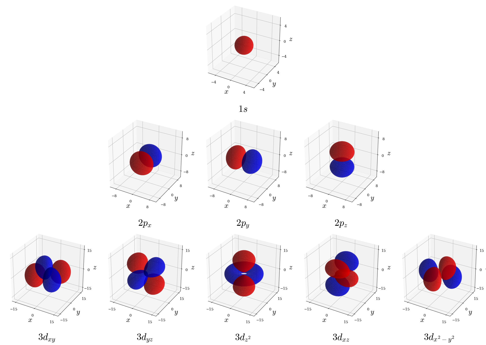

# The Hydrogen Atom {#Hydrogen}

In this chapter we will consider the hydrogen atom as a proton fixed at the origin, orbited by an electron of reduced mass $\mu$. The potential due to electrostatic attraction is:

\begin{equation}
V(r) = - \frac{e^2}{4 \pi \varepsilon_0 r},
(\#eq:HA1)
\end{equation}

where $\varepsilon_0$ is the constant permittivity of vacuum.
The kinetic energy term in the Hamiltonian is 

\begin{equation}
K = - \frac{\hbar^2}{2 \mu} \nabla^2,
(\#eq:HA2)
\end{equation}

where $\nabla^2$ is the Laplace operator (*Laplacian*) representing the divergence of the gradient of a function. Recall that in 1-dimension the kinetic energy is proportional to the second derivative of the wave function with respect to the position. In 3-dimension, the first derivative along all three dimension of space is called gradient, which is written in cartesian coordinates $\nabla = \left(\frac{\partial}{\partial x},\frac{\partial}{\partial y},\frac{\partial}{\partial z} \right)$. The Laplacian is the divergence $\nabla \cdot$ of the gradient (effectively, it replaces the second derivatives in the 1-D case), and can be written in cartesian coordinates as $\nabla^2=\nabla\cdot\nabla=\frac{\partial^2}{\partial x^2}+\frac{\partial^2}{\partial y^2}+\frac{\partial^2}{\partial z^2}$. The TISEq for the Hydrogen atom is therefore:

\begin{equation}
{\displaystyle \left(-{\frac {\hbar ^{2}}{2\mu }}\nabla ^{2}-{\frac {e^{2}}{4\pi \varepsilon _{0}r}}\right)\psi (r,\theta ,\phi )=E\psi (r,\theta ,\phi )},
(\#eq:HA2b)
\end{equation}

which, replacing the Laplacian in spherical coordinates, becomes: 

\begin{equation}
-{\frac {\hbar ^{2}}{2\mu }}\left[{\frac {1}{r^{2}}}{\frac {\partial }{\partial r}}\left(r^{2}{\frac {\partial \psi }{\partial r}}\right)+{\frac {1}{r^{2}\sin \theta }}{\frac {\partial }{\partial \theta }}\left(\sin \theta {\frac {\partial \psi }{\partial \theta }}\right)+{\frac {1}{r^{2}\sin ^{2}\theta }}{\frac {\partial ^{2}\psi }{\partial \phi ^{2}}}\right]-{\frac {e^{2}}{4\pi \varepsilon _{0}r}}\psi =E\psi.
(\#eq:HA3)
\end{equation}

This equation seems very complicated, but comparing the term in between square brackets with the TISEq of the rigid rotor, we immediately see some connections. Eq. \@ref(eq:HA3) is a separable, partial differential equation that can be solved by factorizing the wave function $\psi(r, \theta, \phi)$ into  $R_{nl}(r)Y_{\ell}^{m_{\ell}}(\theta, \phi)$, where  $Y_{\ell}^{m_{\ell}}(\theta, \phi)$ are again the spherical harmonics that solved the TISEq for the rigid rotor. The radial part $R(r)$ obeys the equation:

\begin{equation}
- \frac{\hbar^2}{2 \mu r^2} \frac{d}{dr} \left( r^2 \frac{dR}{dr}
\right) \left[\frac{\hbar^2 \ell(\ell+1)}{2 \mu r^2} + V(r) - E \right] R(r) = 0,
(\#eq:HA4)
\end{equation}

which is called the radial equation for the hydrogen atom. The solutions of the radial part are: 

\begin{equation}
R_{n\ell}(r) = - \left[ \frac{(n - \ell - 1)!}{2n[(n+\ell)!]^3} \right]^{1/2}\left(\frac{2}{na_0}\right)^{\ell+3/2}r^{\ell} e^{-r/na_0} L_{n+\ell}^{2\ell+1}
\left( \frac{2r}{n a_0} \right)
(\#eq:HA5)
\end{equation}

where  $0 \leq \ell \leq n - 1$, and $a_0 = \frac{\varepsilon_0 h^2}{\pi \mu e^2} \approx 0.529 \buildrel _\circ \over {\mathrm{A}}$ is the Bohr radius. The functions  $L_{n+\ell}^{2\ell+1}\left(\frac{2r}{na_0}\right)$ are the associated Laguerre polynomials 

The hydrogen atom eigenfunctions are:

\begin{equation}
\begin{aligned}
\psi_{n\ell m_{\ell}}(r,\theta,\phi) &= R_{n\ell}(r)Y_{\ell}^{m_{\ell}}(\theta,\phi) = \\
&= - \left[ \frac{(n - \ell - 1)!}{2n[(n+\ell)!]^3} \right]^{1/2}\left(\frac{2}{na_0}\right)^{\ell+3/2}r^{\ell} e^{-r/na_0} L_{n+\ell}^{2\ell+1}
\left( \frac{2r}{n a_0} \right) Y_{\ell}^{m_{\ell}}(\theta,\phi)
\end{aligned}
(\#eq:HA6)
\end{equation}

The quantum numbers $n,\ell,m_{\ell}$ can take the following values:

$n=1,2,3,\ldots,\infty$ (principal quantum number),

$\ell =0,1,2,\ldots ,n-1$ (azimuthal quantum number),

$m_{\ell}=-\ell ,\ldots ,\ell$ (magnetic quantum number).

These functions are called the **hydrogen atom orbitals**, and are usually first encountered in introductory chemistry textbooks. Notice that—by definition—an orbital is a complex function (i.e., it has both a real and an imaginary component) that describes *exclusively* one electron. 

The hydrogen atom eigenvalues are:

\begin{equation}
E_n = - \frac{1}{n^2}\frac{e^2}{8 \pi \varepsilon_0 a_0} \quad (n=1,2,\ldots,\infty).
(\#eq:HA7)
\end{equation}

Notice how the eigenvalues (i.e., the energy spectrum) do not depend on the azimuthal and magnetic quantum numbers, $\ell$ and $m_\ell$. Energy levels with the same $n$, but different $\ell$ and/or $m_\ell$ are degenerate. This is, unfortunately, source of some oversimplification in most general chemistry textbook:

- According to the solution of the TISEq, the $2s$ and $2p$ orbitals of the hydrogen atom have the same energy.

In practice, this is not exactly correct either, because of a tiny effect called the [Lamb shift](https://en.wikipedia.org/wiki/Lamb_shift). The description of this effect requires to go beyond the Schrödinger equation into the field of quantum electrodynamics. The Lamb shift, however, is not what is usually depicted in general chemistry textbook as the $2s-2p$ energy difference. This tiny effect, however, is not the responsible for the shift that is usually shown in most general chemistry textbooks. Such difference is usually discussed in the context of the aufbau principle and does not apply to hydrogen. In other words, the $2s-2p$ split is purely a many-electron effect, as we will discuss in chapter \@ref(Atoms). The energy levels of the hydrogen atom are plotted in figure \@ref(fig:fig0c5). 

```{r fig0c5, out.width='90%', fig.show='hold', echo=FALSE, fig.align = 'center', fig.cap='Energy level diagram and degeneracy pattern for the first five levels of the hydrogen atom.'}
knitr::include_graphics('./img/H_levels.png')
```

## Wave Function Analysis

### The radial wave functions

The solutions to the radial equation, eq xxx, involve two key components: an exponential decay factor $e^{-r/na_0}$ and a polynomial factor built from the associated Laguerre polynomials, $L_{n+\ell}^{2\ell+1}\left( \frac{2r}{n a_0} \right)$. The complete radial wave functions for the first three energy levels are:

$\quad R_{10}(r) = 2\left(\frac{1}{a_0}\right)^{3/2} e^{-r/a_0}.$

$\quad R_{20}(r) = \frac{1}{2\sqrt{2}}\left(\frac{1}{a_0}\right)^{3/2}\left(2 - \frac{r}{a_0}\right) e^{-r/2a_0}.$

$\quad R_{21}(r) = \frac{1}{2\sqrt{6}}\left(\frac{1}{a_0}\right)^{3/2}\left(\frac{r}{a_0}\right) e^{-r/2a_0}.$

$\quad R_{30}(r) = \frac{2}{27\sqrt{3}}\left(\frac{1}{a_0}\right)^{3/2}\left[27 - 18\left(\frac{r}{a_0}\right) + 2\left(\frac{r}{a_0}\right)^2\right] e^{-r/3a_0}.$

$\quad R_{31}(r) = \frac{8}{27\sqrt{6}}\left(\frac{1}{a_0}\right)^{3/2} \frac{r}{a_0} \left(1 - \frac{r}{6a_0}\right) e^{-r/3a_0}.$

$\quad R_{32}(r) = \frac{1}{81\sqrt{30}}\left(\frac{1}{a_0}\right)^{3/2} \left(\frac{r}{a_0}\right)^2 e^{-r/3a_0}.$

These formulas illustrate two critical features: (1) the exponential decay avoids the function to diverge as $r\rightarrow\infty$ confining the electron with higher probability closer to the nucleus, and (2) the polynomial factors give to each state a characteristic nodal structure.
The radial wave functions are plotted in figure \@ref(fig:fig1c5). Notice that $R_{10}$ for the $1s$ state is always positive and decays smoothly—this orbital has no radial nodes. By contrast, $R_{20}$ for the $2s$ state changes sign, crossing zero at $r = 2a_0$ (the radial node). This is a mathematical manifestation of increasing angular momentum confinement: higher energy states must oscillate more to fit their energy eigenvalues. The $2p$ radial wave function $R_{21}$ starts at zero (due to the factor of $r$ in the polynomial) and exhibits a single lobe before decaying. The total number of nodes in any orbital is $n - 1$. This count is split between radial and angular contributions:

- **Radial nodes**: $n - \ell - 1$ spherical surfaces where $R_{n\ell}(r) = 0$.
- **Angular nodes**: $\ell$ nodal planes or cones.

For example, the $2s$ orbital ($n=2, \ell=0$) has one total node, which is entirely radial (the sphere at $r = 2a_0$). The $2p$ orbital with $n=2$ and $\ell=1$ has one node, which is angular (the plane perpendicular to the orbital axis). The $3d$ orbital with $n=3$ and $\ell=2$ has $3-1=2$ total nodes, both angular (two nodal cones), with no radial nodes.


```{r fig1c5, out.width='90%', fig.show='hold', echo=FALSE, fig.align = 'center', fig.cap='The radial wave functions of the hydrogen atom orbitals in the first three energy levels. The radial nodes are highlighted with purple dots.'}
knitr::include_graphics('./img/H_r.png')
```

While the radial wave function $R_{n\ell}(r)$ describes the amplitude of the electron probability at distance $r$, what we typically measure experimentally is the radial probability distribution:

\begin{equation}
P(r) = 4\pi r^2 |R_{n\ell}(r)|^2.
(\#eq:HA8)
\end{equation}


This product of $r^2$ and $|R_{n\ell}|^2$ is crucial for physical interpretation and is plotted for the first six radial wave functions in figure \@ref(fig:fig2c5). The factor $4\pi r^2$ represents the *surface area of a spherical shell* at distance $r$. Even though the probability density $|R_{n\ell}|^2$ is largest near the nucleus (often zero right at $r=0$ for $\ell>0$), the shell volume increases with $r^2$, creating a maximum in $P(r)$ at an intermediate distance. This is why the most probable radius for the $1s$ electron is exactly the Bohr radius $a_0$.


```{r fig2c5, out.width='90%', fig.show='hold', echo=FALSE, fig.align = 'center', fig.cap='The radial probability functions of the hydrogen atom orbitals in the first three energy levels. The radial nodes are highlighted with purple dots.'}
knitr::include_graphics('./img/H_rpf.png')
```

The radial probability plot reveals the structure of orbitals at different energy levels. For $1s$, the single smooth peak centered at $a_0 \approx 0.53 \buildrel _\circ \over {\mathrm{A}}$  shows why the ground state is compact and stable. For $2s$, two peaks at $r/a_0 \approx 0.76 \buildrel _\circ \over {\mathrm{A}}$ and $5.24 \buildrel _\circ \over {\mathrm{A}}$ are separated by a radial node at $r = 2a_0$. The presence of multiple peaks indicates that the electron, though more energetic (and thus less tightly bound), still has a non-zero probability of being found relatively close to the nucleus. The $3s$ orbital shows three peaks—the pattern continues with each increase in principal quantum number.

This radial probability distribution is the **observable quantity**—it represents the answer to the experimental question: "If I measure the distance of the electron from the nucleus, what are the odds of finding it between radius $r$ and $r + dr$?"

### The angular wave functions

As we already discussed, the angular part of the Schrödinger equation is solved by the same spherical harmonics we discussed for the solution of the particle on a sphere in Chapter 4. The complete complex spherical harmonics are eigenfunctions of the magnitude of the total angular momentum, $\mathbf{L}^2$, and of one of its component along an arbitrary axis, $L_z$. These two conditions determine the **physical meaning** of the quantum numbers $\ell$ and $m_\ell$. They also establish why the spherical harmonics create the characteristic orbital shapes:

- **$n$ (principal quantum number)**: Determines the energy $E_n = -13.6 \text{ eV}/n^2$ and the size of the orbital.
- **$\ell$ (orbital angular momentum quantum number)**: Ranges from $0$ to $n-1$ and determines orbital shape ($s$ for $\ell=0$, $p$ for $\ell=1$, $d$ for $\ell=2$, $f$ for $\ell=3$, and so on.) The “shape of the orbital” is connected to how the probability density varies with the (angular) direction at a given radius. That information is entirely in the angular part of the wave function and is hence inherited from the shape of the spherical harmonics described in Chapter 4.
- **$m_\ell$ (magnetic quantum number)**: Ranges from $-\ell$ to $+\ell$, specifies the orientation of the orbital in space. The quantum number $\ell$ quantizes the magnitude of the total angular momentum, but its direction is uncertain, except for one component along an arbitrary axis. By convention we take the $z$-axis and quantize its component via the quantum number $m_\ell$. Therefore $m_\ell$ determines the orientation along the associated $z$-axis.

The energy depends *only* on $n$, making all orbitals with the same $n$ but different $\ell$ values degenerate. This is a special feature of the Coulomb potential; most other potentials would split these energy levels. 

Visualization of the complex spherical harmonics can happen in many different ways, as we have already shown in the particle-on-a-sphere section of Chapter 4. The difficulties associated with the visualization of the complex spherical harmonics translate directly to the visualization of the atomic orbitals, which we will discuss next.


### Building the complete orbital

The complete wave function given by the multiplication of the radial components and the complex spherical harmonic encodes *all* the quantum information about the electron's state. The radial part captures the probability of finding the electron at a given distance $r$ (independent of direction), while the angular part specifies how this probability is distributed among different directions.

Since orbitals are functions of three spatial dimensions, visualizing their amplitude would require a four-dimensional plot. One way to reduce the represent them in 3D is to map the amplitude to a color map, similarly to figures \@ref(fig:fig6c4) and \@ref(fig:fig7c4) in Chapter 4. This, however, doesn't solve the issue with the visualization of complex functions, which would require two different 3D plots, one for the real part of the wave function (the amplitude) and one for the imaginary part (the phase). These sets of complementary plots are reported in figure \@ref(fig:fig3c5) for the real part of the hydrogen atom orbitals and in figure \@ref(fig:fig4c5) for the imaginary part.

```{r fig3c5, out.width='90%', fig.show='hold', echo=FALSE, fig.align = 'center', fig.cap='Color gradient maps of the real part $(\\Re[\\psi_{n\\ell m_\\ell}(r,\\theta,\\phi)])$ for hydrogen atom orbitals. Color scheme: Red (positive), blue (negative), white/light (nodal grat circles where $\\psi_{n\\ell m_\\ell}=0$).'}
knitr::include_graphics('./img/H_Re.png')
```
```{r fig4c5, out.width='90%', fig.show='hold', echo=FALSE, fig.align = 'center', fig.cap='Color gradient maps of the imaginary part $(\\Im[\\psi_{n\\ell m_\\ell}(r,\\theta,\\phi)])$ for hydrogen atom orbitals. Color scheme: Red (positive), blue (negative), white/light (nodal grat circles where $\\psi_{n\\ell m_\\ell}=0$).'}
knitr::include_graphics('./img/H_Im.png')
```
In chemistry, we typically use *real orbitals* instead of the pure complex eigenstates. This is convenient because they align with molecular symmetry, bonding intuition, and computational visualization. The real orbitals are obtained from linear combinations of spherical harmonics with opposite $m_\ell$ values,^[The combination of complex spherical harmonics into real ones results in [cubic (or tesseral) harmonics](https://en.wikipedia.org/wiki/Cubic_harmonic).] for example:

\begin{equation}
\begin{aligned}
\psi_{2p_z} &= \psi_{2,1,0}\quad\text{(already real)},\\
\psi_{2p_x} &= \frac{1}{\sqrt{2}}\left(\psi_{2,1,+1} + \psi_{2,1,-1}\right),\\
\psi_{2p_y} &= \frac{i}{\sqrt{2}}\left(\psi_{2,1,+1} - \psi_{2,1,-1}\right).
\end{aligned}
(\#eq:HA9)
\end{equation}

These combinations eliminate the azimuthal phase dependence, producing three real-valued orbitals with the familiar dumbbell shapes oriented along the $x$, $y$, and $z$ axes. Each real orbital still represents a valid quantum state—they are simply a different choice of *basis* for describing the same subspace of quantum states. The real $p$ orbitals are superpositions of definite angular momentum states, so they don't have definite $m_\ell$ values, but they have all other properties encoded in the original states.

The crucial point is: **the real and complex orbital representations are mathematically equivalent descriptions of the same physical system**. They provide different perspectives (real vs. complex) but encode identical measurable information. 

One final comment on the nature of orbital representations merits particular emphasis here. Pictures of orbitals such as those shown in figures \@ref(fig:fig3c5) and \@ref(fig:fig4c5) carry **no direct physical significance**. These pictures simply plot mathematical functions. While they can help infer electron probability distributions, they should never be interpreted as literal "regions of space" where electrons reside. Unfortunately, renderings of these figures are commonly misrepresented as actual orbital images, and students are often led to believe that these pictures represent an actual, measurable, physical reality. **They do not!** Since the probability density is the quantity that can be experimentally measured, $|\psi_{n\ell m_\ell}|^2$ is the only representation that has physical significance. These "electron density probability clouds" can be visualized in several ways:

1. **Probability density contour surface plots (isodensity maps)**: Show an isosurface enclosing (e.g.) 80% of the electron probability. This is done for a few representative orbitals in figure \@ref(fig:fig5c5). These plots are excellent for conveying orbital shape but loses information about the probability gradient.


```{r fig5c5, out.width='90%', fig.show='hold', echo=FALSE, fig.align = 'center', fig.cap='Probability density contour plots (isodensity maps) showing the isosurface containing 80% of the electron probability $(|\\psi_{n\\ell m_\\ell}(r,\\theta,\\phi|^2)$ for a few representative hydrogen atom orbitals. Regions are colored blue (positive wave function phase) and red (negative phase) following standard chemistry convention; note this shading illustrates $\\psi_{n\\ell m_\\ell}$ sign only, not probability itself which remains non-negative everywhere.'}

```


2. **Volumetric density plots**: Use opacity to represent $|\psi|^2$ throughout a region. This is done for a few representative orbitals in figure \@ref(fig:fig6c5). These plots preserve all spatial information but can be harder to interpret visually.


```{r fig6c5, out.width='90%', fig.show='hold', echo=FALSE, fig.align = 'center', fig.cap='Volumetric cloud plots for a few representative hydrogen atom orbitals. Regions are colored blue (positive wave function phase) and red (negative phase) following standard chemistry convention; note this shading illustrates $\\psi_{n\\ell m_\\ell}$ sign only, not probability itself which remains non-negative everywhere.'}
knitr::include_graphics('./img/H_dens2.png')
```

4. **Dot-density plots**: Scatter dots with density proportional to $|\psi|^2$. This is done for a few representative orbitals in figure \@ref(fig:fig7c5). These plots represent a stochastic "electron cloud" model where the actual spatial density of the dots represents the probability of finding the electron and are very intuitive for understanding probability as a statistical distribution.

```{r fig7c5, out.width='90%', fig.show='hold', echo=FALSE, fig.align = 'center', fig.cap='Dot-density plots for a few representative hydrogen atom orbitals. Indiviudual dots are colored blue (positive wave function phase) and red (negative phase) following standard chemistry convention; note this shading illustrates $\\psi_{n\\ell m_\\ell}$ sign only, not probability itself which remains non-negative everywhere.'}
knitr::include_graphics('./img/H_dens3.png')
```


Each method highlights different aspects of the orbital structure. The key is understanding that all these representations show the *same* information (the probability density) through different visual encodings. Finally, it is important to note that most chemistry textbooks depict orbital symmetry on probability density diagrams, such as those in Figures \@ref(fig:fig5c5), \@ref(fig:fig6c5), and \@ref(fig:fig7c5), by overlaying the signs of the wave functions using colors or shading. This common practice is misleading, as these plots represent the probability of finding the electron, which must be non-negative everywhere. Nevertheless, because this convention is too pervasive in the literature to ignore, we retain it here to familiarize students with standard representations while urging them to recognize its limitations.

### Experimental Access to Orbitals

A common question is: "Can we actually measure an orbital?" The answer is nuanced. We cannot directly observe $\psi_{n\ell m_{\ell}}(\mathbf{r})$ because the wave function is not an observable—quantum mechanics predicts only probabilities for measurement outcomes. However, we can:

- Measure the *probability density* through many repeated experiments (electron microscopy, photoelectron spectroscopy).
- Recover both amplitude and phase information through sophisticated techniques like Angle-Resolved Photoemission Spectroscopy (ARPES) combined with iterative reconstruction algorithms.
- Verify orbital shapes indirectly through spectroscopic measurements, magnetic susceptibility, x-ray diffraction, and other bulk properties.

Recent attosecond and femtosecond experiments have directly imaged the amplitude of molecular orbitals and even tracked the phase evolution during chemical reactions, confirming that quantum mechanical orbital descriptions accurately reflect physical reality.

## Chapter Review {#rev5}
### Study Questions {#quest5}

**1. Which of the following is the electrostatic potential energy, $V(r)$, in the hydrogen atom?**

a. $V(r) = -\dfrac{e^2}{4\pi \varepsilon_0 r}$  
b. $V(r) = +\dfrac{e^2}{4\pi \varepsilon_0 r}$  
c. $V(r) = \dfrac{1}{2} k r^2$  
d. $V(r) = -G \dfrac{m_p m_e}{r}$  
e. $V(r) = 0$  

---

**2. Which of the following is the kinetic-energy operator used in the hydrogen Hamiltonian?**

a. $K = -\dfrac{\hbar^2}{2\mu}\nabla^2$  
b. $K = -\dfrac{\hbar^2}{2m_e}\dfrac{d^2}{dr^2}$  
c. $K = \dfrac{p^2}{2\mu}$  
d. $K = -\dfrac{\hbar^2}{2}\nabla$  
e. $K = -\dfrac{\hbar^2}{2M}\nabla^2$  

---

**3. How do you separate the hydrogen-atom wave function in spherical coordinates?**

a. $\psi(r,\theta,\phi) = f(r) g(\theta)$  
b. $\psi(r,\theta,\phi) = R_{n\ell}(r)\,Y_\ell^{m_\ell}(\theta,\phi)$
c. $\psi(r,\theta,\phi) = R(r) \cos\theta$  
d. $\psi(r,\theta,\phi) = Y_\ell^{m_\ell}(\theta,\phi)$  
e. $\psi(r,\theta,\phi) = R_{n\ell}(r) e^{i k r}$  

---

**4. Which special functions give the angular part of the hydrogen-atom wave functions?**

a. Hermite polynomials  
b. Associated Laguerre polynomials  
c. Bessel functions  
d. Plane waves  
e. Spherical harmonics

---

**5. How do you calculate the Bohr's radius?**

a. $a_0 = \dfrac{\varepsilon_0 h^2}{\pi \mu e^2}$  
b. $a_0 = \dfrac{4\pi \varepsilon_0 \hbar^2}{\mu e^2}$  
c. $a_0 = \dfrac{\hbar^2}{\mu e^2}$  
d. $a_0 = \dfrac{\varepsilon_0 h}{\mu e}$  
e. $a_0 = \dfrac{e^2}{4\pi \varepsilon_0 \hbar^2}$  

---

**6. Which special functions give the radial part of the hydrogen-atom wave functions?**

a. Hermite polynomials  
b. Legendre polynomials  
c. Associated Laguerre functions  
d. Spherical harmonics  
e. Bessel functions  

---

**7. What are the allowed values of the principal quantum number $n$?**

a. $n = 0, 1, 2, \dots$  
b. $n = -\infty \dots \infty$  
c. $n = 1, 2, 3, \dots$  
d. $n = \tfrac{1}{2}, \tfrac{3}{2}, \dots$  
e. $n = 2, 4, 6, \dots$  

---

**8. For a given $n$, what are the allowed values of the azimuthal quantum number $\ell$?**

a. $\ell = 0,1,2,\dots,n-1$  
b. $\ell = 1,2,\dots,n$  
c. $\ell = -n,\dots,n$  
d. $\ell = 0,\pm1,\pm2,\dots$  
e. $\ell = n$ only  

---

**9. For or a given $\ell$, what are the allowed values of the magnetic quantum number $m_\ell$?**

a. $m_\ell = 0,1,\dots,\ell$  
b. $m_\ell = 1,2,\dots,\ell$  
c. $m_\ell = -n,\dots,n$  
d. $m_\ell = \pm \tfrac{1}{2}$  
e. $m_\ell = -\ell, -\ell+1, \dots, \ell$  

---

**10. Which statement about orbitals does the chapter explicitly emphasize?**

a. Orbitals physically contain up to two electrons  
b. Each orbital is the mathematical description of one and only one electron  
c. Orbitals are purely classical trajectories  
d. Orbitals only exist for many-electron atoms  
e. Orbitals always have dumbbell shapes in real space  

---

`r if (knitr::is_html_output()) {
  '
  Answers: <span style="cursor: pointer; color: blue; text-decoration: underline;" onclick="document.getElementById(\'reveal-inline-content\').style.display=\'inline\'; this.style.display=\'none\';">
    Click to reveal
  </span>
  <span id="reveal-inline-content" style="display: none;">
            1.a, 2.a, 3.b, 4.e, 5.a, 6.c, 7.c, 8.a, 9.e, 10.b
  </span>
  '
} else if (knitr::is_latex_output()) {
  'Answers: 1.a, 2.a, 3.b, 4.e, 5.a, 6.c, 7.c, 8.a, 9.e, 10.b'
}`


