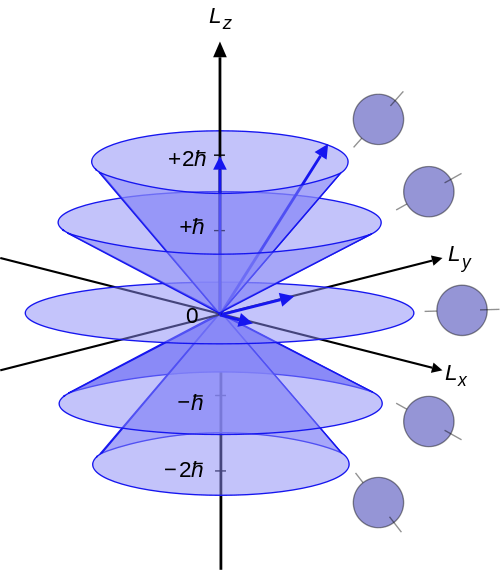

# Operators and Mathematical Background {#Operators}

So far, we have seen a few simple examples of how to solve the TISEq. For the general case, the mathematical formulation of quantum mechanics is built upon the concept of an operator. An operator is a function over a space of physical states onto another space of physical states. Operators do not exist exclusively in quantum mechanics, but they can also be used in classical mechanics. In chapter \@ref(Classical), we have seen at least a couple of them, namely the Lagrangian, $L$, and Hamiltonian, $H$. In quantum mechanics, however, the concept of an operator is the basis of the complex mathematical treatment that is necessary for more complicated cases. In this chapter, we will discuss the mathematics of quantum mechanical operators, and we will recast the results for the analytical cases in light of the new framework. As we will see, this framework is even simpler than what we have seen in the previous chapter. This simplicity, however, will open the door to the "stranger" side of quantum mechanics.

## Operators in Quantum Mechanics

The central concept in this new framework of quantum mechanics is that every observable (i.e., any quantity that can be measured in a physical experiment) is associated with an operator. To distinguish between classical mechanics operators and quantum mechanical ones, we use a hat symbol $\hat{}$ on top of the latter. Physical pure states in quantum mechanics are represented as unit-norm (probabilities are normalized to one) vectors in a special complex Hilbert space. Following the definition, an operator is a function that projects a vector in the Hilbert space onto the space of physical observables. Since observables are values that come up as the result of the experiment, quantum mechanical operators must yield real eigenvalues.^[But they might not be strictly real.] Operators that possess this property are called *Hermitian*. 
In the wave mechanics formulation of quantum mechanics that we have seen so far, the wave function varies with space and time—or equivalently momentum and time—and observables are differential operators. A completely analogous formulation is possible in terms of matrices. In the matrix formulation of quantum mechanics, the norm of the physical state should stay fixed, so the evolution operator should be unitary, and the operators can be represented as matrices.

The expectation value of an operator $\hat{A}$ for a system with wave function $\psi(\mathbf{r})$ living in a Hilbert space with unit vector $\mathbf{r}$ (i.e., in three-dimensional Cartesian space $\mathbf{r} = \left\{ x,y,z \right\}$), is given by: 

\begin{equation}
<A> = \int \psi^{*}({\bf r}) \hat{A} \psi({\bf r}) d{\bf r},
(\#eq:ee1b)
\end{equation}

and if $\hat{A}$ is a Hermitian operator, all physical observables are represented by such expectation values. It is easy to show that if $\hat{A}$ is a linear operator with an eigenfunction $g$, then any multiple of $g$ is also an eigenfunction of $\hat{A}$.

### Basic Properties of Operators

Most of the properties of operators are obvious, but they are summarized below for completeness.
The sum and difference of two operators $\hat{A}$ and  $\hat{B}$ are given by:

\begin{equation}
\begin{aligned}
 (\hat{A} + \hat{B}) f &= \hat{A} f + \hat{B} f \\
(\hat{A} - \hat{B}) f &= \hat{A} f - \hat{B} f.
\end{aligned}
(\#eq:bp0)
\end{equation}

The product of two operators is defined by:

\begin{equation}
\hat{A} \hat{B} f \equiv \hat{A} [ \hat{B} f ]
(\#eq:bp1)
\end{equation}

Two operators are equal if 
\begin{equation}
\hat{A} f = \hat{B} f
(\#eq:bp2)
\end{equation}

for all functions $f$. The identity operator $\hat{1}$ does nothing (or multiplies by 1):

\begin{equation}
{\hat 1} f = f
(\#eq:bp3)
\end{equation}

The associative law holds for operators:

\begin{equation}
\hat{A}(\hat{B}\hat{C}) = (\hat{A}\hat{B})\hat{C}
(\#eq:bp4)
\end{equation}

The commutative law does not generally hold for operators. In general,  $\hat{A} \hat{B} \neq \hat{B} \hat{A}$. It is convenient to define the quantity:

\begin{equation}
[\hat{A}, \hat{B}]\equiv \hat{A} \hat{B} - \hat{B} \hat{A}
(\#eq:bp5)
\end{equation}

which is called the **commutator** of $\hat{A}$ and $\hat{B}$. Note that the order matters, so that  $[ \hat{A}, \hat{B}] = - [ \hat{B}, \hat{A}]$. If $\hat{A}$ and $\hat{B}$ happen to commute, then  $[\hat{A}, \hat{B}] = 0$.

### Linear Operators

Almost all operators encountered in quantum mechanics are linear. A linear operator is any operator $\hat{A}$ satisfying the following two conditions: 

\begin{equation}
\begin{aligned}
\hat{A} (f + g)  &= \hat{A} f + \hat{A} g, \\
\hat{A} (c f) &= c \hat{A} f,
\end{aligned}
(\#eq:linop1)
\end{equation}

where $c$ is a constant and $f$ and $g$ are functions. As an example, consider the operators $\frac{d}{dx}$ and $()^2$. We can see that $\frac{d}{dx}$ is a linear operator because:

\begin{equation}
\begin{aligned}
\frac{d}{dx}[f(x) + g(x)] &=\frac{d}{dx}f(x) + \frac{d}{dx}g(x), \\
\frac{d}{dx}[c f(x)] &= c (d/dx) f(x).
\end{aligned}
(\#eq:linop2)
\end{equation}

However, $()^2$ is not a linear operator because:

\begin{equation}
(f(x) + g(x))^2 \neq (f(x))^2 + (g(x))^2
(\#eq:linop3)
\end{equation}

### Hermitian Operators

Hermitian operators are characterized by the self-adjoint property:

\begin{equation}
\int \psi_a^{*} (\hat{A} \psi_a)d{\bf r} =  \int \psi_a (\hat{A} \psi_a)^{*}d{\bf r},
(\#eq:hop1)
\end{equation}

where the integral is performed over all space. This property guarantees that all the eigenvalues of the operators are real. Defining $a$ as the eigenvalue of operator $\hat{A}$ using: 

\begin{equation}
\hat{A} \psi({\bf r}) = a \psi({\bf r}),
(\#eq:hop2)
\end{equation}

we can prove that $a$ is real by replacing eq. \@ref(eq:hop2) into eq. \@ref(eq:hop1):

\begin{equation}
\begin{aligned}
a \int \psi_a^{*} \psi_a d{\bf r}&= a^{*} \int \psi_a \psi_a^{*} d{\bf r}\\
(a - a^{*}) \int \vert\psi_a\vert^2 d{\bf r} &= 0,
\end{aligned}
(\#eq:hop4)
\end{equation}

and since $\vert\psi_a\vert^2$ is never negative, either $a = a^{*}$ or $\psi_a = 0$. Since $\psi_a = 0$ is not an acceptable wavefunction, $a = a^{*}$, and $a$ is real.

The following additional properties of Hermitian operators can also be proven with some work:

\begin{equation}
\int \psi^{*}\hat{A} \psi d{\bf r} = \int (\hat{A} \psi)^{*} \psi d{\bf r},
(\#eq:hop2b)
\end{equation}

and for any two states $\psi_1$ and $\psi_2$:

\begin{equation}
\int \psi_1^{*} \hat{A} \psi_2 d{\bf r}=
\int (\hat{A} \psi_1)^{*} \psi_2 d{\bf r}.
(\#eq:hop3)
\end{equation}

Taking $\psi_a$ and $\psi_b$ as eigenfunctions of $\hat{A}$ with eigenvalues $a$ and $b$ with $a \neq b$, and using eq. \@ref(eq:hop3), we obtain:

\begin{equation}
\begin{aligned}
\int \psi_a^{*} \hat{A} \psi_b d{\bf r} &= \int (\hat{A} \psi_a)^{*} \psi_b	d{\bf r}\\
b \int \psi_a^{*} \psi_b d{\bf r}	&= a^{*} \int \psi_a^{*} \psi_b d{\bf r}\\
(b - a) \int \psi_a^{*} \psi_b d{\bf r} &= 0.
\end{aligned}
(\#eq:hop5)
\end{equation}

Thus, since $a = a^{*}$, and since we assumed $b \neq a$, we must have $\int \psi_a^{*} \psi_b d{\bf r} = 0$, i.e. $\psi_a$ and $\psi_b$ are orthogonal. In other words, eigenfunctions of a Hermitian operator with different eigenvalues are orthogonal (or can be chosen to be so). 

## Eigenfunctions and Eigenvalues

As we have already seen, an eigenfunction of an operator $\hat{A}$ is a function $f$ such that the application of $\hat{A}$ on $f$ gives $f$ again, times a constant: 

\begin{equation}
\hat{A} f = k f,
(\#eq:ee1)
\end{equation}

where $k$ is a constant called the eigenvalue. 

When a system is in an eigenstate of observable $A$ (i.e., when the wave function is an eigenfunction of the operator $\hat{A}$) then the expectation value of $A$ is the eigenvalue of the wave function. Therefore:

\begin{equation}
\hat{A} \psi({\bf r}) = a \psi({\bf r}),
(\#eq:ee2)
\end{equation}

then:

\begin{equation}
\begin{aligned}
<A> &= \int \psi^{*}({\bf r}) \hat{A} \psi({\bf r}) d{\bf r} \\
&= \int \psi^{*}({\bf r}) a \psi({\bf r}) d{\bf r} \\	 
&= a \int \psi^{*}({\bf r}) \psi({\bf r}) d{\bf r} = a,	 
\end{aligned}
(\#eq:ee3)
\end{equation}

which implies that:

\begin{equation}
\int \psi^{*}({\bf r}) \psi({\bf r}) d{\bf r} = 1.
(\#eq:ee4)
\end{equation}

This property of wave functions is called normalization, and in the one-electron TISEq guarantees that the maximum probability of finding an electron over the entire space is one.^[Imposing the normalization condition is the best way to find the constant $A$ in the solution of the TISEq for the particle in a box, a topic that we delayed in chapter \@ref(Models).]

A unique property of quantum mechanics is that a wave function can be expressed not just as a simple eigenfunction, but also as a combination of several of them. We have in part already encountered such property in the previous chapter, where complex hydrogen orbitals have been combined to form corresponding linear ones. As a general example, let us consider a wave function written as a linear combination of two eigenstates of $\hat{A}$, with eigenvalues $a$ and $b$:

\begin{equation}
\psi = c_a \psi_a + c_b \psi_b,
(\#eq:ee5)
\end{equation}

where  $\hat{A} \psi_a = a \psi_a$ and  $\hat{A} \psi_b = b \psi_b$. Then, since $\psi_a$ and $\psi_b$ are orthogonal and normalized (usually abbreviated as orthonormal), the expectation value of $A$ is:

\begin{equation}
\begin{aligned}
<A> &= \int \psi^{*} \hat{A} \psi d{\bf r} \\
 	&= \int \left[ c_a \psi_a + c_b \psi_b \right]^{*} \hat{A} \left[ c_a \psi_a + c_b \psi_b \right] d{\bf r}\\
 	&= \int \left[ c_a \psi_a + c_b \psi_b \right]^{*}
\left[ a c_a \psi_a + b c_b \psi_b \right] d{\bf r}\\	 
 	&= a \vert c_a\vert^2 \int \psi_a^{*} \psi_a d{\bf r} +
b c_a^{*} c_b \int \psi_a^{*} \psi_b d{\bf r} + a c_b^{*} c_a \int \psi_b^{*} \psi_a d{\bf r} +
b \vert c_b\vert^2 \int \psi_b^{*} \psi_b d{\bf r}\\ 
 	&= a \vert c_a\vert^2 + b \vert c_b\vert^2.
\end{aligned}
(\#eq:ee6)    
\end{equation}

This result shows that the average value of $A$ is a weighted average of eigenvalues, with the weights being the squares of the coefficients of the eigenvectors in the overall wavefunction.^[This section was adapted in part from Prof. C. David Sherrill's A Brief Review of Elementary Quantum Chemistry Notes available [here](http://vergil.chemistry.gatech.edu/notes/quantrev/node1.html).]

## Common Operators in Quantum Mechanics

Some common operators occurring in quantum mechanics are collected in the table below:

\tiny
| Observable Name  |   Symbol    |   Operator       |  Operation             |
|------------------|:-----------:|:----------------:|------------------------|
| Position         | ${\bf r}$   |   $\hat{\bf r}$  |  Multiply by ${\bf r}$ |
| Momentum         |${\bf p}$    |   $\hat{\bf p}$  |  $-i \hbar \left(\hat{i}\frac{\partial}{\partial x} +\hat{j} \frac{\partial}{\partial y}+\hat{k} \frac{\partial}{\partial z} \right)$ |
| Kinetic energy   | $K$         |   $\hat{K}$      |  $- \frac{\hbar^2}{2m} \left(\frac{\partial^2}{\partial x^2} +\frac{\partial^2}{\partial y^2} +\frac{\partial^2}{\partial z^2} \right)$ |
| Potential energy | $V({\bf r})$|$\hat{V}({\bf r})$| Multiply by $V({\bf r})$ |
| Total energy     | $E$         |  $\hat{H}$       |$-\frac{\hbar^2}{2m} \left(\frac{\partial^2}{\partial x^2} +\frac{\partial^2}{\partial y^2} +\frac{\partial^2}{\partial z^2} \right) +V({\bf r})$ |
| Angular momentum | $L$         | $\hat{L}^2$       | $\hat{L}_x^2+\hat{L}_y^2+\hat{L}_z^2$ |
|                  | $L_x$       | $\hat{L}_x$       | $-i\hbar\left(y\frac{\partial}{\partial z} - z \frac{\partial}{\partial y} \right)$ |
|                  | $L_y$       |  $\hat{L}_y$      | $-i \hbar \left(z\frac{\partial}{\partial x} - x \frac{\partial}{\partial z} \right)$ |
|                  | $L_z$       | $\hat{L}_z$       | $-i \hbar \left(x\frac{\partial}{\partial y} - y \frac{\partial}{\partial x} \right)$ |
\normalsize

In the sections below we analyze in details two main operators for the energy and the angular momentum.

### Hamiltonian Operator

The main quantity that quantum mechanics is interested in is the total energy of the system, $E$. The operator corresponding to this quantity is called *Hamiltonian*:

\begin{equation}
\hat{H} = - \frac{\hbar^2}{2} \sum_i \frac{1}{m_i} \nabla_i^2 + V,
(\#eq:hamilt1)  
\end{equation}

where $i$ is an index over all the particles of the system. Using the formalism of operators in conjunction with eq. \@ref(eq:hamilt1), we can write the TISEq just simply  as:

\begin{equation}
\hat{H} \psi = E\psi.
(\#eq:scheqsimple)  
\end{equation}

Comparing eq. \@ref(eq:hamilt1) to the classical analog in eq. \@ref(eq:ham2), we notice how the first term in the Hamiltonian operator represents the corresponding kinetic energy operator, $\hat{K}$, while the second term represents the potential energy operator, $\hat{V}$. For a one-electron system—such as the ones we studied in chapter \@ref(Models)—we can write:

\begin{equation}
\hat{K}=- \frac{\hbar^2}{2m} \left(\frac{\partial^2}{\partial x^2} + \frac{\partial^2}{\partial y^2} + \frac{\partial^2}{\partial z^2} \right) = \frac{\hbar^2}{2m} \nabla^2,
(\#eq:hamilt2)  
\end{equation}

which is universal and applies to all systems. The potential energy operator $\hat{V}$ is what differentiate each system. Using eq. \@ref(eq:scheqsimple), we can then simply obtain the TISEq for each of the first three models discussed in chapter \@ref(Models) by simply using:

\begin{equation}
\begin{aligned}
\text{Free particle:}\qquad \hat{V} &= 0, \\
\text{Particle in a box:}\qquad \hat{V} &= 0 \; \text{inside the box, } \hat{V} = \infty \; \text{outside the box},\\
\text{Harmonic oscillator:}\qquad \hat{V} &= \frac{1}{2}kx^2. \\
\end{aligned}
(\#eq:hamilt3)  
\end{equation}

While these three cases are trivial to solve, the case of the rigid rotor is more complicated to solve, since the kinetic energy operator needs to be solved in spherical polar coordinates, as we will show in the next section.  

### Angular Momentum Operator

To write the kinetic energy operator $\hat{K}$ for the rigid rotor, we need to express the Laplacian, $\nabla^2$, in spherical polar coordinates:

\begin{equation}
\nabla^2=\nabla^2_r - \frac{\hat{L}^2}{r^2},
(\#eq:angmom1)  
\end{equation}

where $\nabla_r^2 = \frac{1}{r^2}\frac{\partial}{\partial r} \left( r^2\frac{\partial}{\partial r} \right)$ is the radial Laplacian, and $\hat{L}^2$ is the square of the total angular momentum operator, which is:

\begin{equation}
\begin{aligned}
\hat{L}^2 &=\hat{L}\cdot\hat{L}=\left(\mathbf{i}\hat{L}_x+\mathbf{j}\hat{L}_y+\mathbf{k}\hat{L}_z\right)\cdot\left(\mathbf{i}\hat{L}_x+\mathbf{j}\hat{L}_y+\mathbf{k}\hat{L}_z \right) \\
&=\hat{L}_x^2+\hat{L}_y^2+\hat{L}_z^2,
\end{aligned}
(\#eq:angmom1b)    
\end{equation}

with $\left\{\mathbf{i},\mathbf{j},\mathbf{k}\right\}$ the unitary vectors in three-dimensional space. The component along each direction, $\left\{\hat{L}_x,\hat{L}_y,\hat{L}_z\right\}$, are then expressed in cartesian coordinates using to the following formulas:

\begin{equation}
\begin{aligned}
\hat{L}_x &= -i\hbar\left(y\frac{\partial}{\partial z} - z \frac{\partial}{\partial y} \right), \\
\hat{L}_y &= -i \hbar \left(z\frac{\partial}{\partial x} - x \frac{\partial}{\partial z} \right), \\
\hat{L}_z &= -i \hbar \left(x\frac{\partial}{\partial y} - y \frac{\partial}{\partial x} \right).
\end{aligned}
(\#eq:angmom2)    
\end{equation}

The eigenvalues equation corresponding to the total angular momentum is:

\begin{equation}
\hat{L}^2 Y(\theta, \varphi) =
\hbar^2 \ell(\ell+1) Y_{\ell}^{m_{\ell}}(\theta, \varphi),
(\#eq:angmom3)
\end{equation}
 
where $\ell$ is the azimuthal quantum number and $Y_{\ell}^m(\theta, \varphi)$ are the spherical harmonics, both of which we already encountered in chapter \@ref(Models). Recall once again that each energy level $E_{\ell}$ is $(2\ell+1)$-fold degenerate in $m_{\ell}$, since $m_{\ell}$ can have values  $-\ell, -\ell+1, \ldots, \ell-1, \ell$. This means that there are $(2\ell+1)$ states with the same energy $E_{\ell}$, each characterized by the magnetic magnetic quantum number $m_{\ell}$. This quantum number can be determined using the following eigenvalues equation:

\begin{equation}
\hat{L}_z Y(\theta, \varphi) =
\hbar m_{\ell} Y_{\ell}^{m_{\ell}}(\theta, \varphi).
(\#eq:angmom4)
\end{equation}

The interpretation of these results is rather complicated, since the angular momenta are quantum operators and they cannot be drawn as vectors like in classical mechanics. Nevertheless, it is common to depict them heuristically as in figure \@ref(fig:Fig1c6)^[This diagram is taken from [Wikipedia](https://en.wikipedia.org/wiki/Angular_momentum_operator#/media/File:Vector_model_of_orbital_angular_momentum.svg) by user Maschen, and is of public domain], where a set of states with quantum numbers $\ell =2$, and $m_{\ell}=-2,-1,0,1,2$ are reported. Since $|L|={\sqrt {L^{2}}}=\hbar {\sqrt {6}}$, the vectors are all shown with length $\hbar \sqrt{6}$. The rings represent the fact that $L_{z}$ is known with certainty, but $L_{x}$ and $L_{y}$ are unknown; therefore every classical vector with the appropriate length and $z$-component is drawn, forming a cone. The expected value of the angular momentum for a given ensemble of systems in the quantum state characterized by $\ell$ and $m_{\ell}$, could be somewhere on this cone but it cannot be defined for a single system.

```{r Fig1c6, out.width='50%', fig.show='hold', echo=FALSE, fig.align = 'center', fig.cap='Illustration of the vector model of orbital angular momentum.'}

```

