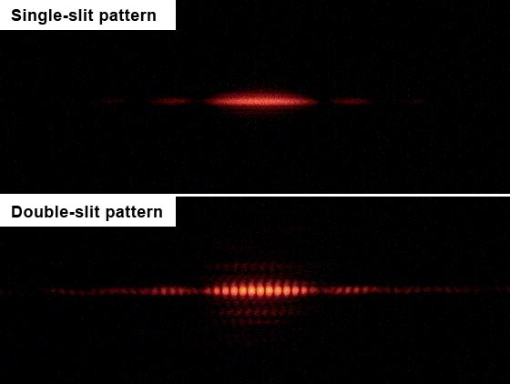
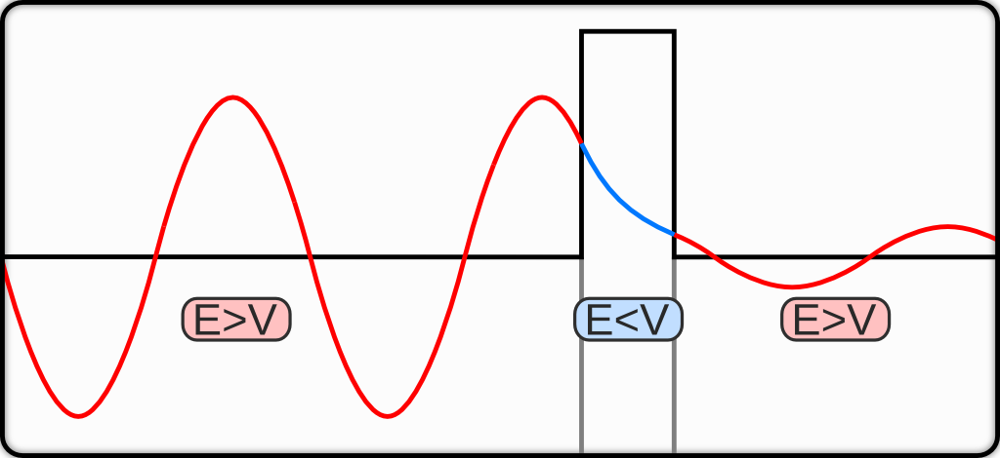

# Quantum Weirdness {#Weirdness}
In this chapter, we will delve deeper into the strangeness of quantum mechanics. In particular, we will explore quantum phenomena that don't have a classical counterpart, starting from perhaps the most simple but also one of the most revealing: the double-slit experiment.

## The double-slit experiment

The double-slit experiment is considered by many the seminal experiment in quantum mechanics. The reason why we see it only at this advanced point is that its interpretation is not as straightforward as it might seem from a superficial analysis. The famous physicist Richard Feynman was so fond of this experiment that he used to say that all of quantum mechanics can be understood from carefully thinking through its implications.

The premises of the experiment are very simple: cut two slits in a solid material (such as a sheet of metal), send light or electrons through them, and observe what happens on a screen position at some distance on the other side. The result of this experiment though are far from straightforward.

Let's first consider the single-slit case. If light consisted of classical particles, and these particles were sent in a straight line through a single-slit and allowed to strike a screen on the other side, we would expect to see a pattern corresponding to the size and shape of the slit. However, when this "single-slit experiment" is actually performed, the pattern on the screen is a diffraction pattern in which the light is spread out. The smaller the slit, the greater the angle of spread. This behavior is typical of waves, where diffraction explains the pattern as being the result of the interference of the waves with the slit.

If one illuminates two parallel slits, the light from the two slits again interferes. Here the interference is a more pronounced pattern with a series of alternating light and dark bands. The width of the bands is a property of the frequency of the illuminating light. The pattern observed on the screen is the result of this interference, as shown in figure \@ref(fig:Fig1c9).^[This diagram is taken from [Wikipedia](https://en.wikipedia.org/wiki/Double-slit_experiment#/media/File:Single_slit_and_double_slit2.jpg) by user Jordgette, and distributed under CC BY-SA 3.0 license.]

```{r Fig1c9, out.width='70%', fig.show='hold', echo=FALSE, fig.align = 'center', fig.cap='Outcomes of single-slit and double-slit experiments.'}

```

The interference pattern resulting from the double-slit experiment are observed not only with light, but also with a beam of electrons, and other small particles. 

### The individual particles experiment
The first twist in the plot is if we perform the experiment by sending individual particles (e.g, either individual photons, or individual electrons). Sending particles through a double-slit apparatus one at a time results in single particles appearing on the screen, as expected. Remarkably, however, an interference pattern emerges when these particles are allowed to build up one by one (figure  \@ref(fig:Fig2c9)^[This diagram is taken from [Wikipedia](https://en.wikipedia.org/wiki/Double-slit_experiment#/media/File:Interference_electrons_double-slit_at_10cm.png) by user Alexandre Gondran, and distributed under CC BY-SA 4.0 license]). The resulting pattern on the screen is the same as if each individual particle had passed through both slits. 

```{r Fig2c9, out.width='70%', fig.show='hold', echo=FALSE, fig.align = 'center', fig.cap='Numerical simulation of the double-slit experiment with electrons.'}
knitr::include_graphics('./img/OEP_wiki4.png')
```

This variation of the double-slit experiment demonstrates the wave–particle duality: the particle is measured as a single pulse at a single position, while the wave describes the probability of absorbing the particle at a specific place on the screen.

### "Which way" experiment
A second twist happens if we place particle detectors at the slits with the intent of showing through which slit a particle goes. The interference pattern in this case will disappear. 

This experiment illustrates that photons (and electrons) can behave as either particles or waves, but cannot be observed as both at the same time. The simplest interpretation of this experiment is that the wave function of the photon collapses into a deterministic position due to the interaction with the detector on the slit, and the interference pattern is therefore lost. This result also proves that in order to measure (detect) a photon, we must interact with it, an act that changes its wave function.

The interpretation of the results of this experiment is not simple. As for other situations in quantum mechanics, the problem arise not because we cannot describe the experiment in mathematical terms, but because the math that we need to describe it cannot be related to the macroscopic classical world we live in. According to the math, in fact, particles in the experiment are described exclusively in probabilistic terms (given by the square of the wave function). The macroscopic world, however, is not probabilistic, and outcomes of experiments can be univocally measured. Several different ways of reediming this controversy have been proposed, including for example the possibility that quantum mechanics is incomplete (the emergence of probability is due to the ignorance of some more fundamental deterministic feature of nature), or assuming that every time a measurement is done on a quantum system, the universe splits, and every possible measurable outcome is observed in different branches of our universe (we only happen to live in one of such branches, so we observe only one non-probabilistic result).^[The interested student can read more about different interpretations [HERE](https://en.wikipedia.org/wiki/Interpretations_of_quantum_mechanics).] The interpretation of quantum mechanics is still an unsolved problem in modern physics (luckily, it does not prevent us from using quantum mechanics in chemistry).

## Heisenberg's Uncertainty Principle

Let's now revisit the simple case of a free particle. As we saw in chapter \@ref(Models), the wave function that solved the TISEq: 

\begin{equation}
\psi(x) = A \exp(\pm ikx),
(\#eq:heis0)  
\end{equation}

is the equation of a plane wave along the $x$ direction. This result is in agreement with the de Broglie hypothesis, which says that every object in the universe is a wave. If this wave function describes a particle with mass (such as an electron), freely moving along one spatial direction $x$, it would be reasonable to ask the question: where is the particle located? Analyzing eq. \@ref(eq:heis0), however, it is not possible to answer this question since $\psi(x)$ is delocalized in space from $x=-\infty$ to $x=+\infty$.^[The time-dependent picture does not help us either, but since it is a little more complicated to work with the TDSEq, we are not showing it here.] In other words, the particle position is extremely uncertain because it could be essentially anywhere along the wave.

Thus for a free particle, the particle side of the wave-particle duality seems completely lost. We can, however, bring it back into the picture by writing the wave function as a sum of many plane waves, called a *wave packet*:

\begin{equation} 
\psi (x)\propto \sum _{n}A_{n}\exp\left(\frac{ip_n x}{\hbar} \right),
(\#eq:heis1)  
\end{equation}

where $A_n$ represents the relative contribution of the mode $p_n$ to the overall total. We are allowed to write the wave function this way because each individual plane wave is a solution of the TISEq, and as we already saw in chapter \@ref(Operators) and several other places, the sum of each individual solution is also a solution. An interesting consequence of writing the wave function as a wave packet is that when we sum different waves, they interfere with each other, and they might localize in some region of space. Thus for a wave function written as in eq. \@ref(eq:heis1), the wave packet can become more localized. We may also make this procedure a step further to the continuum limit, where the wave function goes from a sum to an integral over all possible modes:

\begin{equation}
\psi (x)=\frac {1}{\sqrt{2\pi\hbar}}\int_{-\infty }^{\infty }\varphi (p)\cdot \exp
\left(\frac{ip x}{\hbar} \right)\,dp,
(\#eq:heis2)  
\end{equation}

where $\varphi(p)$ represents the amplitude of these modes and is called the wave function in momentum space. In mathematical terms, we say that $\varphi (p)$ is the Fourier transform of $\psi (x)$ and that $x$ and $p$ are conjugate variables. Adding together all of these plane waves comes at a cost; namely, the momentum has become less precise since it becomes a mixture of waves of many different momenta.

One way to quantify the precision of the position and momentum is the standard deviation, $\sigma$. Since $|\psi (x)|^{2}$ is a probability density function for position, we calculate its standard deviation. The precision of the position is improved—i.e., reduced $\sigma_x$—by using many plane waves, thereby weakening the precision of the momentum—i.e., increased $\sigma_p$. Another way of stating this is that $\sigma_x$ and $\sigma_p$ have an inverse relationship (once we know one with absolute precision, the other becomes completely unknown). This fact was discovered by Werner Heisenberg and is now called the **Heisenberg's uncertainty principle**. The mathematical treatment of this procedure results in the simple formula:

\begin{equation}
\sigma_{x}\sigma_{p} \geq \frac{\hbar }{2}.
(\#eq:heis3)  
\end{equation}

The uncertainty principle can be extended to any couple of conjugated variables, including, for example, energy and time, angular momentum components along perpendicular directions, spin components along perpendicular directions, etc. It is also easy to show that conjugate variables in quantum mechanics correspond to non-commuting operators.^[Therefore, a simpler way of finding if two variables are subject to the uncertainty principle is to check if their corresponding operators commute.]

## Tunneling

Tunneling is a phenomenon where a particle may cross a barrier even if it does not have sufficient kinetic energy to overcome the potential of the barrier itself. In this situation, the particle is said to "tunnel through" the barrier following a purely quantum mechanical phenomenon (figure \@ref(fig:Fig3c9)).^[This diagram is taken from [Wikipedia](https://en.wikipedia.org/wiki/Quantum_tunnelling#/media/File:TunnelEffektKling1.png) by user Felix Kling, and distributed under CC BY-SA 3.0 license.]

```{r Fig3c9, out.width='70%', fig.show='hold', echo=FALSE, fig.align = 'center', fig.cap='Quantum tunneling through a barrier. The energy of the tunnelled particle is the same but the probability amplitude is decreased.'}

```

To explain tunneling we must resort once again to the TISeq. A traveling or standing wave function incident on a non-infinite potential barrier ($V_0$) decays in the potential as a function of $A_0\exp[-\alpha x]$, where $A_0$ is the amplitude at the boundary, $\alpha$ is proportional to the potential, and $x$ is the distance into the potential. If a second well exists at infinite distance from the first well, the probability goes to zero, so the probability of a particle existing in the second well is zero. If a second well is brought closer to the first well, the amplitude of the wave function at this boundary is not zero, so the particle may tunnel into that well from the first well. It would appear that the particle is "leaking" through the barrier; it can travel through it without having to surmount it. An important point to keep in mind is that tunneling conserves energy. The final sum of the kinetic and potential energy of the system cannot exceed the initial sum. Therefore, the potential on both sides of the barrier does not need to be the same, but the sum of the ground state energy and the potential on the opposite side of the barrier may not be larger than the initial particle energy and potential.

Tunneling can be described using the TISEq, eq. \@ref(eq:hamilt1). For the tunneling problem we can take the potential $V$ to be zero for all space, except for the region inside the barrier (between $0$ and $a$):

\begin{equation}
V=\begin{cases} 0\quad&\text{if}\; -\infty<x\leq 0 \\ V_0\quad&\text{if}\; 0<x<a \\ 0\quad&\text{if}\; a\leq x< \infty \end{cases}.
(\#eq:tunn1)  
\end{equation}
 
To solve the TISEq with this potential, we must solve it separately for each region, but we should make sure that the wave function stays single-valued, continuous and everywhere continuously differentiable. The general solution for each region, before applying the boundary conditions, is:

\begin{equation}
\psi=\begin{cases} A\sin (kx)+B\cos (kx)\quad&\text{if}\; -\infty<x\leq 0 \\ C \exp(-\alpha x)+D\exp(\alpha x) \quad&\text{if}\; 0<x<a \\ E\sin (kx)+F\cos (kx) \quad&\text{if}\; a\leq x< \infty \end{cases}
(\#eq:tunn2)  
\end{equation}

where $k=\frac{\sqrt{2mE}}{\hbar}$, and $\alpha=\frac{\sqrt{2m(V_0-E)}}{\hbar}$. To enforce continuity, we must have at the first boundary:

\begin{equation}
A\sin(0) +B \cos(0)=C\exp(0)+D\exp(0),
(\#eq:tunn3)  
\end{equation}

which implies that  $A=0$, and $B=C+D$. At the opposite boundary:

\begin{equation}
A\sin(ka) +B \cos(ka)=C\exp(-\alpha a)+D\exp(\alpha a).
(\#eq:tunn4)  
\end{equation}

We notice that, as $a$ goes to infinity, the right hand side of eq. \@ref(eq:tunn4) goes to infinity, which does not make physical sense. To reconcile this,  we must set $D=0$. 

For the final region, $E$ and $F$, present a potentially intractable problem. However, if one realizes that the value at the boundary $a$ is driving the wave in the region $a$ to infinity, it may also be realized that the wave function could be rewritten as $C\exp[-\alpha a]\cos[k(x-a)]$, phase shifting the wave function by the value of $a$,
 and setting the amplitude to the boundary value. Summarizing, the wave function is:

\begin{equation}
\psi=\begin{cases} B\cos (kx)\quad&\text{if}\; -\infty<x\leq 0 \\ B \exp(-\alpha x)  \quad&\text{if}\; 0<x<a \\ B\exp(-\alpha a)\cos[k(x-a)] \quad&\text{if}\; a\leq x< \infty. \end{cases}
(\#eq:tunn5)  
\end{equation}

Comparing the wave function on the left of the barrier with the one on its right, we notice how the amplitude is attenuated by the barrier as  $\exp\left(-a\frac{\sqrt{2m(V_0-E)}}{\hbar}\right)$, where $a$ is the width of the barrier, and  $(V_0-E)$ is the difference between the potential energy of the barrier and the current energy of the particle. Since the square of the wave function is the probability distribution, the probability of transmission through a barrier is:

\begin{equation}
\exp\left(-2a\frac{\sqrt{2m(V_0-E)}}{\hbar}\right).
(\#eq:tunn6)  
\end{equation}

As the barrier width or height approaches zero, the probability of a particle tunneling through the barrier becomes one. We can also note that $k$ is unchanged on the other side of the barrier. This implies that the energy of the particle is exactly the same as it was before it tunneled through the barrier, as stated earlier, the only thing that changes is the quantity of particles going in that direction. The rest is reflected off the barrier, and go back the way it came. On the opposite end, as the barrier width or height approaches infinity, the probability of a particle tunneling through the barrier becomes zero, and the barrier behaves similarly to those that contained the particle in the particle in a box example discussed in chapter \@ref(Models).


### Tunneling in chemical reactions
The ammonia umbrella inversion reaction provides an excellent example of the impact of quantum mechanical tunneling on the kinetic isotope effect (KIE). The reaction involves the inversion of the nitrogen atom in ammonia, which changes its position from above the plane of the three hydrogen atoms to below it and vice versa. This is a rapid oscillation of the atom and substituents, classically described by the molecule passing through a planar transition state. The ammonia interconversion is, however, more rapid than the classical prediction would predict. At room temperature, ammonia inverts 30 billion times per second. Two factors contribute to the rapidity of the inversion: a low energy barrier (24.2 kJ/mol) and a narrow width of the barrier itself, which allows for frequent quantum tunneling of the hydrogen atoms. In contrast, phosphine ($\text{PH}_3$) inverts very slowly at room temperature (energy barrier: 132 kJ/mol).

One of the primary effects of tunneling can be seen on the KIE. This is because tunneling allows some of the isotopes to bypass the activation barrier, making it easier for them to react. As a result, the reaction rate for the heavier isotope is increased relative to what it would be in the absence of tunneling, leading to a reduction in the KIE. In the case of the umbrella inversion reaction, replacing ammonia with its deuterated counterpart, $\text{ND}_3$, leads to a higher activation barrier, resulting in a slower reaction rate.

The impact of tunneling on the KIE can be quantified using transition state theory (TST), which accounts for the probability of tunneling through the activation barrier. The KIE is given by:

\begin{equation}
\text{KIE} = \frac{k(\text{H})}{k(\text{D})} = \left[\frac{m(\text{H})}{m(\text{D})}\right]^{\frac{1}{2}} \frac{k_{\text{tunneling}}}{k_{\text{classical}}},
(\#eq:kie)  
\end{equation}

where $k(\text{H})$ and $k(\text{D})$ are the rate constants for the reaction involving hydrogen and deuterium, respectively; $m(\text{H})$ and $m(\text{D})$ are the masses of hydrogen and deuterium; $k_{\text{tunneling}}$ is the rate constant for tunneling; and $k_{\text{classical}}$ is the rate constant in the absence of tunneling.

Using experimental data for the umbrella inversion reaction, the KIE can be calculated to be approximately 1.3 in the absence of tunneling. However, when tunneling is allowed, the KIE is reduced to around 1.1. This reduction in the KIE due to tunneling is a significant effect and must be considered when studying chemical reactions involving light atoms.
