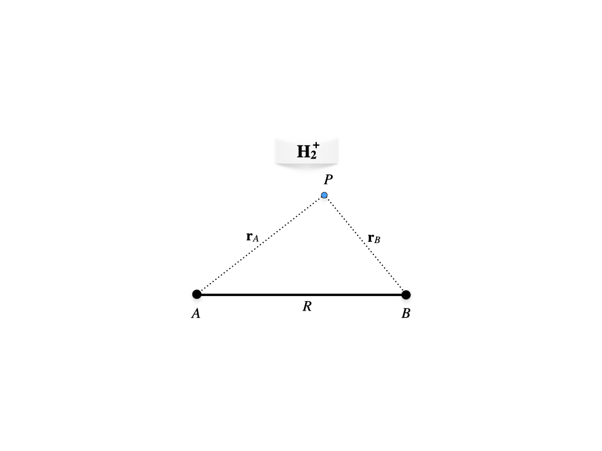
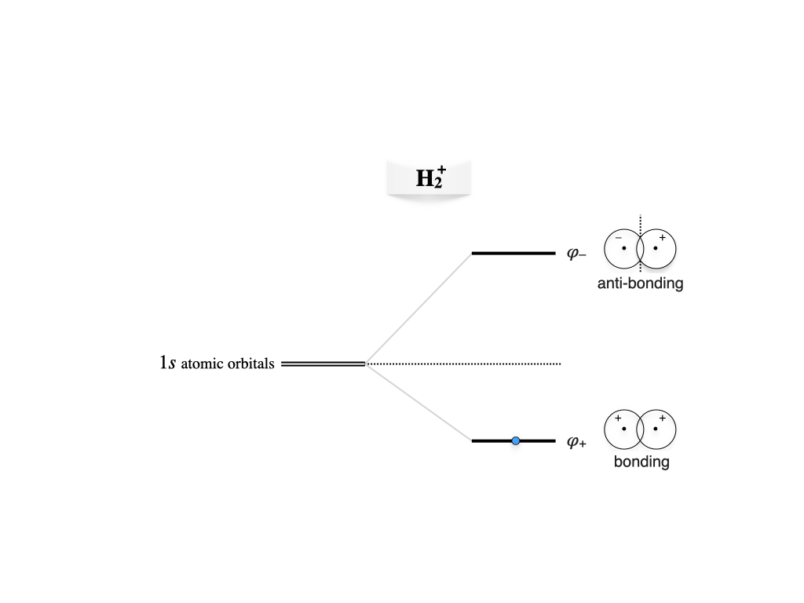
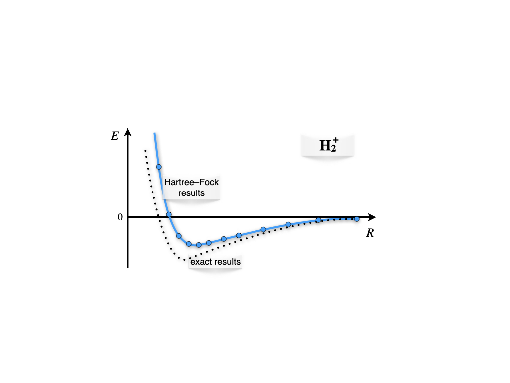
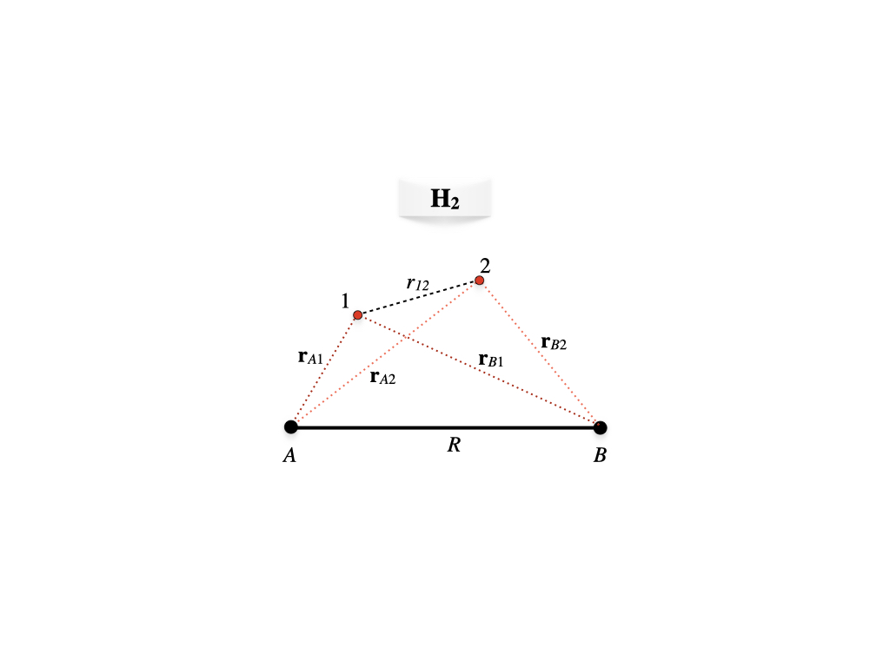
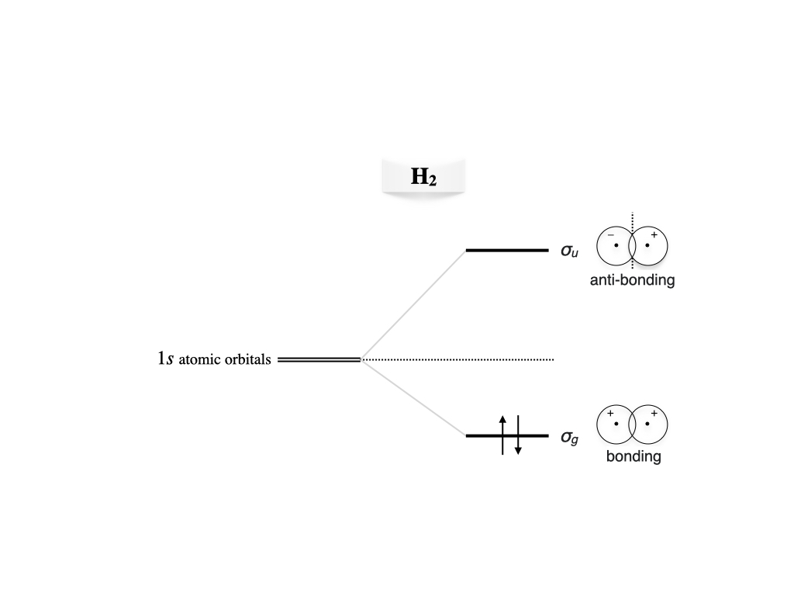
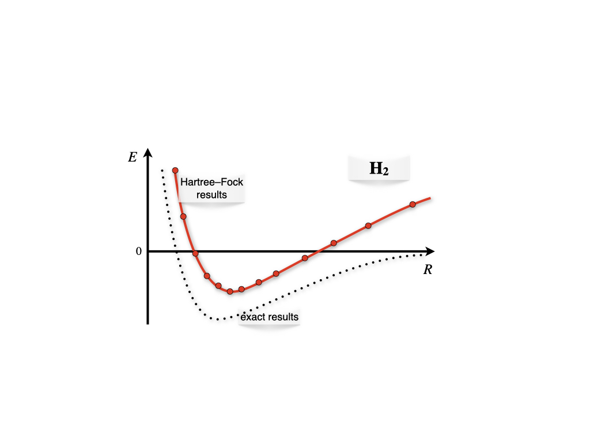

# The Chemical Bond in Diatomic Molecules {#Bonds}

In this chapter we will see a couple of examples of how the concept and mathematics of quantum mechanics can be applied to understand the chemical bond in molecules. We will start from the simplest molecule, the $\mathrm{H}_2^+$ molecular ion, and then we will move on to the simplest two-electron bond in the hydrogen molecule. To simplify the notation in this chapter, we will move away from S.I. units and  use a set tailored for molecules, called *atomic units (a.u.)*. This set of units is built by setting $\hbar=e=m_e=a_0=1$. As an example of the simplification that a.u. allows, the energy eigenvalues of the hydrogen atom, eq. \@ref(eq:HA7), simply becomes $E_n=-\frac{1}{2n^2}$ in the a.u. of energy, which are called Hartrees.

## The Chemical Bond in the Hydrogen Molecular Cation

This system has only one electron, but since its geometry is not spherical (figure \@ref(fig:Fig1c12)), the TISEq cannot be solved analytically as for the hydrogen atom. 

```{r Fig1c12, out.width='70%', fig.show='hold', echo=FALSE, fig.align = 'center', fig.cap='Geometry of the hydrogen molecular cation.'}

```

The electron is at point $P$, while the two protons are at position $A$ and $B$ at a fixed distance $R$. Using the Born-Oppenheimer approximation we can write the one-electron molecular Hamiltonian in a.u. as: 

\begin{equation}
\hat{H} = \hat{H}_e+\frac{1}{R} = \left( -\frac{1}{2}\nabla^2-\frac{1}{\mathbf{r}_A}-\frac{1}{\mathbf{r}_B} \right)+\frac{1}{R}
(\#eq:bond1)
\end{equation}

As a first approximation to the variational wave function, we can build the one-electron molecular orbital (MO) by linearly combine two $1s$ hydrogenic orbitals centered at $A$ and $B$, respectively:

\begin{equation}
\varphi = c_1 a + c_2 b,
(\#eq:bond2)
\end{equation}

with:

\begin{equation}
\begin{aligned}
a &= 1s_A = \left( \psi_{100} \right)_A\\
b &= 1s_B = \left( \psi_{100} \right)_B.
\end{aligned}
(\#eq:bond3)
\end{equation}

Using eq. \@ref(eq:molham11) and considering that the nuclei are identical, we can define the integrals $H_{aa}=H_{bb}, H_{ab}=H_{ba}$ and $S_{ab}=S$ (while $S_{aa}=1$ because the hydrogen atom orbitals are normalized). The secular equation, eq. \@ref(eq:molham12) can then be written:

\begin{equation}
\begin{vmatrix}
H_{aa}-E   & H_{ab}-ES \\\
H_{ab}-ES  & H_{aa}-E
\end{vmatrix}=0
(\#eq:bond4)
\end{equation}

The expansion of the determinant results into:

\begin{equation}
\begin{aligned}
(H_{aa}-E)^2 &=(H_{ab}-ES)^2 \\
H_{aa}-E &= \pm (H_{ab}-ES), \\
\end{aligned}
(\#eq:bond5)
\end{equation}

with roots:

\begin{equation}
\begin{aligned}
E_{+} &= \frac{H_{aa}+H_{ab}}{1+S} = H_{aa}+\frac{H_{ba}-SH_{aa}}{1+S}, \\
E_{-} &= \frac{H_{aa}-H_{ab}}{1-S} = H_{aa}-\frac{H_{ba}-SH_{aa}}{1-S}, 
\end{aligned}
(\#eq:bond6)
\end{equation}

the first corresponding to the ground state, the second to the first excited state. Solving for the best value for the coefficients of the linear combination for the ground state $E_{+}$, we obtain:

\begin{equation}
c_1=c_2=\frac{1}{\sqrt{2+2S}},
(\#eq:bond7)
\end{equation}

which gives the bonding MO:

\begin{equation}
\varphi_{+}=\frac{a+b}{\sqrt{2+2S}}.
(\#eq:bond8)
\end{equation}

Proceeding similarly for the excited state, we obtain:

\begin{equation}
c_1=\frac{1}{\sqrt{2-2S}}\;\quad c_2=-\frac{1}{\sqrt{2-2S}},
(\#eq:bond9)
\end{equation}

which gives the antibonding MO:

\begin{equation}
\varphi_{-}=\frac{b-a}{\sqrt{2-2S}}.
(\#eq:bond10)
\end{equation}

These results can be summarized in the molecular orbital diagram of figure \@ref(fig:Fig2c12) We notice that the splitting of the doubly degenerate atomic level under the interaction is non-symmetric for $S\neq0$, the antibonding level being more repulsive and the bonding less attractive than the symmetric case occurring for $S = 0$.

```{r Fig2c12, out.width='70%', fig.show='hold', echo=FALSE, fig.align = 'center', fig.cap='Molecular orbitals diagram for the hydrogen molecular cation.'}

```

Calculating the values for the integrals and repeating these calculations for different internuclear distances, $R$, results in the plot of figure \@ref(fig:Fig3c12) As we see from the plots, the ground state solution is negative for a vast portion of the plot. The energy is negative because the electronic energy calculated with the bonding orbital is lower than the nuclear repulsion. In other words, the creation of the molecular orbital stabilizes the molecular configuration versus the isolated fragments (one hydrogen atom and one proton).

```{r Fig3c12, out.width='70%', fig.show='hold', echo=FALSE, fig.align = 'center', fig.cap='Born-Oppenheimer energy landscape for the hydrogen molecular cation.'}

```

## The Chemical Bond in the Hydrogen Molecule

```{r Fig4c12, out.width='70%', fig.show='hold', echo=FALSE, fig.align = 'center', fig.cap='Geometry of the hydrogen molecule.'}

```

We can now examine the formation of the two-electron chemical bond in the $\text{H}_2$ molecule. With reference to figure \@ref(fig:Fig4c12), the molecular Hamiltonian for $\text{H}_2$ in a.u. in the Born-Oppenheimer approximation will be: 

\begin{equation}
\begin{aligned}
\hat{H} &= \hat{H}_e+\frac{1}{R} \\
&=\left( -\frac{1}{2}\nabla^2_1-\frac{1}{\mathbf{r}_{A1}}-\frac{1}{\mathbf{r}_{B1}} \right)+\left( -\frac{1}{2}\nabla^2_2-\frac{1}{\mathbf{r}_{A2}}-\frac{1}{\mathbf{r}_{B2}} \right)+\frac{1}{r_{12}}+\frac{1}{R}\\
&= \hat{h}_1+\hat{h}_2+\frac{1}{r_{12}}+\frac{1}{R},
\end{aligned}
(\#eq:bond11)
\end{equation}

where $\hat{h}$ is the one-electron Hamiltonian. As for the previous case, we can build the first approximation to the molecular wave function by considering two $1s$ atomic orbitals $a(\mathbf{r}_1)$ and $b(\mathbf{r}_2)$ centered at $A$ and $B$, respectively, having an overlap $S$. If we Neglect the electron-electron repulsion term, $\frac{1}{r_{12}}$, the resulting Hartree-Fock equations are exactly the same as in the previous case. The most important difference, though, is that in this case we need to consider the spin of the two electrons. Proceeding similarly to what we have done for the many-electron atom in chapter \@ref(Atoms), we can build an antisymmetric wave function for $\text{H}_2$ using a Slater determinant of doubly occupied MOs. For the ground state, we can use the lowest energy orbital obtained from the solution of the Hartree-Fock equations, which we already obtained in eq. \@ref(eq:bond8). Using a notation that is based on the symmetry of the molecule, this bonding orbital in $\text{H}_2$ is usually called $\sigma_g$, where $\sigma$ refers to the $\sigma$ bond that forms between the two atoms. The Slater determinant for the ground state is therefore:^[Compare this equation to \@ref(eq:atom6) for the helium atom.]

\begin{equation}
\Psi (\mathbf{x}_{1},\mathbf{x}_{2})= |\sigma_{g}\phi_{\uparrow},\sigma_{g}\phi_{\downarrow}\rangle,=\sigma_{g}(\mathbf{r}_1)\sigma_{g}(\mathbf{r}_2) \frac{1}{\sqrt{2}} \left[ \phi_{\uparrow}\phi_{\downarrow} - \phi_{\downarrow}\phi_{\uparrow} \right],
(\#eq:bond12)
\end{equation}

where:

\begin{equation}
\sigma_{g}=\varphi_{+}=\frac{\left(\psi_{100}\right)_A+\left(\psi_{100}\right)_B}{\sqrt{2+2S}}.
(\#eq:bond13)
\end{equation}

The energies and the resulting MO diagram is similar to that for $\mathrm{H}_2^+$, with the only difference that two electron will be described by the same $\sigma_g$ MO (figure \@ref(fig:Fig5c12)). 

```{r Fig5c12, out.width='70%', fig.show='hold', echo=FALSE, fig.align = 'center', fig.cap='Molecular orbitals diagram for the hydrogen molecule.'}

```

As for the many-electron atoms, the Hartree-Fock method is just an approximation to the exact solution. The accurate theoretical value for the bond energy at the bond distance of $R_e=1.4\;a_0$ is $E= -0.17447\;E_h$. The variational result obtained with the wave function in eq. \@ref(eq:bond12) is $E= -0.12778\;E_h$, which is $\sim 73 \%$ of the exact value. The variational coefficient (i.e., the orbital exponent, $c_0$, that enters the $1s$ orbital formula $\psi_{100}=\frac{1}{\pi}\exp[c_0r]$) is optimized at $c_0=1.1695$, a value that shows how the orbitals significantly contract due to spherical polarization.

If we scan the Born-Oppenheimer energy landscape using the wave function in eq. \@ref(eq:bond12) as we have done for $\mathrm{H}_2^+$,  we obtain the plot in figure \@ref(fig:Fig6c12).

```{r Fig6c12, out.width='70%', fig.show='hold', echo=FALSE, fig.align = 'center', fig.cap='Born-Oppenheimer energy landscape for the hydrogen molecule.'}

```


As we can see, the Hartree-Fock results for $\mathrm{H}_2$ describes the formation of the bond qualitatively around the bond distance (minimum of the curve), but they fail to describe the molecule at dissociation. This happens because in eq. \@ref(eq:bond12) both electrons are in the same orbital with opposite spin (electrons are coupled), and the orbital is shared among both centers. At dissociation, this corresponds to an erroneous ionic dissociation state where both electron are localized on either one of the two centers (this center is therefore negatively charged), with the other proton left without electrons. This is in contrast with the correct dissociation, where each electron should be localized around each center (and therefore, it should be uncoupled from the other electron). This error is once again the result of the approximations that are necessary to treat the TISEq of a many-electron system. It is obviously not a failure of quantum mechanics, and it can be easily corrected using more accurate approximations on modern computers. 


## Chapter Review {#rev12}
### Study Questions {#quest12}

**1. In the H$_2^+$ treatment, which one‑electron molecular Hamiltonian (in atomic units, and using the Born–Oppenheimer approximation) is used?**

a. $\hat{H} = -\tfrac{1}{2}\nabla^2 - \dfrac{1}{r_a}$  
b. $\hat{H} = -\tfrac{1}{2}\nabla^2 - \dfrac{1}{r_b}$  
c. $\hat{H} = -\tfrac{1}{2}\nabla^2 - \dfrac{1}{r_a} - \dfrac{1}{r_b}$  
d. $\hat{H} = -\tfrac{1}{2}\nabla^2 + \dfrac{1}{r_a} + \dfrac{1}{r_b}$  
e. $\hat{H} = -\nabla^2 + \dfrac{1}{r_a r_b}$  

---

**2. Which of the following is used as the first variational ansatz for the one‑electron molecular orbital in H$_2^+$?**

a. $\varphi = a$  
b. $\varphi = b$  
c. $\varphi = a b$  
d. $\varphi = c_1 a + c_2 b$
e. $\varphi = a^2 + b^2$  

---

**3. In the secular problem for H$_2^+$, what is the physical meaning of the overlap integral $S = S_{ab}$?**

a. integral $\int a(\mathbf{r}) b(\mathbf{r}) d\mathbf{r}$ measuring non‑orthogonality of the two 1s orbitals 
b. nuclear repulsion between the two protons  
c. kinetic energy between $a$ and $b$  
d. electron–electron repulsion  
e. spin overlap between alpha and beta functions  

---

**4. The diagonalization of the 2×2 secular problem for H$_2^+$ gives which types of molecular orbitals?**

a. a nonbonding and an antinonbonding orbital  
b. a bonding $\varphi_+$ and an antibonding $\varphi_-$ combination  
c. two identical orbitals with the same energy  
d. two core orbitals localized on each nucleus  
e. two purely antibonding orbitals

---

**5. What is the physical meaning of the negative total energy of the ground state for a range of $r$ in H$_2^+$?**

a. the molecular ion is unstable relative to separated H + H$^+$  
b. the molecular orbital stabilizes the system relative to the separated fragments  
c. electron–nuclear attraction is negligible  
d. only nuclear–nuclear repulsion matters  
e. there is no chemical bond  

---

**6. Which of the following is the correct molecular Hamiltonian, in a.u. and under the Born–Oppenheimer approximation, for H$_2$?**

a. $\hat{h}_1 + \hat{h}_2$ only  
b. $\hat{h}_1 + \hat{h}_2 - 1/r_{12}$  
c. $\hat{k}_n + \hat{k}_e$ only  
d. $1/r_{12} + 1/r$ only  
e. $\hat{h}_1 + \hat{h}_2 + 1/r_{12} + 1/r$  

---

**7. For the ground state of H$_2$ in the minimal MO picture used in this chapter, which orbital and occupancy pattern are used?**

a. two electrons singly occupying $\varphi_+$ and $\varphi_-$ with parallel spins  
b. both electrons in the antibonding MO $\varphi_-$ with opposite spin  
c. one electron in $\sigma_g$, one in a core orbital  
d. both electrons in the bonding MO $\sigma_g = \varphi_+$ with opposite spin  
e. both electrons in a localized atomic orbital on a single nucleus   

---

**8. why does the RHF‑type description of H$_2$ fail at large H–H separations (dissociation limit)?**

a. it breaks spin symmetry  
b. it forces both electrons to remain in the same delocalized orbital shared between centers, rather than localizing one electron on each atom  
c. it neglects nuclear repulsion  
d. it neglects electron kinetic energy  
e. it overestimates overlap as $S=1$

---

**9. What is the main qualitative effect of including electron–electron repulsion and better correlation methods beyond the simple Hartree–Fock picture in H$_2$?**

a. they destroy the bond minimum  
b. they force both electrons into antibonding orbitals  
c. they improve the description of the potential‑energy curve, particularly the dissociation region  
d. they eliminate spin considerations  
e. they make the electrons behave classically  

---

**10. Comparing H$_2^+$ and H$_2$, which statement about their bonding descriptions is true?**

a. both are one‑electron systems with identical Hamiltonians  
b. H$_2^+$ is exactly solvable analytically while H$_2$ is not  
c. H$_2^+$ has one‑electron bonding described by a single MO; H$_2$ requires a two‑electron antisymmetric wave function including spin  
d. H$_2^+$ has no bound state  
e. H$_2$ can be described without consideration of spin  


---

`r if (knitr::is_html_output()) {
  '
  Answers: <span style="cursor: pointer; color: blue; text-decoration: underline;" onclick="document.getElementById(\'reveal-inline-content\').style.display=\'inline\'; this.style.display=\'none\';">
    Click to reveal
  </span>
  <span id="reveal-inline-content" style="display: none;">
            1.c, 2.d, 3.a, 4.b, 5.b, 6.e, 7.d, 8.b, 9.c, 10.c
  </span>
  '
} else if (knitr::is_latex_output()) {
  'Answers: 1.c, 2.d, 3.a, 4.b, 5.b, 6.e, 7.d, 8.b, 9.c, 10.c'
}`

