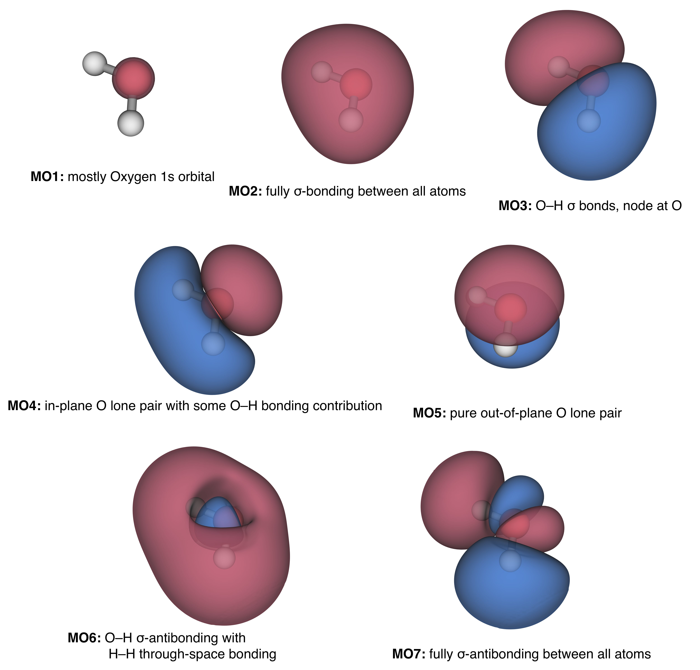
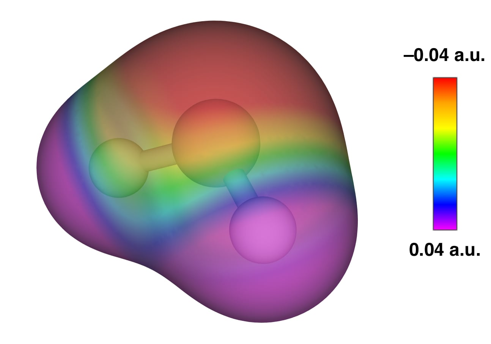

# The Chemical Bond in Polyatomic Molecules {#Poly}

The structure in space of polyatomic molecules depends on the stereochemistry of their chemical bonds and can be determined by solving the (approximated) TISEq using the Born—Oppenheimer approximation using a method that uses a linear combination of atomic orbitals to form molecular orbitals (LCAO-MO).

## The Chemical Bond in the Water Molecule Using a Minimal Basis

For a minimal representation of the two hydrogen atoms, we need two $1s$ functions, one centered on each atom. Oxygen has electrons in the second principal quantum level, so we will need one $1s$, one $2s$, and three $2p$ functions (one each of $p_x$, $p_y$, and $p_z$). Summarizing, for a minimal representation of the water wave function we need five orbitals on oxygen, plus one each on the hydrogen atoms, for a total of 7 functions. From these atomic functions, we can build a total wave function using the LCAO method of chapter \@ref(Molecules), and then we can use the variational principle, in conjunction with the Hartree—Fock (HF) method, to build and solve a secular determinant that looks is similar to that in eq. \@ref(eq:molham12), with $m=7$ being the total number of basis functions. The approximated Hamiltonian operator in the HF method is called the Fock operator, and it can be divided into one-electron integrals, comprising the kinetic and potential energy contributions:


\begin{equation}
\begin{aligned}
\displaystyle K_{ij} &= \int \phi_i^* {\hat K} \phi_j\; d\mathbf{\tau}=\int \phi_i^* {\left(-\frac{1}{2}\nabla^2\right)} \phi_j\; d\mathbf{\tau} \\
\displaystyle V_{ij} &= \int \phi_i^* {\hat V} \phi_j\;d\mathbf{\tau} = \int \phi_i^* {\left(-\sum_k^{\mathrm{nuclei}}\frac{Z_k}{r_k}\right)} \phi_j\; d\mathbf{\tau} ,
\end{aligned}
(\#eq:oneelint)
\end{equation}

as well as two-electron integrals describing the coulomb repulsion between electrons:

\begin{equation}
V_{ijkl} = \iint \phi_i^* \phi_j^* {\hat r}_{12} \phi_k \phi_l\; d\mathbf{\tau_1}d\mathbf{\tau_2}=\iint \phi_i^* \phi_j^* \left(\frac{1}{r_{12}}\right) \phi_k \phi_l\; d\mathbf{\tau_1}d\mathbf{\tau_2}.
(\#eq:twoelint)
\end{equation}

Despite the minimal basis set, the total number of integrals that need to be calculated for water is large, since  $i$, $j$, $k$, and $l$ can be any one of the 7 basis functions. Hence there are $7\times7=49$ kinetic energy integrals, and the same number of potential energy integrals for each nucleus, resulting in $7\times 7 \times 3 = 147$. The grand total of one-electron integrals is thus 196. For the two-electron integrals, we have $7 \times 7 \times 7 \times 7 = 2{,}401$ integrals to calculate. Overall for this simple calculation on water, we need almost $2{,}600$ integrals.^[The numbers computed here involve the minimum amount of uncontracted "hydrogenic" functions that can be used for calculation on water. In real-life calculations a linear combination of simpler primitive functions (gaussians) is used to describe a single uncontracted function. For example in the simplest case, the STO-3G basis set, each uncontracted function is composed of 3 primitive gaussian functions. Thus, for any individual one-electron integral, there will be $3 \times 3 = 9$ separate integrals involving the primitives. There are thus $9 \times 196 = 1{,}764$ individual primitive one-electron integrals. As for the two-electron integrals, again, every individual integral will require considering every possible combination of constituent primitives which is $3 \times 3 \times 3 \times 3 = 81$. Thus, the total number of primitive two-electron integrals is $81 \times 2{,}401 = 194{,}481$ (gulp!) Notice that even for this small molecule the number of two-electron integrals totally dominates the number of one-electron integrals. The disparity only increases with molecular size. Notice: Portions of this section are based on Prof. C.J. Cramer's lecture notes available (here)[http://pollux.chem.umn.edu/4502/3502_lecture_29.pdf]]

All this to find $5$ occupied molecular orbitals from which to form a final Slater determinant ($10$ electrons, two to an orbital, so $5$ orbitals). The situation sounds horrible, but it should be recognized that the solutions to all of the integrals are known to be analytic formulae involving only interatomic distances, cartesian exponents, and the values of a single exponent in the atomic functions. If we use slightly simpler gaussian functions instead of the more complicated hydrogenic solutions, the total number of floating-point operations to solve the integrals is roughly $1{,}000{,}000$. In computer speak that's one megaflop (megaflop = million FLoating-point OPerations). A modern digital computer processor can achieve gigaflop per second performance, so the computer can accomplish all these calculations in under one second. An additional way in which things can be improved is to recognize that the molecule has symmetries that can be exploited to reduce the number of total integrals that needs to be calculated. 


## Hartree-Fock Calculation for Water

To find the Hartree-Fock (HF) molecular orbitals (MOs) we need to solve the following secular determinant:

\begin{equation}
\begin{vmatrix}
F_{11}-ES_{11}   & F_{12}-ES_{12}   & \cdots & F_{17}-ES_{17}\\\
F_{21}-ES_{21}   & F_{22}-ES_{22}   & \cdots & F_{27}-ES_{27}\\\
\vdots           &   \vdots         & \ddots & \vdots\\\
H_{71}-ES_{71}   & F_{72}-ES_{72}   & \cdots & F_{77}-ES_{77}
\end{vmatrix}=0
(\#eq:hfequationh2o)
\end{equation}

with $S_{ij}$ being the overlap integrals of eq. \@ref(eq:molham11)), and $F_{ij}$ the matrix elements of the Fock operator, defined using the one- and two-electron integrals in eq. \@ref(eq:oneelint) and eq. \@ref(eq:twoelint) as:

\begin{equation}
F_{ij} = K_{ij} + V_{ij} + \sum_{kl} P_{kl} \left[ V_{ijkl} -\frac{1}{2}V_{ikjl} \right],
(\#eq:HFmatrixelement)
\end{equation}

with the density matrix elements $P_{kl}$ defined as:

\begin{equation}
P_{kl} = 2 \sum_{i}^{\mathrm{occupied}} a_{ki}a_{li},
(\#eq:densitymatrixelement)
\end{equation}

where the $a$ values are the coefficients of the basis functions in the occupied molecular orbitals. These values will be determined using the SCF procedure, which proceeds as follows: At the first step we simply guess what these are, then we iterate through solution of the secular determinant to derive new coefficients and we continue to do so until self-consistency is reached (i.e. the $N+1$ step provides coefficients and energies that are equal to those in the $N$ step).

We can try to solve the SCF procedure for water using a fixed geometry of the nuclei close to the experimental structure: O-H bond lengths of $0.95\,\dot{A}$ and a valence bond angle at oxygen of $104.5^\circ$. To do so, we can use a minimal basis functions composed of the following seven orbitals: basis function #1 is an oxygen $1s$ orbital, #2 is an oxygen $2s$ orbital, #3 is an oxygen $2p_x$ orbital, #4 is an oxygen $2p_y$ orbital, #5 is an oxygen $2p_z$ orbital, #6 is one hydrogen $1s$ orbital, and #7 is the other hydrogen $1s$ orbital. The corresponding integrals introduced in the previous section can be calculated using a quantum chemistry code. The calculated overlap matrix elements are:


\begin{equation}
\mathbf{S}=
\begin{bmatrix}
\mathrm{O}\;1s & \mathrm{O}\;2s & \mathrm{O}\;2p_x & \mathrm{O}\;2p_y & \mathrm{O}\;2p_z & \mathrm{H}_a\;1s & \mathrm{H}_b\;1s & \\\
1.000 & & & & & &  &\mathrm{O}\;1s \\\ 
0.237 & 1.000 & & & & &  &\mathrm{O}\;2s \\\
0.000 & 0.000 & 1.000 & & & & &\mathrm{O}\;2p_x \\\
0.000 & 0.000 & 0.000 & 1.000 & & & &\mathrm{O}\;2p_y \\\
0.000 & 0.000 & 0.000 & 0.000 & 1.000 & & &\mathrm{O}\;2p_z \\\
0.055 & 0.479 & 0.000 & 0.313 & -0.242 & 1.000 &  &\mathrm{H}_a\;1s \\\
0.055 & 0.479 & 0.000 & -0.313 & -0.242 & 0.256 & 1.000&\mathrm{H}_b\;1s 
\end{bmatrix}
(\#eq:smatrix)
\end{equation}

There are many noteworthy features in $\mathbf{S}$. First, it is shown in a lower packed triangular form because every element $j,i$ is the same as the element $i,j$ by symmetry, and every diagonal element is $1$ because the basis functions are normalized. Note that, again by symmetry, every $p$ orbital on oxygen is orthogonal (overlap = zero) with every $s$ orbital and with each other, but the two $s$ orbitals do overlap (this is due to the fact that they are not pure hydrogenic orbitals—which would indeed be orthogonal—but they have been optimized, so $S_{12} = 0.237$). Note also that the oxygen $1s$ orbital overlaps about an order of magnitude less with any hydrogen $1s$ orbital than does the oxygen $2s$ orbital, reflecting how much more rapidly the first quantum-level orbital decays compared to the second. Note that by symmetry the oxygen $p_x$ cannot overlap with the hydrogen $1s$ functions (positive overlap below the plane exactly cancels negative overlap above the plane) and that the oxygen $p_y$ overlaps with the two hydrogen $1s$ orbitals equally in magnitude but with different sign because the $p$ orbital has different phase at its different ends. Finally, the overlap of the $p_z$ is identical with each H $1s$ because it is not changing which lobe it uses to interact. The kinetic energy matrix (in a.u.) is:

\begin{equation}
\mathbf{K}=
\begin{bmatrix}
29.003 & & & & & & \\\ 
-0.168 & 0.808 & & & & &  \\\
0.000 & 0.000 & 2.529 & & & & \\\
0.000 & 0.000 & 0.000 & 2.529 & & & \\\
0.000 & 0.000 & 0.000 & 0.000 & 2.529 & & \\\
-0.002 & 0.132 & 0.000 & 0.229 & -0.177 & 0.760 & \\\
-0.002 & 0.132 & 0.000 & -0.229 & -0.177 & 0.009 & 0.760
\end{bmatrix}
(\#eq:kmatrix)
\end{equation}

Notice that every diagonal term is much larger than any off-diagonal term. Recall that each each kinetic energy integral, eq. \@ref(eq:oneelint), involves the Laplacian operator, $\nabla^2$. The Laplacian reports back the sum of second derivatives in all coordinate directions. That is, it is a measure of how fast the slope of the function is changing in various directions. If we take two atomic orbitals $\mu$ and $\nu$ far apart from each other, then since gaussians go to zero at least exponentially fast with distance, $\nu$ is likely to be very flat where $\mu$ is large. The second derivative of a flat function is zero. So, every point in the integration will be roughly the amplitude of $\mu$ times zero, and not much will accumulate. For the diagonal element, on the other hand, the interesting second derivatives will occur where the function has maximum amplitude (amongst other places) so the accumulation should be much larger. Notice also that off-diagonal terms can be negative. That is because there is no real physical meaning to a kinetic energy expectation value involving two different orbitals. It is just an integral that appears in the complete secular determinant. Symmetry again keeps $p$ orbitals from mixing with $s$ orbitals or with each other. The nuclear attraction matrix is:

\begin{equation}
\mathbf{V}=
\begin{bmatrix}
-61.733 & & & & & & \\\ 
-7.447 & -10.151 & & & & &  \\\
0.000 & 0.000 & -9.926 & & & & \\\
0.000 & 0.000 & 0.000 & -10.152 & & & \\\
0.000 & 0.000 & 0.000 & 0.000 & -10.088 & & \\\
-1.778 & -3.920 & 0.000 & -0.228 & -0.184 & -5.867 & \\\
-1.778 & -3.920 & 0.000 & 0.228 & 0.184 & -1.652 & -5.867
\end{bmatrix}
(\#eq:vmatrix)
\end{equation}

Again, diagonal elements are bigger than off-diagonal elements because the $1/r$ operator acting on a basis function $\nu$ will ensure that the largest contribution to the overall integral will come from the nucleus $k$ on which basis function $\nu$ resides. Unless $\mu$ also has significant amplitude around that nucleus, it will multiply the result by roughly zero and the whole integral will be small. Again, positive values can arise when two different functions are involved even though electrons in a single orbital must always be attracted to nuclei and thus diagonal elements must always be negative. Note that the $p$ orbitals all have different nuclear attractions. That is because, although they all have the same attraction to the O nucleus, they have different amplitudes at the H nuclei. The $p_x$ orbital has the smallest amplitude at the H nuclei (zero, since they are in its nodal plane), so it has the smallest nuclear attraction integral. The $p_z$ orbital has somewhat smaller amplitude at the H nuclei than the $p_y$ orbital because the bond angle is greater than $90^\circ$ (it is $104.5^\circ$; if it were $90^\circ$ the O-H bonds would bisect the $p_y$ and $p_z$ orbitals and their amplitudes at the H nuclei would necessarily be the same). Thus, the nuclear attraction integral for the latter orbital is slightly smaller than for the former. 

The sum of the kinetic and nuclear attraction integrals is usually called the one- electron or core part of the Fock matrix and abbreviated $\mathbf{h}$ (i.e., $\mathbf{h} = \mathbf{K} + \mathbf{V}$). One then writes $\mathbf{F} = \mathbf{h} + \mathbf{G}$ where $\mathbf{F}$ is the Fock matrix, $\mathbf{h}$ is the one-electron matrix, and $\mathbf{G}$ is the remaining part of the Fock matrix coming from the two-electron four-index integrals (cf eq. \@ref(eq:HFmatrixelement)). To compute those two-electron integrals, however, we need the density matrix, which itself comes from the occupied MO coefficients. So, we need an initial guess at those coefficients. We can get such a guess many ways, but ultimately any guess is as good as any other. With these coefficients we can compute the density matrix using eq. \@ref(eq:densitymatrixelement):

\begin{equation}
\mathbf{P}=
\begin{bmatrix}
2.108 & & & & & & \\\ 
-0.456 & 2.010 & & & & &  \\\
0.000 & 0.000 & 2.000 & & & & \\\
0.000 & 0.000 & 0.000 & 0.737 & & & \\\
-0.104 & 0.618 & 0.000 & 0.000 & 1.215 & & \\\
-0.022 & -0.059 & 0.000 & 0.539 & -0.482 & 0.606 & \\\
-0.022 & -0.059 & 0.000 & -0.539 & -0.482 & -0.183 & 0.606
\end{bmatrix}
(\#eq:pmatrix)
\end{equation}

With $\mathbf{P}$, we can compute the remaining contribution of $\mathbf{G}$ to the Fock matrix. We will not list all 406 two-electron integrals here. Instead, we will simply write the total Fock matrix:

\begin{equation}
\mathbf{F}=
\begin{bmatrix}
-20.236 & & & & & & \\\ 
-5.163 & -2.453 & & & & &  \\\
0.000 & 0.000 & -0.395 & & & & \\\
0.000 & 0.000 & 0.000 & -0.327 & & & \\\
0.029 & 0.130 & 0.000 & 0.000 & -0.353 & & \\\
-1.216 & -1.037 & 0.000 & -0.398 & 0.372 & -0.588 & \\\
-1.216 & -1.037 & 0.000 & 0.398 & 0.372 & -0.403 & -0.588
\end{bmatrix}
(\#eq:fmatrix)
\end{equation}

So, we're finally ready to solve the secular determinant, since we have $\mathbf{F}$ and $\mathbf{S}$ fully formed. When we do that, and then solve for the MO coefficients for each root $E$, we get new occupied MOs. Then, we iterate again, and again, and again, until we are satisfied that further iterations will not change either our (i) energy, (ii) density matrix, or (iii) MO coefficients (it’s up to the quantum chemist to decide what is considered satisfactory).

In our water calculation, if we monitor the energy at each step we find:

\begin{equation}
\begin{aligned}
E(RHF) &= \; -74.893\,002\,803\qquad\text{a.u. after 1 cycles} \\
E(RHF) &= \; -74.961\,289\,145\qquad\text{a.u. after 2 cycles} \\
E(RHF) &= \; -74.961\,707\,247\qquad\text{a.u. after 3 cycles} \\
E(RHF) &= \; -74.961\,751\,946\qquad\text{a.u. after 4 cycles} \\
E(RHF) &= \; -74.961\,753\,962\qquad\text{a.u. after 5 cycles} \\
E(RHF) &= \; -74.961\,754\,063\qquad\text{a.u. after 6 cycles} \\
E(RHF) &= \; -74.961\,754\,063\qquad\text{a.u. after 7 cycles} \\
\end{aligned}
(\#eq:h2oenergies)
\end{equation}

Which means that our original guess was really not too bad—off by a bit less than $0.1\text{ a.u.}$ or roughly $60\text{ kcal mol}^{-1}$. Our guess energy is too high, as the variational principle guarantees that it must be. Our first iteration through the secular determinant picks up nearly $0.07\text{ a.u.}$, our next iteration an additional $0.000\,42$ or so, and by the end we are converged to within 1 nanohartree ($0.000\,000 6\text{ kcal mol}^{-1}$).

The final optimized MOs for water are:

\begin{equation}
\begin{matrix}                  
& 1 & 2 & 3 & 4 & 5 & 6 & 7 \\\
E  & -20.24094 &  -1.27218   &   -.62173    &  -.45392     &    -.39176    &   .61293    & .75095 \\\
\\\
1                & .99411    &   -.23251   &   .00000     &  -.10356     &    .00000     &   -.13340   & .00000   \\\
2                & .02672    &   .83085    &  .00000      & .53920       &  1.0000      &  .89746     & .00000  \\\
3                & .00000    &   .00000    &  .00000      & .00000       &  .00000       & .00000      & .00000  \\\
4                & .00000    &   .00000    & .60677       &  .00000      &   .00000      &  .00000     & .99474  \\\
5                & -.00442   &    -.13216  &    .00000    &   .77828     &    .00000     &  -.74288    &  .00000  \\\
6                & -.00605   &    .15919   &   .44453     &  -.27494     &    .00000     &  -.80246    &  -.84542  \\\
7                &  -.00605  &     .15919  &     -.44453  &     -.27494  &       .00000  &     -.80246 &     .84542 \\\
\end{matrix}
(\#eq:eigenvalMO)
\end{equation}

where the first row reports the eigenvalues of each MO, in $E_h$ (i.e., the energy of one electron in the MO). The sum of all of the occupied MO energies should be an underestimation of the total electronic energy because electron-electron repulsion will have been double counted. So, if we sum the occupied orbital energies (times two, since there are two electrons in each orbital), we get $2(-20.24094{-}1.27218{-}0.62173{-}0.45392{-}0.39176)=-45.961\,060$. If we now subtract the electron-electron repulsion energy $38.265\,406$ we get $-84.226\,466$. If we add the nuclear repulsion energy $9.264\,701$ to this we get a total energy $-74.961\,765$. The difference between this and the converged result above ($-74.961\,754$) can be attributed to rounding in the MO energies, which are truncated after 5 places. Notice that the five occupied MOs all have negative energies. So, their electrons are bound within the molecule. The unoccupied MOs (called "virtual" MOs) all have positive energies, meaning that the molecule will not spontaneously accept an electron from another source.

##  Shapes and Energies of Molecular Orbitals

If we analyze the optimized coefficients of the occupied MOs reported in eq.  \@ref(eq:eigenvalMO), we observe that the lowest energy orbital (by a lot!) is a nearly pure oxygen $1s$ orbital since the coefficient of the oxygen $1s$ basis function is very nearly 1 and all other coefficients are rather close to 0. Note, however, that the coefficient is not really a percentage measure. That's because the basis functions are not necessarily orthogonal to one another. Let's consider the next molecular orbital up, number 2. It has a dominant contribution from the oxygen $2s$ basis function, but non-trivial contributions from many other basis functions as well. In order to understand which kind of orbital it is, it is useful to try to visualize some of its properties. For example, recall that the square of the orbital at a particular point in space represents a probability density. As such, we can map values of the square of each orbital on a grid in 3-dimensional space, and then pick a value of probability density, say $0.04 a_0^{-3}$, and plot that as a contour surface (remember that a probability density is a 4-dimensional quantity, so we need to take a slice at some constant density to be able to plot it in 3-D). That surface is called an "isodensity" surface. In addition to the square of the function, we can also regions where the wave function is positive blue and regions where it's negative red. The five occupied and two unoccupied MOs mapped from their one-electron wave functions are plotted in figuere \@ref(fig:Fig1c12b). 

```{r Fig1c12b, out.width='90%', fig.show='hold', echo=FALSE, fig.align = 'center', fig.cap='Isodensity maps of the Molecular Orbitals (MOs) of water.'}

```

Going back to the Lewis structure of water as taught in general chemistry courses, it says that there is one pair of electrons in one O–H $\sigma$ bond, one pair in another identical such $\sigma$ bond, and two equivalent pairs that constitute the lone pairs on oxygen. The two lone pairs and the O–H bonds should by pointing towards the apices of a tetrahedron because they are all considered to be $sp^3$ hybridized. 

As you can see, the MOs look nothing like the Lewis picture. Instead, amongst other details, there is one lone pair that is pure $p$ (not $sp^3$), another that is, if anything, $sp^2$-like, but also enjoys contribution from hydrogen $1s$ components. There is one orbital that looks like both O–H $\sigma$ bonds are present, but another that has an odd "bonding-all-over" character to it.

Is it really possible that for something as simple as water all the things you've ever been told about the Lewis structure are wrong? Water must have two equivalent lone pairs, right?

It turns out that the molecular orbital results can be tested with spectroscopic experiments, and suffice to say, they agree perfectly. 


But the $sp^3$-hybridized picture of water works well, for example, to explain its hydrogen-bonding behavior: In liquid water each water molecule makes two hydrogen bonds to other water molecules and accepts two more from different water molecules and the final structure has a net lattice-like form that is tetrahedral at each oxygen atom. How can the above MOs explain that? The key point to remember is that another molecule does not see the individual orbitals of water, it just sees the final effect of all of those electrons and nuclei **together**. To explain the tetrahedral H-bond lattice we can plot some constant level of electron density (i.e. $0.02\text{ a.u.}) and map onto this isodensity surface the values of the electrostatic potential. We can find these values by bringing a positive test charge onto that surface and recording how much would it find itself attracted (because of a net negative electrostatic potential) or repelled (because of a net positive electrostatic potential). This is done in figure \@ref(fig:Fig2c12b). Notice how the negative potential is entirely on the oxygen side and the positive potential entirely on the hydrogens side. Moreover, the negative potential splays out to the tetrahedral points and the positive potential does too (those points for the purple region being roughly where the H atoms are). 

```{r Fig2c12b, out.width='60%', fig.show='hold', echo=FALSE, fig.align = 'center', fig.cap='Molecular electrostatic potential of water plotted on a 0.02 a.u. isodensity surface.'}

```


