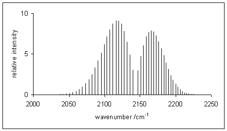

# Spectroscopy {#Spectroscopy}

The primary method of measuring the energy levels of a material is through the use of electromagnetic radiation. Experiments involving electromagnetic radiation—matter interaction are called spectroscopies. Since the energy levels of atoms and molecules are discontinuous, they absorb or emit light only at specific energies. These specific values correspond to the energy level difference between the initial and final states and they can be measured as signals in spectroscopic experiments. The intensity of the experimental signals depends on the population of the initial state involved in the transition. 

Depending on the type of radiation, as well as the shape of the molecules and the inner details of the instrument that is used, some transition might be visible by the experiment (allowed), while others might not be (forbidden). The analysis of allowed and forbidden transition for each type of spectroscopy results into some mathematical formula that are called **selection rules**. 

To summarize, spectroscopy is mainly the result of the following three effects: 

- The energy levels of the atoms or molecules (determining the position of the signals).
- The population of the energy levels (determining the intensity of the signals).
- The selection rules that account for the symmetry and the interaction with the instrument.

Spectroscopy is the most important experimental verification of quantum mechanics, since we can use it to validate its theoretical results on the energy levels of atoms and molecules.

## Rotational Spectroscopy

Rotational spectroscopy is concerned with the measurement of the energies of transitions between quantized rotational states of molecules in the gas phase. Rotational transitions of molecules are usually measured in the range $1-10\; \text{cm}^{-1}$ (microwave radiation) and rotational spectroscopy is therefore usually referred to as *microwave spectroscopy*.

Rotational spectroscopy is actively used by astrophysicists to explore the chemical composition of the interstellar medium using radio telescopes.

The rotational energies are derived theoretically by considering the molecules to be rigid rotors and applying the same treatment that we saw in chapter \@ref(Models). Correction terms might be applied to account for deviation from the ideal rigid rotor case. As we saw in chapter \@ref(Models), the quantized rotational energy levels of a rigid rotor depend on the angular moment of inertia, which in turn depends on the masses of the nuclei and the internuclear distance. Reversing the theoretical procedure of obtaining the energy levels from the distances, we can use the experimental energy levels to derive very precise values of molecular bond lengths (and in some complex case, also of angles). We will discuss below the simplest case of a diatomic molecule. For non-linear molecules, the moments of inertia are multiple, and only a few analytical method of solving the TISEq are available. For the most complicated cases, numerical methods can be used.

### Rotation of diatomic molecules

Transitions between rotational states can be observed in molecules with a permanent electric dipole moment. The rigid rotor is a good starting point from which to construct a model of a rotating molecule. It is assumed that component atoms are point masses connected by rigid bonds. A linear molecule lies on a single axis and each atom moves on the surface of a sphere around the center of mass. The two degrees of rotational freedom correspond to the spherical coordinates, $\theta$ and $\varphi$, which describe the direction of the molecular axis. The quantum state is determined by two quantum numbers $J$ and $M$. $J$ defines the magnitude of the rotational angular momentum, and $M$ its component about an axis fixed in space, such as an external electric or magnetic field. In the absence of external fields, the energy depends only on $J$. Under the rigid rotor model, the rotational energy levels, $F(J)$, of the molecule can be expressed as:

\begin{equation}
F\left(J\right)=BJ\left(J+1\right)\qquad J=0,1,2,\ldots
(\#eq:rot1)
\end{equation}

where $B$ is the rotational constant of the molecule and is related to its moment of inertia. In a diatomic molecule the moment of inertia about an axis perpendicular to the molecular axis is unique, so:

\begin{equation}
B={\frac{h}{8\pi ^{2}cI}},
(\#eq:rot2)
\end{equation}

with:

\begin{equation}
 I=\frac{m_1m_2}{m_1 +m_2}d^2,
 (\#eq:rot3)
\end{equation}

where $m_1$ and $m_2$ are the masses of the atoms and $d$ is the distance between them.

The selection rule for rotational spectroscopy dictate that during emission or absorption the rotational quantum number has to change by unity:

\begin{equation}
 \Delta J = J^{{\prime }} - J^{{\prime \prime }} = \pm 1,
 (\#eq:rot4)
\end{equation} 

where $J^{{\prime }}$ denotes the lower level and $J^{{\prime \prime }}$ denotes the upper level involved in the transition. Thus, the locations of the lines in a rotational spectrum will be given by

\begin{equation}
{\tilde  \nu }_{{J^{{\prime }}\leftrightarrow J^{{\prime \prime }}}}=F\left(J^{{\prime }}\right)-F\left(J^{{\prime \prime }}\right)=2B\left(J^{{\prime \prime }}+1\right)\qquad J^{{\prime \prime }}=0,1,2,\ldots
(\#eq:rot5)
\end{equation}

The diagram illustrates rotational transitions that obey the $\Delta J=1$ selection rule is in figure \@ref(fig:Fig1c13).^[This diagram is taken from [Wikipedia](https://en.wikipedia.org/wiki/Rotational_spectroscopy#/media/File:Rotational_spectrum_example.png) by user Nnrw, and distributed under CC BY_SA 3.0 license.] The dashed lines show how these transitions map onto features that can be observed experimentally. Adjacent $J^{{\prime \prime}}{\leftarrow}J^{{\prime }}$ transitions are separated by $2B$ in the observed spectrum. Frequency or wavenumber units can also be used for the $x$ axis of this plot.

```{r Fig1c13, out.width='50%', fig.show='hold', echo=FALSE, fig.align = 'center', fig.cap='Rotational energy levels and line positions calculated in the rigid rotor approximation.'}

```

The probability of a transition taking place is the most important factor influencing the intensity of an observed rotational line. This probability is proportional to the population of the initial state involved in the transition. The population of a rotational state depends on two factors. The number of molecules in an excited state with quantum number $J$, relative to the number of molecules in the ground state, $N_J/N_0$ is given by the Boltzmann distribution:

\begin{equation}
\frac{N_J}{N_0}=e^{-\frac{E_J}{kT}} =\exp\left[-\frac {BhcJ(J+1)}{kT}\right],
(\#eq:rot6)
\end{equation}

where $k$ is the Boltzmann constant and $T$ is the absolute temperature. This factor decreases as $J$ increases. The second factor is the degeneracy of the rotational state, which is equal to $2J+1$. This factor increases as $J$ increases. Combining the two factors we obtain:

\begin{equation}
\mathrm{population} \propto (2J+1)\exp\left[\frac{E_J}{kT}\right],
(\#eq:rot7)
\end{equation}

in agreement with the experimental shape of rotational spectra of diatomic molecules.

## Vibrational Spectroscopy
Vibrational spectroscopy is concerned with the measurement of the energies of transitions between quantized vibrational states of molecules in the gas phase. These transitions usually occur in the middle infrared (IR) region of the electromagnetic wave at approximately $4,000-400\;\text{cm}^{-1}$ ($2.5-25\;\mu \text{m}$). In the gas phase, vibrational transitions are almost always accompanied by changes in rotational energy. Transitions involving changes in both vibrational and rotational states are usually abbreviated as rovibrational transitions. Since changes in rotational energy levels are typically much smaller than changes in vibrational energy levels, changes in rotational state are said to give fine structure to the vibrational spectrum. For a given vibrational transition, the same theoretical treatment that we saw in the previous section for pure rotational spectroscopy gives the rotational quantum numbers, energy levels, and selection rules. 

As we have done in the previous section, we will discuss below the simplest case of a diatomic molecule. For non-linear molecules the spectra becomes complicated to calculate, but their interpretation remains an important tool for the analysis of chemical structures.

### Vibration of heteronuclear diatomic molecules

Diatomic molecules with the general formula $\mathrm{AB}$ have one normal mode of vibration involving stretching of the $\mathrm{A}-\mathrm{B}$ bond. The vibrational term values, $G(v)$ can be calculated with the harmonic approximation that we discussed in chapter \@ref(Models). The resulting equidistant energy levels depend on one vibrational quantum number $v$:

\begin{equation}
G(v) = \omega_e \left( v + \frac{1}{2} \right),
(\#eq:vib1)
\end{equation}

where $\omega_e$ is the harmonic frequency around equilibrium. When the molecule is in the gas phase, it can rotate about an axis, perpendicular to the molecular axis, passing through the center of mass of the molecule. As we discussed in the previous section, the rotational energy is also quantized, and depend on the rotational quantum number $J$. The values of the ro-vibrational states are found (in wavenumbers) by combining the expressions for vibration and rotation:

\begin{equation}
G(v)+F_{v}(J)=\left[\omega_e \left(v + \frac{1}{2} \right) +B_{v}J(J+1)\right],
(\#eq:vib2)
\end{equation}

where $F_{v}(J)$ are the rotational levels at each vibrational state $v$.^[This is just a first approximation to rovibrational spectroscopy. Corrections for anharmonicity centrifugal distortion are necessary to closely match experimental spectra.] 

The selection rule for electric dipole allowed ro-vibrational transitions, in the case of a diamagnetic diatomic molecule is:

\begin{equation} 
\Delta v=\pm 1\ (\pm 2,\pm 3,\ldots),\; \Delta J=\pm 1.
(\#eq:vib3)
\end{equation}

The transition with $\Delta v =\pm 1$ is known as the *fundamental transition*, while the others are called *overtones*. The selection rule has two consequences:

1. Both the vibrational and rotational quantum numbers must change. The transition $\Delta v=\pm 1,\;\Delta J=0$ (Q-branch) is forbidden.
2. The energy change of rotation can be either subtracted from or added to the energy change of vibration, giving the P- and R- branches of the spectrum, respectively.

```{r Fig2c13, out.width='50%', fig.show='hold', echo=FALSE, fig.align = 'center', fig.cap='Simulated vibration-rotation line spectrum of carbon monoxide. The P-branch is to the left of the gap at 2140 1/cm, the R-branch on the right.'}

```

A typical rovibrational spectrum is reported in figure \@ref(fig:Fig2c13) for the $\mathrm{CO}$ molecule.^[This picture is taken from [Wikipedia](https://en.wikipedia.org/wiki/Rotational–vibrational_spectroscopy#/media/File:Vib_rot_CO.png) of anonimous user, and distributed under CC BY 3.0 license.] The intensity of the signals is—once again—proportional to the initial population of the levels. Notice how the signals in the spectrum are divided among two sides, the P-branch to the left, and the R-branch to the right. These signals correspond to the transitions reported in figure \@ref(fig:Fig3c13).^[This picture is taken from [Wikipedia](https://en.wikipedia.org/wiki/Rotational–vibrational_spectroscopy#/media/File:Vibrationrotationenergy.svg) by user David-i98, and under public domain.] Notice how the transitions corresponding to the Q-branch are forbidden by the selection rules, and therefore not observed in the experimental spectrum. The position of the missing Q-branch, however, can be easily obtained from the experimental spectrum as the missing signal between the P- and R- branches. Since the Q-branch transitions do not involve changes in the rotational energy level, their value is directly proportional to $\omega_e$. This fact makes rovibrational spectroscopy an important experimental tool in the determination of bond distances of diatomic molecules.

```{r Fig3c13, out.width='50%', fig.show='hold', echo=FALSE, fig.align = 'center', fig.cap='Schematic rovibrational energy level diagram for a linear molecule.'}
knitr::include_graphics('./img/OEP_wiki7.png')
```

### Vibration of homonuclear diatomic molecules
The quantum mechanics for homonuclear diatomic molecules is qualitatively the same as for heteronuclear diatomic molecules, but the selection rules governing transitions are different. Since the electric dipole moment of the homonuclear diatomics is zero, the fundamental vibrational transition is electric-dipole-forbidden and the molecules are infrared inactive.

The spectra of these molecules can be observed by a type of IR spectroscopy that is subject to different selection rules. This technique is called **Raman spectroscopy**, and allows identification of the rovibrational spectra of homonuclear diatomic molecules because their molecular vibration is Raman-allowed.

## Electronic Spectroscopy
Electronic spectroscopy is concerned with the measurement of the energies of transitions between quantized electronic states of molecules. Electronic transitions are always associated with simultaneous changes in vibrational levels. In the gas phase vibronic transitions are also accompanied by changes in rotational energy. 

Electronic transitions are typically observed in the visible and ultraviolet regions, in the wavelength range approximately $200-700\; \text{nm }$ ($50,000-14,000\; \text{cm}^{-1}$). When the electronic and vibrational energy changes are drastically different, vibronic coupling (mixing of electronic and vibrational wave functions) can be neglected and the energy of a vibronic level can be taken as the sum of the electronic and vibrational (and rotational) energies; that is, the Born–Oppenheimer approximation applies. The overall molecular energy depends not only on the electronic state but also on the vibrational and rotational quantum numbers, $v$ and $J$. In this context, it is conventional to add a double prime $\left(v^{\prime\prime},J^{\prime\prime}\right)$ for levels of the electronic ground state and a single prime $\left(v^{\prime},J^{\prime}\right)$ for electronically excited states.

Each electronic transition may show vibrational coarse structure, and for molecules in the gas phase, rotational fine structure. This is true even when the molecule has a zero dipole moment and therefore has no vibration-rotation infrared spectrum or pure rotational microwave spectrum.

It is necessary to distinguish between absorption and emission spectra. With absorption the molecule starts in the ground electronic state, and usually also in the vibrational ground state $v^{\prime\prime}=0$ because at ordinary temperatures the energy necessary for vibrational excitation is large compared to the average thermal energy. The molecule is excited to another electronic state and to many possible vibrational states $v^{\prime}=0,1,2,3,ldots$. With emission, the molecule can start in various populated vibrational states, and finishes in the electronic ground state in one of many populated vibrational levels. The emission spectrum is more complicated than the absorption spectrum of the same molecule because there are more changes in vibrational energy level.

As we did for the previous two cases, we will concentrate below on the electronic absorption spectroscopy of diatomic molecules.

### Electronic spectroscopy of diatomic molecules
The vibronic spectra of diatomic molecules in the gas phase also show rotational fine structure. Each line in a vibrational progression will show P- and R- branches. For some electronic transitions there will also be a Q-branch. The transition energies of the lines for a particular vibronic transition are given (in wavenumbers) by:

\begin{equation}
G(J^{\prime },J^{{\prime \prime }})={\bar  \nu }_{{v^{\prime }-v^{{\prime \prime }}}}+B^{\prime }J^{\prime }(J^{\prime }+1)-B^{{\prime \prime }}J^{{\prime \prime }}(J^{{\prime \prime }}+1).
(\#eq:elec1)
\end{equation}

The values of the rotational constants, $B^{\prime}$ and $B^{\prime\prime}$ may differ appreciably because the bond length in the electronic excited state may be quite different from the bond length in the ground state. The rotational constant is inversely proportional to the square of the bond length. Usually $B^{\prime}<B^{\prime\prime}$, as is true when an electron is promoted from a bonding orbital to an antibonding orbital, causing bond lengthening. 

The treatment of rotational fine structure of vibronic transitions is similar to the treatment of rotation-vibration transitions and differs principally in the fact that the ground and excited states correspond to two different electronic states as well as to two different vibrational levels. For the P-branch $J^{\prime }=J^{{\prime \prime}}-1$, so that:

\begin{equation}
\begin{aligned}
{\bar  \nu }_{P}&={\bar  \nu}_{{v^{\prime}-v^{\prime\prime}}}+B^{\prime}(J^{\prime\prime}-1)J^{\prime\prime}-B^{\prime\prime}J^{\prime\prime}(J^{\prime\prime}+1) \\
&={\bar  \nu }_{{v^{\prime}-v^{\prime\prime}}}-(B^{\prime}+B^{\prime\prime})J^{\prime\prime}+(B^{\prime}-B^{\prime\prime}){J^{\prime\prime}}^{2}.
\end{aligned}
(\#eq:elec2)
\end{equation}

Similarly, for the R-branch $J^{\prime\prime }=J^{{\prime }}-1$, and:

\begin{equation}
\begin{aligned}
{\bar  \nu }_{R} &={\bar  \nu}_{{v^{\prime}-v^{\prime\prime}}}+B^{\prime}J^{\prime}(J^{\prime}+1)-B^{\prime\prime}J^{\prime}(J^{\prime}-1) \\
&={\bar  \nu }_{{v^{\prime}-v^{\prime\prime}}}+(B^{\prime}+B^{\prime\prime})J^{\prime}+(B^{\prime}-B^{\prime\prime}){J^{\prime}}^{2}.
\end{aligned}
(\#eq:elec3)
\end{equation}

Thus, the wavenumbers of transitions in both P- and R- branches are given, to a first approximation, by the single formula:

\begin{equation}
{\bar  \nu }_{{P,R}}={\bar  \nu }_{{v^{\prime },v^{{\prime \prime }}}}+(B^{\prime }+B^{{\prime \prime }})m+(B^{\prime }-B^{{\prime \prime }})m^{2},\quad m=\pm 1,\pm 2\, \ldots.
(\#eq:elec4)
\end{equation}

Here positive $m$ values refer to the R-branch (with $m=+J^{\prime}=J^{\prime\prime}+1$) and negative values refer to the P-branch (with $m=-J^{\prime\prime}$). 

The intensity of allowed vibronic transitions is governed by the Franck-Condon principle, which states that during an electronic transition, a change from one vibrational energy level to another will be more likely to happen if the two vibrational wave functions overlap more significantly. A diagrammatic representation of electronic spectroscopy and the Frack-Condon principle for a diatomic molecule is presented in figure \@ref(fig:Fig4c13).^[This picture is taken from [Wikipedia](https://en.wikipedia.org/wiki/Franck–Condon_principle#/media/File:Franck_Condon_Diagram.svg) by user Samoza, and distributed under CC BY-SA 3.0 license.]

```{r Fig4c13, out.width='70%', fig.show='hold', echo=FALSE, fig.align = 'center', fig.cap='Energy level diagram illustrating the Franck–Condon principle.'}

```
